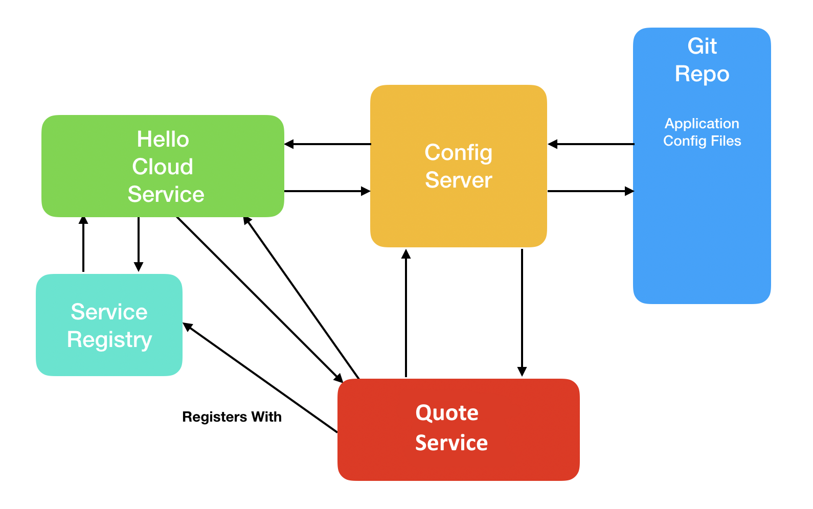

# Hello Cloud Service v2

## Introduction

In this activity, we will set up a Eureka Service Registry and use the service registry to locate and call a remote service.

## System Design



This system builds on the Hello Cloud Service and the Quote Service we built in previous activities.

In this activity, we'll add a Service Registry component.

* The Quote Service registers with the Service Registry when it starts up.

* The Hello Cloud Service is modified to ask the Quote Service for its quote rather than using the `officialGreeting` value from its configuration file as in the previous version.

* The Hello Cloud Service asks the Service Registry for the location and connection details for the Quote Service and uses that information to call the Quote Service.

## Modifying the System

We will build the system in the following steps:

1. Create the Service Registry.

2. Modify the Quote Service.

3. Modify the Hello Cloud Service.

## Instructions

### Step 1: Create the Service Registry

Our next step is to create the Service Registry. We'll use the Spring Initializr to create our project. Go to `start.spring.io`, and enter the follow information:

- Group = com.trilogyed

- Artifact = registry

- Name = EurekaServiceRegistry

- Dependencies = Eureka Server

- Java = 8

Download the project, copy it into your working directory, and open the project in IntelliJ.

The Spring Initializr adds the required starter dependencies to our POM file for a Eureka Service Registry, but we must add some annotations and some entries to the `application.properties` file to make our Service Registry operational.

#### 1.1: Annotate the Main Application Class

 Open the main application class (`com.trilogyed.registry.EurekaServiceRegistryApplication.java`), and add the `@EnableEurekaServer` annotation to the class. Your code should look like this:

```java
@SpringBootApplication
@EnableEurekaServer
public class EurekaServiceRegistryApplication {

	public static void main(String[] args) {
		SpringApplication.run(EurekaServiceRegistryApplication.class, args);
	}
}
```

This annotation tells spring to enable the features in the Eureka Server starter dependencies. This essentially turns our application into a Eureka Server.

#### 1.2: Add Entries to Properties File

Now we must set the host name and port on which our Eureka Server will listen and configure some Eureka specific settings.

Open `src/main/resources/application.properties`, and add the following entries:

`java
server.port=8761
eureka.instance.hostname=localhost

# Shut off the client functionality of the Eureka server (used for HA)
eureka.client.registerWithEureka=false
eureka.client.fetchRegistry=false
eureka.client.serviceUrl.defaultZone=http://${eureka.instance.hostname}:${server.port}/eureka
`

The value for `server.port` is arbitrary. For our demonstration, the hostname is `localhost` because we are running it locally. The `registerWithEureka` and `fetchRegistry` setting turn off the high availability/clustering features of Eureka because we are running only a single node.

Start your new Eureka Service Registry, and visit `http://localhost:8761`. You should see a Spring Eureka System Status page indicating that everything is running correctly.

### Step 2: Modify the Quote Service

#### 2.1: Add Eureka Client Dependency

Open the `pom.xml` file, and add the following dependency:

```xml
		<dependency>
			<groupId>org.springframework.cloud</groupId>
			<artifactId>spring-cloud-starter-netflix-eureka-client</artifactId>
		</dependency>

```

#### 3.2: Add `@EnableDiscoveryClient` Annotation

Now we need to modify the Quote Service to register with the Eureka Service Registry on startup. Open `com.trilogyed.config.QuoteServiceApplication.java`, and add the  `@EnableDiscoveryClient` class-level annotation. Your code should look like this:

```java
@SpringBootApplication
@EnableDiscoveryClient
public class QuoteServiceApplication {

	public static void main(String[] args) {
		SpringApplication.run(QuoteServiceApplication.class, args);
	}
}
```

### Step 3: Modify the Hello Cloud Service

Now we want to modify the Hello Cloud Service to use the Quote Service rather than its configuration file as the source of its "hello" message. We'll do that in four steps:

1. Add the Eureka client dependency to our POM file.

2. Add the `@EnableDiscoveryClient` annotation to our main application class.

3. Modify the `hello-cloud-service.properties` file.

4. Modify the controller to call the Quote Service.

#### 3.1: Add Eureka Client Dependency

Open the `pom.xml` file, and add the following dependency:

```xml
		<dependency>
			<groupId>org.springframework.cloud</groupId>
			<artifactId>spring-cloud-starter-netflix-eureka-client</artifactId>
		</dependency>

```

#### 3.2: Add the @EnableDiscoveryClient Annotation

Open `com.trilogyed.hellocloudservice.HelloCloudServiceApplication.java`, and add the `@EnableDiscoveryClient` class-level annotation. Your code should look like this:

```java
@SpringBootApplication
@EnableDiscoveryClient
public class HelloCloudServiceApplication {

	public static void main(String[] args) {
		SpringApplication.run(HelloCloudServiceApplication.class, args);
	}
}
```

Adding this annotation does the following:

1. Causes the Hello Cloud Service to register with the Eureka Service registry upon startup.

2. Allows the Hello Cloud Service to contact the Eureka Service Registry to look up the Quote Service location and connection information.

#### 3.3: Add Configuration Entries

Now we'll add some configuration entries to the `hello-cloud-service.properties` file. Modify your file so it looks like this:

```java
server.port=7979

# allow for RefreshScope
management.endpoints.web.exposure.include=*

officialGreeting="Greetings from the Hello Cloud Service!!! We're glad you're here!"

quoteServiceName=quote-service
serviceProtocol=http://
servicePath=/quote
```

The new entries will help us locate and call the Quote Service.

#### 3.4: Modify the Controller

Finally, we will modify the controller to use the Quote Service. Open `com.trilogyed.config.controller.HelloCloudServiceController.java`, and modify the class so it looks like this:

```java
@RestController
@RefreshScope
public class HelloCloudServiceController {

    @Autowired
    private DiscoveryClient discoveryClient;

    private RestTemplate restTemplate = new RestTemplate();

    @Value("${quoteServiceName}")
    private String quoteServiceName;

    @Value("${serviceProtocol}")
    private String serviceProtocol;

    @Value("${servicePath}")
    private String servicePath;

    @Value("${officialGreeting}")
    private String officialGreeting;

    @RequestMapping(value="/hello", method = RequestMethod.GET)
    public String helloCloud() {

        List<ServiceInstance> instances = discoveryClient.getInstances(quoteServiceName);

        String quoteServiceUri = serviceProtocol + instances.get(0).getHost() + ":" + instances.get(0).getPort() + servicePath;

        String quote = restTemplate.getForObject(quoteServiceUri, String.class);

        return quote;
    }
}
```

Things to note about this code:

1. We autowire a `DiscoveryClient` instance. We'll use this to contact Eureka and ask about the connection details of the Quote Service.

2. We include a `RestTemplate` property. This will used to communicate with the Quote Service. It allows us to make REST calls from our Java code.

3. We use the `@Value` annotation to get the values of the `quoteServiceName`, `serviceProtocol`, and `servicePath` properties in our config file.

4. `helloCloud` Method:

   1. We use the `DiscoveryClient` to ask for the Quote Service by name.

   2. We combine the `serviceProtocol` and `servicePath` from our configuration file with the host and port of the Quote Service from Eureka to create the URI for the Quote Service.
   3. We use the `restTemplate` and the URI to call the Quote Service and get our "hello" greeting.

## Running the System

Start the services in the following order:

1. `config-server`

2. `registry`

3. `quote-service`

4. `hello-cloud`

Open a browser and visit `http://localhost:7979/hello`. You should see one of the random quotes from the Quote Service. Refresh the page, and you should get different quotes.

---

© 2022 Trilogy Education Services, a 2U, Inc. brand. All Rights Reserved.
