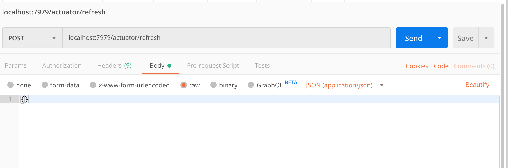

# 5.1-activities

## We Do: Create Config Server

**Starter & Solved Folders:** [02-we-create-config-server](https://drive.google.com/file/d/1W1wriimc_F9XriYaYoWk2FwXF69epNLz/view?usp=sharing)

In this activity, you will create, configure, and run a Spring Cloud Config Server.

Follow along with the instructor throughout the exercise.

**Instructions:**

1. Create a new public GitHub repository in your account.

2. Create a new properties file called ```test.properties``` in your new repository with the following content:

      ```java
      test.property=My Test Value!
      ```
 
3. Go to the Spring Initializr (http://start.spring.io).

4. Create a new project:

   * Set ```Group``` to ```com.trilogyed```. 
   
   * Set ```Artifact``` to ```config```. 
   
   * Set ```Name``` to ```CloudConfigService```. 

   * Set ```Java``` to ```8```. 

5. Add the ```Config Server [Cloud Config]``` starter dependency.

6. Click Generate Project, and download to a location of your choice.

7. Unzip the project file.

8. Open the project in IntelliJ.

9. Open the ```CloudConfigService.java``` file.

10. Add the ```@EnableConfigServer``` annotation at the class level like this:

       ```java
        @SpringBootApplication
        @EnableConfigServer
        public class CloudConfigServiceApplication {

	            public static void main(String[] args) { 		           
                     SpringApplication.run(CloudConfigServiceApplication.class, args);
	            }
        }
      ```

11. Open the ```applications.properties``` file, and add the following entries:

            ```java
            server.port=9999
            spring.cloud.config.server.git.uri=<the uri to your new git repo>
            ```

> Make sure this URI is a public Git repository because we have no username/password.

12. Test the server setup:

    * Start the service.
    
    * Open a browser and go to ```localhost:9999/test/main```.
    
    * Everyone should see something similar (not exactly) to this:

```json
{
  "name":"test",
  "profiles":["master"],
  "label":null,
  "version":"5081c444a5c0835d77fae114b0c36138cced3ed6",
  "state":null,
  "propertySources":[{
    "name":"https://github.com/coding-boot-camp/enterprise-cloud-config/test.properties",
    "source":{"test.property":"My Test Value!"}
  }]}
```

## We Do: Hello Cloud

**Starter & Solved Folders:** [03-we-hello-cloud](https://drive.google.com/file/d/11oCts7H-DSqVgc0oW2H8D7Ml3X1QNwyf/view?usp=sharing)

In this activity, you will create, configure, and run a web service that uses the Spring Cloud Config Server that we created in the previous activity.

Code along with the instructor throughout the exercise.

**Instructions:**

1. Go to the Spring Initializr (http://start.spring.io).

2. Create a new project:

   * Set ```Group``` to ```com.trilogyed```. 
   
   * Set ```Artifact``` to ```config```. 
   
   * Set ```Name``` to ```HelloCloudService```. 

   * Set ```Java``` to ```8```. 
   
3. Add the Web [Web], Config Client [Cloud Config], and the Actuator [Ops] starter dependencies.

4. Click Generate Project, and download to a location of your choice.

5. Unzip the project file.

6. Open the project in IntelliJ.

7. Add the following entries into the ```application.properties``` file:

      ```java
      # our application needs the information below to find the configuration
      # service and its configuration settings.

      # this name must match the name of the properties file for this application
      # in the configuration repository. we are looking for a file called
      # hello-cloud-service.properties
      spring.application.name=hello-cloud-service

      # this is the URL to the configuration service that we will use to get our configuration
      spring.config.import=optional:configserver:http://localhost:9999/
      ```

8. Create a new file called ```hello-cloud-service.properties``` in the configuration repository that you created earlier. Add the following content and then commit the file to your repository:

      ```java
          # this is the port on which our hello-cloud-service will run
          server.port=7979

          # allow for RefreshScope
          management.endpoints.web.exposure.include=*

          # the hello-cloud-service will use this as the greeting that it serves up
          officialGreeting="Greetings from the Hello Cloud Service!!! We're glad you're here!"
      ```

9. Create a new Controller:

   * Create a new Java class called ```com.trilogyed.hellocloudservice.controller.HelloCloudServiceController```. 
   * Add code to the controller so it looks like this:

   ```java
   @RestController
   @RefreshScope
   public class HelloCloudServiceController {
   
       @Value("${officialGreeting}")
       private String officialGreeting;
   
       @GetMapping(value="/hello")
       public String helloCloud() {
   
           return officialGreeting;
       }
   }
   ```

10. Start the service and visit ```http://localhost:7979/hello```. The service should return the following:

```java
"Greetings from the Hello Cloud Service!!! We're glad you're here!"
```

## Modifying the Configuration File and Resetting with Postman

Finally, we will demonstrate how to use the ```@RefreshScope``` feature to read in changes to the configuration without restarting the `hello-cloud-service`.

1. Modify the `hello-cloud-service.properties` file by setting the ```officialGreeting``` property value to ```This is the NEW greeting!```. 
2. Send a `POST` request to ```http://localhost:7979/actuator/refresh``` using Postman. The body of the post should be an empty JSON object. Your Postman request should look like this:

   

3. Open your browser, and visit ```localhost:7979/hello```. The application should display the new greeting.


## Modifying the Configuration File and Resetting with Curl Command
1. Change the ```officialGreeting``` property in the ```hello-cloud-service``` to the following:

      ```java
      officialGreeting="This is the new greeting reset with Curl Command!!!"
      ```

2. Commit this file to your config repository.

3. Go to your browser and refresh ```http://localhost:7979/hello```. You should see **no change**.

4. Issue the following `curl` command in the terminal:

      ```java
      curl localhost:7979/actuator/refresh -d {} -H "Content-Type: application/json"
      ```

5. Go to your browser, and refresh ```http://localhost:7979/hello```. You should see the new greeting message.


## Student Do: Quote Service

**Starter & Solved Folders:** [04-stu-quote-service](https://drive.google.com/file/d/1nP9mcQ-QRCQO8i-A7RVUaMiyBcpK-n2P/view?usp=sharing)

**Instructions:**

In this activity, you will create a web service that returns random quotes. This web service will get its configuration from a cloud config server.


## Instructions

1. Create a new Spring Cloud Config Server project called ```firstname-lastname-cloud-config-server``` using the Spring Initializr by following the steps outlined in the lesson. Have the server run on port 9999, and have it use the Git repository that you created in class to store the configuration files for client applications.

2. Create a new Spring Boot REST web service called ```firstname-lastname-random-quote-service```. This web service must meet the following requirements:

   * It uses the Config Server created in the previous step for all of its configuration settings.
   
   * It runs on port 2244.
   
   * It contains the following endpoint:

   ```java
   URI: /quote
   HTTP Method: GET
   Request Body: None
   Response Body: Quote (String) 
   ```

   * The endpoint should randomly return one of the following eight quotes:
   
      * To me programming is more than an important practical art. It is also a gigantic undertaking in the foundations of knowledge. &mdash;Grace Hopper
      
      * Programs must be written for people to read, and only incidentally for machines to execute. &mdash;Hal Ableson
      
      * Don't call me the mother of the internet. &mdash;Radia Perlman
      
      * When I first started using the phrase software engineering, it was considered to be quite amusing. They used to kid me about my radical ideas. Software eventually and necessarily gained the same respect as any other discipline. &mdash;Margaret Hamilton
      
      * Machines take me by surprise with great frequency. &mdash;Alan Turing
      
      * The function of good software is to make the complex appear simple. &mdash;Grady Booch
      
      * An API that isn't comprehensible isn't usable. &mdash;James Gosling
      
      * I'm not a great programmer; I'm just a good programmer with great habits. &mdash;Martin Fowler


## Hints

* Consider using an array or `ArrayList` to store the quotes.

* Consider using a random number to help you choose the quote to return.


## We Do: Hello Cloud v2

**Starter & Solved Folders:** [05-we-hello-cloud](https://drive.google.com/file/d/1y5gfxfxCFRiyRAaxcTEBQCwAhKqzVXrP/view?usp=sharing)

In this activity, we will set up a Eureka Service Registry and use the service registry to locate and call a remote service.

Code along with the instructor throughout the exercise.

## System Design


This system builds on the Hello Cloud Service and the Quote Service we built in previous activities.

In this activity we'll add a Service Registry component.

* The Quote Service registers with the Service Registry when it starts up.
* The Hello Cloud Service is modified to ask the Quote Service for its quote rather than using the ```officialGreeting``` value from its configuration file, as in the previous version.
* The Hello Cloud Service asks the Service Registry for the location and connection details for the Quote Service and uses that information to call the Quote Service.

## Modifying the System

We will build the system in the following steps:

1. Create the Service Registry.
2. Modify the Quote Service.
3. Modify the Hello Cloud Service.

## Instructions

### Step 1: Create the Service Registry

Our next step is to create the Service Registry. We'll use the Spring Initializr to create our project. Go to ```start.spring.io```, and enter the follow information:

- Group = com.trilogyed
- Artifact = registry
- Name = EurekaServiceRegistry
- Dependencies = Eureka Server
- Java = 8

Download the project, copy it into your working directory, and open the project in IntelliJ.

The Spring Initializr adds the required starter dependencies to our POM file for a Eureka Service Registry, but we must add some annotations and some entries to the ```application.properties``` file to make our Service Registry operational.

#### 1.1: Annotate the Main Application Class

 Open the main application class (```com.trilogyed.registry.EurekaServiceRegistryApplication.java```), and add the ```@EnableEurekaServer``` annotation to the class. Your code should look like this:

```java
@SpringBootApplication
@EnableEurekaServer
public class EurekaServiceRegistryApplication {

	public static void main(String[] args) {
		SpringApplication.run(EurekaServiceRegistryApplication.class, args);
	}
}
```

This annotation tells Spring to enable the features in the Eureka Server starter dependencies. This essentially turns our application into a Eureka Server.

#### 1.2: Add Entries to Properties File

Now we must set the host name and port on which our Eureka Server will listen and configure some Eureka specific settings.

Open ```src/main/resources/application.properties```, and add the following entries:

```java
server.port=8761
eureka.instance.hostname=localhost

# Shut off the client functionality of the Eureka server (used for HA)
eureka.client.registerWithEureka=false
eureka.client.fetchRegistry=false
eureka.client.serviceUrl.defaultZone=http://${eureka.instance.hostname}:${server.port}/eureka
```

The value for ```server.port``` is arbitrary. For our demonstration, the hostname is ```localhost``` because we are running it locally. The ```registerWithEureka``` and ```fetchRegistry``` settings turn off the high availability/clustering features of Eureka because we are running only a single node.

Start your new Eureka Service Registry and visit ```http://localhost:8761```. You should see a Spring Eureka System Status page that indicates that everything is running correctly.

### Step 2: Modify the Quote Service

#### 2.1: Add Eureka Client Dependency

Open the ```pom.xml``` file, and add the following dependency:

```xml
		<dependency>
			<groupId>org.springframework.cloud</groupId>
			<artifactId>spring-cloud-starter-netflix-eureka-client</artifactId>
		</dependency>

```

#### 3.2: Add the @EnableDiscoveryClient Annotation

Now we need to modify the Quote Service to register with the Eureka Service Registry on startup. Open ```com.trilogyed.config.QuoteServiceApplication.java``` and add the  ```@EnableDiscoveryClient``` class-level annotation. Your code should look like this:

```java
@SpringBootApplication
@EnableDiscoveryClient
public class QuoteServiceApplication {

	public static void main(String[] args) {
		SpringApplication.run(QuoteServiceApplication.class, args);
	}
}
```

### Step 3: Modify the Hello Cloud Service

Now we want to modify the Hello Cloud Service to use the Quote Service rather than its configuration file as the source of its "hello" message. We'll do that in four steps:

1. Add the Eureka client dependency to our POM file.
2. Add the ```@EnableDiscoveryClient``` annotation to our main application class.
3. Modify the ```hello-cloud-service.properties``` file.
4. Modify the controller to call the Quote Service.

#### 3.1: Add Eureka Client Dependency

Open the ```pom.xml``` file, and add the following dependency:

```xml
		<dependency>
			<groupId>org.springframework.cloud</groupId>
			<artifactId>spring-cloud-starter-netflix-eureka-client</artifactId>
		</dependency>

```

#### 3.2: Add ```@EnableDiscoveryClient``` Annotation

Open ```com.trilogyed.hellocloudservice.HelloCloudServiceApplication.java``` and add the ```@EnableDiscoveryClient``` class-level annotation. Your code should look like this:

```java
@SpringBootApplication
@EnableDiscoveryClient
public class HelloCloudServiceApplication {

	public static void main(String[] args) {
		SpringApplication.run(HelloCloudServiceApplication.class, args);
	}
}
```

Adding this annotation does the following:

1. Causes the Hello Cloud Service to register with the Eureka Service registry upon startup.
2. Allows the Hello Cloud Service to contact the Eureka Service Registry to lookup the Quote Service location and connection information.

#### 3.3: Add Configuration Entries

Now we'll add some configuration entries to the ```hello-cloud-service.properties``` file. Modify your file so it looks like this:

```java
server.port=7979

# allow for RefreshScope
management.endpoints.web.exposure.include=*

officialGreeting="Greetings from the Hello Cloud Service!!! We're glad you're here!"

quoteServiceName=quote-service
serviceProtocol=http://
servicePath=/quote
```

The new entries will help us locate and call the Quote Service.

#### 3.4: Modify Controller

Finally, we will modify the controller to use the Quote Service. Open ```com.trilogyed.config.controller.HelloCloudServiceController.java``` and modify the class so it looks like this:

```java
@RestController
@RefreshScope
public class HelloCloudServiceController {

    @Autowired
    private DiscoveryClient discoveryClient;

    private RestTemplate restTemplate = new RestTemplate();

    @Value("${quoteServiceName}")
    private String quoteServiceName;

    @Value("${serviceProtocol}")
    private String serviceProtocol;

    @Value("${servicePath}")
    private String servicePath;

    @Value("${officialGreeting}")
    private String officialGreeting;

    @RequestMapping(value="/hello", method = RequestMethod.GET)
    public String helloCloud() {

        List<ServiceInstance> instances = discoveryClient.getInstances(quoteServiceName);

        String quoteServiceUri = serviceProtocol + instances.get(0).getHost() + ":" + instances.get(0).getPort() + servicePath;

        String quote = restTemplate.getForObject(quoteServiceUri, String.class);

        return quote;
    }
}
```

Things to note about this code:

1. We autowire a `DiscoveryClient` instance. We'll use this to contact Eureka and ask about the connection details of the Quote Service.
2. We include a `RestTemplate` property. This will be used to communicate with the Quote Service. It allows us to make REST calls from our Java code.
3. We use the ```@Value``` annotation to get the values of the `quoteServiceName`, `serviceProtocol`, and `servicePath` properties in our config file.
4. ```helloCloud``` Method:
   1. We use the `DiscoveryClient` to ask for the Quote Service by name.
   2. We combine the `serviceProtocol` and `servicePath` from our configuration file with the host and port of the Quote Service from Eureka to create the URI for the Quote Service.
   3. We use the `restTemplate` and the URI to call the Quote Service and get our "hello" greeting.

## Running the System

Start the services in the following order:

1. `config-server`
2. `registry`
3. `quote-service`
4. `hello-cloud`

Open a browser and visit ```http://localhost:7979/hello```. You should see one of the random quotes from the Quote Service. Refresh the page and you should get different quotes.


## Student Do: Quote Service v2

**Starter & Solved Folders:** [04-stu-quote-service-v2](https://drive.google.com/file/d/17ICNBRpAdDIP3OVkTY4HHbxcJafE-0d0/view?usp=sharing)

In this activity, we will
- Create a Eureka service registry from scratch.
- Create and register a Magic Eight Ball Service with the service registry.
- Modify the existing Quote Service to use the service registry to locate and call the Magic Eight Ball Service.

## Requirements

### Service Registry

1. Create a new Eureka service registry project called ```firstname-lastname-service-registry``` using the Spring Initializr following the steps outlined in the lesson.

2. Use the following configuration settings for the service registry:

   * Run on port 8761.
   
   * Set the hostname to `localhost`.
   
   * All other settings should match those in your cheatsheet for this lesson.

### Cloud Config Server

* Use the Cloud configuration server created in the first version of this project to serve up config files to both the Quote service and the Magic Eight Ball service.

### Magic Eight Ball Service

1. Create a new Spring Boot web service project called ```firstname-lastname-magic-eight-ball-service``` using the Spring Intitializr. This web service must include support for the service to register with the Eureka service registry.

2. The service must register with the Eureka service registry.

3. The service must run on port 3344.

4. The service must have the following endpoint:

```java
URI: /answer
HTTP Method: GET
Request Body: None
Response Body: Answer (String)
```

4. The endpoint should randomly return one of the following answers:

   * No
   * Yes
   * Looking cloudy   
   * Not sure   
   * Absolutely!   
   * Ask again   
   * Ummm   
   * Not a chance

### Quote Service Modifications

1. Add the following endpoint to version 1 of the Random Quote Service:

```java
URI: /answerme
HTTP Method: GET
Request Body: None
Response Body: Answer (String)
```

2. This endpoint must do the following:

   * Call the Magic Eight Ball Service ```/answer``` endpoint, and return the result to the caller.


---

© 2022 Trilogy Education Services, a 2U, Inc. brand. All Rights Reserved.
