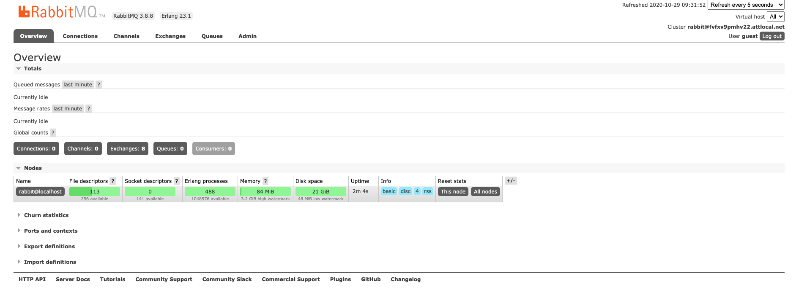

# Email List System

## Introduction

In this activity, you will create a simple producer/consumer system that uses Spring Boot and RabbitMQ.

The application you'll build simulates an account-creation web service.

The account creation is divided in two parts:

1. Create the main account.

2. Add a new account to the company email list.

It's critical that the main account is created in a timely manner. Even though it's important that we add new members to the email list, we don't want the main account creation to be slowed down or otherwise adversely affected by issues with the email list system.

We'll use a queue to process new email list entries. This allows the new account service to simply place the new email list entry request in the queue and move on. The queue entries will be processed asynchronously according to the availability and capacity of the email list creation service.

### Email List System

The following diagram shows our email list system.


The **account service** is a REST web service that processes incoming new account requests. Part of that processing includes sending a new email list entry message to the `queue-demo-exchange`. Messages sent to the exchange are routed to the `email-list-add-queue` and then processed by the **email list queue consumer** application.

## Building the System

We will build the system in the following steps:

1. Create the consumer application.

2. Create the producer application.

3. Process objects.

### Step 1: Create the Consumer Application

The next step is to create the application that will process the messages from the queue. We'll use the Spring Initializr to create our project. Go to `start.spring.io`, and enter the follow information:

- Group = com.trilogyed

- Artifact = email-list-queue-consumer

- Dependencies = Spring for RabbitMQ

Download the project, copy it into your working directory, and open the project in IntelliJ.

It is worth noting that this application is **not** a web service; it is just a queue consumer.

#### 1.1: Create the Message Class

Now we will create a Java class that will act as the message in our system. This class will be present both in the consumer application and in the producer application.

Create a new class called `com.trilogyed.emaillistqueueconsumer.util.messages.EmailListEntry.java`. Add the following code to your new class:

```java
public class EmailListEntry {

    private String name;
    private String email;

    public EmailListEntry() {

    }

    public EmailListEntry(String name, String email) {
        this.name = name;
        this.email = email;
    }

    public String getName() {
        return name;
    }

    public void setName(String name) {
        this.name = name;
    }

    public String getEmail() {
        return email;
    }

    public void setEmail(String email) {
        this.email = email;
    }

    @Override
    public String toString() {
        return "EmailListEntry{" +
                "name='" + name + '\'' +
                ", email='" + email + '\'' +
                '}';
    }
}
```

Items to note about this code:

1. Make sure you include the default constructor. Jackson requires a default constructor to marshal and unmarshal the messages. The other constructor is a convenience.

2. Make sure each property has a getter and setter. Again, Jackson requires getters and setters to marshal and unmarshal the messages.

3. Have IntelliJ generate the `toString()` method.

#### 1.2: Add the Jackson Converter Libraries

Next, we will add the Jackson converter libraries. These are the same libraries used to convert Java objects to JSON and vice versa in Spring Boot REST web services. These libraries will allow the system to convert messages to Java objects and vice versa.

Open the project `pom.xml` file, and add the following dependencies:

```xml
  <dependency>
   <groupId>com.fasterxml.jackson.core</groupId>
   <artifactId>jackson-core</artifactId>
   <version>2.9.8</version>
  </dependency>
  <dependency>
   <groupId>com.fasterxml.jackson.core</groupId>
   <artifactId>jackson-annotations</artifactId>
   <version>2.9.8</version>
  </dependency>
  <dependency>
   <groupId>com.fasterxml.jackson.core</groupId>
   <artifactId>jackson-databind</artifactId>
   <version>2.9.8</version>
  </dependency>
```

#### 1.3: Create the Message Listener

Now we will create the message listener. This component listens for messages on the queue and processes them. Our component will simply print the message content to standard out. A real application would take the information and create a new entry in the Email List database.

Create a new file called `com.trilogyed.emaillistqueueconsumer.MessageListener.java`. Add the following code to your new class:

```java
@Service
public class MessageListener {

    @RabbitListener(queues = EmailListQueueConsumerApplication.QUEUE_NAME)
    public void receiveMessage(EmailListEntry msg) {
        System.out.println(msg.toString());
    }
}
```

Items to note about this code:

1. We use the the `@Service` annotation to let Spring know that it should pay attention to this component.

2. We use the `@RabbitListener` annotation to specify the queues this component will listen to. We'll set the queue name constant in the next step. For now, you will see a compiler error because this constant does not exist.

3. The `receiveMessage` method processes our messages. It takes an `EmailListEntry` message as a parameter and processes it. In our case, it just prints the message; an actual application would use the message contents to create a new email list entry.

#### 1.4: Configure the Exchange, Queue, Binding, and Converter

The next step is to configure our exchange and bind it to our queue. This involves five steps:

1. Create the topic exchange and queue names.

2. Create a queue.

3. Create a `TopicExchange`.

4. Create a binding.

5. Create a `jackson2JsonMessageConverter`.

We'll do all of this in our main `Application` class. Open `com.trilogy.emaillistqueueconsumer.EmailListQueueConsumer.java`, and add code so that it looks like this:

```java
@SpringBootApplication
public class EmailListQueueConsumerApplication {

 public static final String TOPIC_EXCHANGE_NAME = "queue-demo-exchange";
 public static final String QUEUE_NAME = "email-list-add-queue";
  public static final String ROUTING_KEY = "email.list.add.#";

 @Bean
 Queue queue() {
  return new Queue(QUEUE_NAME, false);
 }

 @Bean
 TopicExchange exchange() {
  return new TopicExchange(TOPIC_EXCHANGE_NAME);
 }

 @Bean
 Binding binding(Queue queue, TopicExchange exchange) {
  return BindingBuilder.bind(queue).to(exchange).with(ROUTING_KEY);
 }

 @Bean
 public Jackson2JsonMessageConverter jackson2JsonMessageConverter() {
  return new Jackson2JsonMessageConverter();
 }

 public static void main(String[] args) {
  SpringApplication.run(EmailListQueueConsumerApplication.class, args);
 }
}
```

Items to note about this code:

1. Our `Queue`, `TopicExchange`, `Binding`, and `Jackson2JsonMessageConverter` are all set up as Spring-managed Beans.

2. The second parameter of the `Queue` constructor indicates whether the queue should be durable between restarts of the RabbitMQ broker. We do not need the queue to be durable for this demo.

3. Our binding specifies that any message sent to our topic exchange with the routing key of `email.list.add.#` (where # is one or more characters) will be routed to our queue. We'll configure our producer to use this routing key.

### Step 2: Create the Producer Application

Now we will create the application that will produce messages and send them to our topic exchange.  We'll use the Spring Initializr to create our project. Go to `start.spring.io`, and enter the follow information:

- Group = com.trilogyed

- Artifact = account-service

- Dependencies = Spring Web Starter, Spring for RabbitMQ

Download the project, copy it into your working directory, and open the project in IntelliJ.

#### 2.1: Create the Message Class

Now we will create a Java class that will act as the message in our system. This class is identical to the message class we created in the consumer application earlier. This class would likely be contained in a shared library in a production setting, which would allow us to avoid the duplication of code.

Create a new class called `com.trilogyed.accountservice.util.messages.EmailListEntry.java`. Add the following code to your new class:

```java
public class EmailListEntry {

    private String name;
    private String email;

    public EmailListEntry() {

    }

    public EmailListEntry(String name, String email) {
        this.name = name;
        this.email = email;
    }

    public String getName() {
        return name;
    }

    public void setName(String name) {
        this.name = name;
    }

    public String getEmail() {
        return email;
    }

    public void setEmail(String email) {
        this.email = email;
    }

    @Override
    public String toString() {
        return "EmailListEntry{" +
                "name='" + name + '\'' +
                ", email='" + email + '\'' +
                '}';
    }
}
```

See the notes about this class found in Section 2.1 earlier.

#### 2.2: Create the Account Class

Next, we will create the `Account` class. The `Account` class contains all of the information required to create an account for this system, including the information needed for a new email list entry.

Create a new file called `com.trilogyed.accountservice.model.Account.java`, and add the following code:

```java
public class Account {

    private String firstName;
    private String lastName;
    private String email;
    private String username;

    public String getFirstName() {
        return firstName;
    }

    public void setFirstName(String firstName) {
        this.firstName = firstName;
    }

    public String getLastName() {
        return lastName;
    }

    public void setLastName(String lastName) {
        this.lastName = lastName;
    }

    public String getEmail() {
        return email;
    }

    public void setEmail(String email) {
        this.email = email;
    }

    public String getUsername() {
        return username;
    }

    public void setUsername(String username) {
        this.username = username;
    }
}
```

#### 2.3: Configure the RabbitTemplate and Message Converter

Like the consumer application, this application requires the Jackson library to convert messages to Java objects and vice versa. Our application also requires a `RabbitTemplate` to send messages to the topic exchange. We will set up both of these in the main application class.

Open `com.trilogyed.accountservice.AccountServiceApplication.java`, and add code so it looks like this:

```java
@SpringBootApplication
public class AccountServiceApplication {

 @Bean
 public RabbitTemplate rabbitTemplate(ConnectionFactory connectionFactory) {
  RabbitTemplate rabbitTemplate = new RabbitTemplate(connectionFactory);
  rabbitTemplate.setMessageConverter(jackson2JsonMessageConverter());
  return rabbitTemplate;
 }

 @Bean
 public Jackson2JsonMessageConverter jackson2JsonMessageConverter() {
  return new Jackson2JsonMessageConverter();
 }

 public static void main(String[] args) {
  SpringApplication.run(AccountServiceApplication.class, args);
 }
}
```

Items to note about this code:

1. The `RabbitTemplate` and `Jackson2JsonMessageConverter` are both Spring-managed Beans.

2. We set both the `ConnectionFactory` (supplied by Spring) and the `MessageConverter` (our Bean) to the `RabbitTemplate`.

#### 2.4: Create the AccountController

Finally, we create the `AccountController` and the endpoint that creates the accounts.

Create a new file called `com.trilogyed.accountservice.controller.AccountServiceController.java`, and add the following code:

```java
@RestController
public class AccountController {

    public static final String EXCHANGE = "queue-demo-exchange";
    public static final String ROUTING_KEY = "email.list.add.account.controller";

    @Autowired
    private RabbitTemplate rabbitTemplate;

    public AccountController(RabbitTemplate rabbitTemplate) {
        this.rabbitTemplate = rabbitTemplate;
    }

    @RequestMapping(value = "/account", method = RequestMethod.POST)
    public String createAccount(@RequestBody Account account) {
        // create message to send to email list creation queue
        EmailListEntry msg = new EmailListEntry(account.getFirstName() + " " + account.getLastName(), account.getEmail());
        System.out.println("Sending message...");
        rabbitTemplate.convertAndSend(EXCHANGE, ROUTING_KEY, msg);
        System.out.println("Message Sent");

        // Now do account creation stuff...

        return "Account Created";
    }
}
```

Items to note about this code:

1. This is a normal `@RestController`.

2. We use the topic exchange name that we created when we built the consumer application and configured the topic exchange and binding.

3. We use a routing key that will route our message to the desired queue. Recall that we set the routing key in our binding to `email.list.add.#`. The value of `email.list.add.account.controller` will route to our queue.

4. We're `@Autowiring` the `RabbitTemplate` Bean that we created in the previous step.

5. Our endpoint does the following:

   - Creates an `EmailListEntry` from the incoming `Account` object.

   - Sends the `EmailListEntry` message to the topic exchange.

   - Prints out a message to the console. A production application would actually call other components to do the work necessary for creating the account.

## Run the System

Now that we've built the system, we want to demonstrate two things when we run it:

- Normal message flow

- Messages getting queued up and then processed later when the consumer application goes offline for some period of time

#### Step 1: Start RabbitMQ

Start RabbitMQ by typing `rabbitmq-server` on the command line (Mac). Or, if you installed RabbitMQ with Homebrew, then alternatively you can use the command `brew services start rabbitmq` (Mac). RabbitMQ starts automatically on Windows.

#### Step 2: Start the Consumer Application

Run the consumer application in IntelliJ.

#### Step 3: Start the Producer Application

Run the producer application in IntelliJ.

#### Step 4: Send POST to the Producer Application

Send a `POST` to the producer application. It should look similar to this in Postman:


Notice the console output from the consumer application. It should look something like this:


#### Step 5: Stop the Consumer Application

Stop the consumer application. Now there is nothing listening to our queue.

#### Step 6: Send POST to the Producer Application

Send a `POST` to the producer application. It should look similar to this in Postman:


The service should return a message of "Account Created," even though the consumer application is down.

#### Step 7: Start the Consumer Application

Finally, start the consumer application. You should see output in the console similar to this right after the service starts up:


**Note:** This message was in the queue waiting to be processed when the consumer application restarted.

---

## Monitor Queues with the RabbitMQ Management User Interface

RabbitMQ offers an Admin Management User Interface that allows for a user interface dashboard-style monitoring tool.
Once the RabbitMQ server has been started, the Admin UI can be used by performing the following steps:

1. Open a browser and navigate to `localhost:15672`.

2. Enter the following credentials:

    - UserName: guest

    - Password: guest

3. After logging in you will see the RabbitMQ dashboard page:

    - From the Overview tab, click the Queues button found in the middle of the page.

        

4. To view messages in a queue:

    - Click the queue that you would like to view. (In this example, the queue is `email-list-add-queue`.)

        

    - On the lower-left menu, click Get Messages to view the messages in the queue.

        

    - Important Note: Take note of the value in the text box labeled Messages. This value defaults to 1.

        This is the value that determines how many messages will be displayed. Raise this value if viewing
        multiple messages is desired.

        

    - Finally, to view a list of messages, click the Get Message Button, and a list of messages in the queue is displayed.

        

5. It is recommended to return to the Run The System section from earlier and rerun the Postman transactions while monitoring the RabbitMQ Management User Interface to see messages flowing in and out of the queue.

---

© 2022 Trilogy Education Services, a 2U, Inc. brand. All Rights Reserved.
