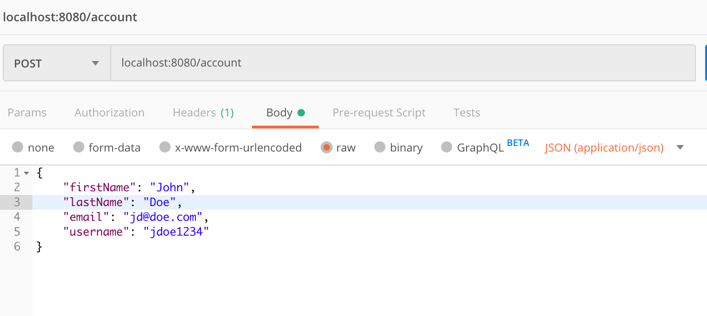
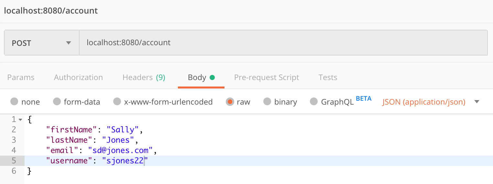
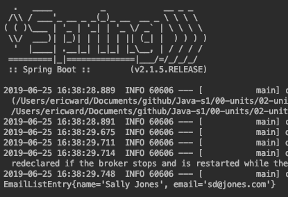
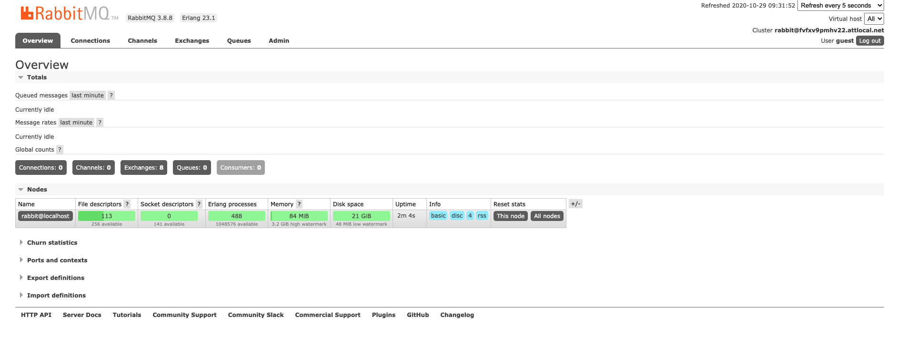
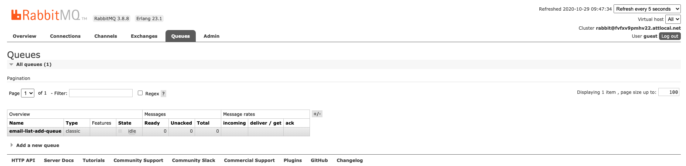
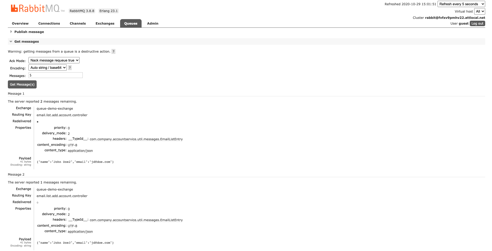
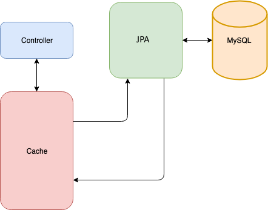

# 5.2-activities

## Student Do: Hello Cloud v3

**Starter & Solved Folders:** [01-we-hello-cloud-v3](https://drive.google.com/file/d/12eD5mc-Iqzn1tdRZB3hdWvYwtnGUQ7QY/view?usp=sharing)

In this activity, you will use the Feign web service client and the Eureka service registry to communicate with other services in the system.

### System Design


**Instructions:**

### Modify the System

We will modify the ```hello-cloud``` project by swapping out the `RestTemplate` for the Feign web service client. We'll build the system in the following steps:

1. Add dependencies to the POM file.
2. Enable Feign.
3. Create the Feign client.
4. Modify the controller to use the Feign client.

#### Step 1: Add Dependencies

Before you begin, open the ```hello-cloud``` project in IntelliJ.

The first step is to add the Feign libraries to the project. To do so, open the POM file and add the following dependency:

```xml
  <dependency>
   <groupId>org.springframework.cloud</groupId>
   <artifactId>spring-cloud-starter-feign</artifactId>
   <version>1.4.7.RELEASE</version>
  </dependency>
```

#### Step 2: Enable Feign

The next step is to enable Feign. To do so, we will add the ```@EnableFeignClients``` annotation to the```com.trilogyed.config.HelloCloudService.java``` class.

Open ```com.trilogyed.config.HelloCloudService.java```, and modify it so it looks like this:

```java
@SpringBootApplication
@EnableDiscoveryClient
@EnableFeignClients
public class HelloCloudServiceApplication {

 public static void main(String[] args) {
  SpringApplication.run(HelloCloudServiceApplication.class, args);
 }
}
```

#### Step 3: Create the Feign Client

The Feign library allows us to create web service clients in a declarative manner using annotations and an interface definition. No code is required beyond the annotated interface definition. We will use the following two annotations:

* `@FeignClient`
* `@RequestMapping`

##### @FeignClient

This interface-level annotation marks our interface as a Feign client. The ```name``` parameter allows us to specify the web service that our client interacts with.

##### @RequestMapping

This is the same annotation we use to define endpoints in our web service controllers. In this case, we use it to define which of the service endpoints a given method definition should interact with.

Create a new Java interface called ```com.trilogyed.config.util.feign.RandomGreetingClient.java```, and add the following code:

```java
@FeignClient(name = "quote-service")
public interface QuoteClient {

    @RequestMapping(value = "/quote", method = RequestMethod.GET)
    public String getRandomQuote();
}
```

Items to note about this code:

1. The ```@FeignClient``` marks this interface as a Feign client. The ```name``` attribute is the name of the service this client will interact with. This name must match the name of a service registered with Eureka.
2. The ```@RequestMapping``` annotation allows us to specify which endpoint should be called when the annotated method is invoked. In our case, a `GET` request will be issued to ```/greeting``` on the ```random-greeting-service``` whenever ```getRandomGreeting``` is invoked in our code.

#### Step 4: Modify the Controller

Finally, we will modify the controller to use the Feign client instead of the ```RestTemplate``` for interaction with the ```random-greeting-service```.

Open ```com.trilogyed.hellocloudservice.controller.HelloCloudServiceController.java```, and modify it so it looks like the following code. The original ```RestTemplate```-based code as been commented out so we can see each version side by side. It is clear that the Feign-based code is much less complex.

```java
@RestController
@RefreshScope
public class HelloCloudServiceController {

//    @Autowired
//    private DiscoveryClient discoveryClient;
//
//    private RestTemplate restTemplate = new RestTemplate();
//
//    @Value("${randomGreetingServiceName}")
//    private String randomGreetingServiceName;
//
//    @Value("${serviceProtocol}")
//    private String serviceProtocol;
//
//    @Value("${servicePath}")
//    private String servicePath;
//
//    @Value("${officialGreeting}")
//    private String officialGreeting;

    @Autowired
    private final RandomGreetingClient client;


    HelloCloudServiceController(RandomGreetingClient client) {
        this.client = client;
    }

    @RequestMapping(value="/hello", method = RequestMethod.GET)
    public String helloCloud() {

//        List<ServiceInstance> instances = discoveryClient.getInstances(randomGreetingServiceName);
//
//        String randomGreetingServiceUri = serviceProtocol + instances.get(0).getHost() + ":" + instances.get(0).getPort() + servicePath;
//
//        String greeting = restTemplate.getForObject(randomGreetingServiceUri, String.class);
//
//        return greeting;

        return client.getRandomGreeting();
    }
}
```

Items to note about this code:

1. No additional annotations are needed on the controller.
2. We use DI constructor injection to wire the ```RandomGreetingClient``` into the controller.
3. The Feign client makes the web service call to the ```random-greeting-service``` look like a normal method call.

### Run the System

Start the services in the following order:

1. ```config-server```
2. ```registry```
3. ```quote-service```
4. ```hello-cloud```

Open a browser and visit <http://localhost:7979/hello>. You should see one of the random quotes from the Quote Service. Refresh the page and you should get different quotes.


## We Do: Email List System

**Starter & Solved Folders:** [02-we-email-list-system](https://drive.google.com/file/d/1xc1ZESVQYUs6dwgKuKM7-FPbgQXo4-m3/view?usp=sharing)

In this activity, you will create a simple producer/consumer system that uses Spring Boot and RabbitMQ.

The application you'll build simulates an account-creation web service.

The account creation is divided in two parts:

1. Create the main account.

2. Add a new account to the company email list.

It's critical that the main account is created in a timely manner. Even though it's important that we add new members to the email list, we don't want the main account creation to be slowed down or otherwise adversely affected by issues with the email list system.

We'll use a queue to process new email list entries. This allows the new account service to simply place the new email list entry request in the queue and move on. The queue entries will be processed asynchronously according to the availability and capacity of the email list creation service.

Code along with the instructor throughout the exercise.

**Instructions:**

The following diagram shows our email list system:


The **account service** is a REST web service that processes incoming new account requests. Part of that processing includes sending a new email list entry message to the ```queue-demo-exchange```. Messages sent to the exchange are routed to the ```email-list-add-queue``` and then processed by the **email list queue consumer** application.

### Building the System

We will build the system in the following steps:

1. Create the consumer application.
2. Create the producer application.
3. Process the objects.

#### Step 1: Create the Consumer Application

The next step is to create the application that will process the messages from the queue.  We'll use the Spring Initializr to create our project. Go to ```start.spring.io```, and enter the follow information:

* Group = com.trilogyed
* Artifact = email-list-queue-consumer
* Dependencies = Spring for RabbitMQ

Download the project, copy it into your working directory, and open the project in IntelliJ.

It is worth noting that this application is **not** a web service; it is just a queue consumer.

##### 1.1: Create the Message Class

Now we will create a Java class that will act as the message in our system. This class will be present both in the consumer application and in the producer application.

Create a new class called ```com.trilogyed.emaillistqueueconsumer.util.messages.EmailListEntry.java```. Add the following code to your new class:

```java
public class EmailListEntry {

    private String name;
    private String email;

    public EmailListEntry() {

    }

    public EmailListEntry(String name, String email) {
        this.name = name;
        this.email = email;
    }

    public String getName() {
        return name;
    }

    public void setName(String name) {
        this.name = name;
    }

    public String getEmail() {
        return email;
    }

    public void setEmail(String email) {
        this.email = email;
    }

    @Override
    public String toString() {
        return "EmailListEntry{" +
                "name='" + name + '\'' +
                ", email='" + email + '\'' +
                '}';
    }
}
```

Items to note about this code:

1. Make sure you include the default constructor. Jackson requires a default constructor to marshal and unmarshal the messages. The other constructor is a convenience.
2. Make sure each property has a getter and setter. Again, Jackson requires getters and setters to marshal and unmarshal the messages.
3. Have IntelliJ generate the ```toString()``` method.

##### 1.2: Add the Jackson Converter Libraries

Next, we will add the Jackson converter libraries. These are the same libraries used to convert Java objects to JSON and vice versa in Spring Boot REST web services. These libraries will allow the system to convert messages to Java objects and vice versa.

Open the project ```pom.xml``` file, and add the following dependencies:

```xml
  <dependency>
   <groupId>com.fasterxml.jackson.core</groupId>
   <artifactId>jackson-core</artifactId>
   <version>2.9.8</version>
  </dependency>
  <dependency>
   <groupId>com.fasterxml.jackson.core</groupId>
   <artifactId>jackson-annotations</artifactId>
   <version>2.9.8</version>
  </dependency>
  <dependency>
   <groupId>com.fasterxml.jackson.core</groupId>
   <artifactId>jackson-databind</artifactId>
   <version>2.9.8</version>
  </dependency>
```

##### 1.3: Create the Message Listener

Now we will create the message listener. This component listens for messages on the queue and processes them. Our component will simply print the message content to standard out. A real application would take the information and create a new entry in the `Email List` database.

Create a new file called ```com.trilogyed.emaillistqueueconsumer.MessageListener.java```. Add the following code to your new class:

```java
@Service
public class MessageListener {

    @RabbitListener(queues = EmailListQueueConsumerApplication.QUEUE_NAME)
    public void receiveMessage(EmailListEntry msg) {
        System.out.println(msg.toString());
    }
}
```

Items to note about this code:

1. We use the the ```@Service``` annotation to let Spring know that it should pay attention to this component.

2. We use the ```@RabbitListener``` annotation to specify the queues this component will listen to. We'll set the queue name constant in the next step. For now, you will see a compiler error because this constant does not exist.

3. The ```receiveMessage``` method processes our messages. It takes an ```EmailListEntry``` message as a parameter and processes it. In our case, it just prints the message; an actual application would use the message contents to create a new email list entry.

##### 1.4: Configure the Exchange, Queue, Binding, and Converter

The next step is to configure our exchange and bind it to our queue. This involves five steps:

1. Create the topic exchange and queue names.

2. Create a queue.

3. Create a ```TopicExchange```.

4. Create a binding.

5. Create a ```jackson2JsonMessageConverter```.

We'll do all of this in our main ```Application``` class. Open ```com.trilogy.emaillistqueueconsumer.EmailListQueueConsumer.java```, and add code so that it looks like this:

```java
@SpringBootApplication
public class EmailListQueueConsumerApplication {

 public static final String TOPIC_EXCHANGE_NAME = "queue-demo-exchange";
 public static final String QUEUE_NAME = "email-list-add-queue";
  public static final String ROUTING_KEY = "email.list.add.#";

 @Bean
 Queue queue() {
  return new Queue(QUEUE_NAME, false);
 }

 @Bean
 TopicExchange exchange() {
  return new TopicExchange(TOPIC_EXCHANGE_NAME);
 }

 @Bean
 Binding binding(Queue queue, TopicExchange exchange) {
  return BindingBuilder.bind(queue).to(exchange).with(ROUTING_KEY);
 }

 @Bean
 public Jackson2JsonMessageConverter jackson2JsonMessageConverter() {
  return new Jackson2JsonMessageConverter();
 }

 public static void main(String[] args) {
  SpringApplication.run(EmailListQueueConsumerApplication.class, args);
 }
}
```

Items to note about this code:

1. Our ```Queue```, ```TopicExchange```, ```Binding```, and ```Jackson2JsonMessageConverter``` are all set up as Spring-managed Beans.
2. The second parameter of the ```Queue``` constructor indicates whether the queue should be durable between restarts of the RabbitMQ broker. We do not need the queue to be durable for this demo.
3. Our binding specifies that any message sent to our topic exchange with the routing key of ```email.list.add.#``` (where # is one or more characters) will be routed to our queue. We'll configure our producer to use this routing key.

#### Step 2: Create the Producer Application

Now we will create the application that will produce messages and send them to our topic exchange.  We'll use the Spring Initializr to create our project. Go to ```start.spring.io```, and enter the follow information:

* Group = com.trilogyed
* Artifact = account-service
* Dependencies = Spring Web Starter, Spring for RabbitMQ

Download the project, copy it into your working directory, and open the project in IntelliJ.

##### 2.1: Create the Message Class

Now we will create a Java class that will act as the message in our system. This class is identical to the message class we created in the consumer application earlier. This class would likely be contained in a shared library in a production setting, which would allow us to avoid the duplication of code.

Create a new class called ```com.trilogyed.accountservice.util.messages.EmailListEntry.java```. Add the following code to your new class:

```java
public class EmailListEntry {

    private String name;
    private String email;

    public EmailListEntry() {

    }

    public EmailListEntry(String name, String email) {
        this.name = name;
        this.email = email;
    }

    public String getName() {
        return name;
    }

    public void setName(String name) {
        this.name = name;
    }

    public String getEmail() {
        return email;
    }

    public void setEmail(String email) {
        this.email = email;
    }

    @Override
    public String toString() {
        return "EmailListEntry{" +
                "name='" + name + '\'' +
                ", email='" + email + '\'' +
                '}';
    }
}
```

See the notes about this class found previously, in Section 2.1.

##### 2.2: Create the Account Class

Next, we will create the ```Account``` class. The ```Account``` class contains all of the information required to create an account for this system, including the information needed for a new email list entry.

Create a new file called ```com.trilogyed.accountservice.model.Account.java```, and add the following code:

```java
public class Account {

    private String firstName;
    private String lastName;
    private String email;
    private String username;

    public String getFirstName() {
        return firstName;
    }

    public void setFirstName(String firstName) {
        this.firstName = firstName;
    }

    public String getLastName() {
        return lastName;
    }

    public void setLastName(String lastName) {
        this.lastName = lastName;
    }

    public String getEmail() {
        return email;
    }

    public void setEmail(String email) {
        this.email = email;
    }

    public String getUsername() {
        return username;
    }

    public void setUsername(String username) {
        this.username = username;
    }
}
```

##### 2.3: Configure the ```RabbitTemplate``` and Message Converter

Like the consumer application, this application requires the Jackson library to convert messages to Java objects and vice versa. Our application also requires a ```RabbitTemplate``` to send messages to the topic exchange. We will set up both of these in the main application class.

Open ```com.trilogyed.accountservice.AccountServiceApplication.java```, and add code so it looks like this:

```java
@SpringBootApplication
public class AccountServiceApplication {

 @Bean
 public RabbitTemplate rabbitTemplate(ConnectionFactory connectionFactory) {
  RabbitTemplate rabbitTemplate = new RabbitTemplate(connectionFactory);
  rabbitTemplate.setMessageConverter(jackson2JsonMessageConverter());
  return rabbitTemplate;
 }

 @Bean
 public Jackson2JsonMessageConverter jackson2JsonMessageConverter() {
  return new Jackson2JsonMessageConverter();
 }

 public static void main(String[] args) {
  SpringApplication.run(AccountServiceApplication.class, args);
 }
}
```

Items to note about this code:

1. The ```RabbitTemplate``` and ```Jackson2JsonMessageConverter``` are both Spring-managed Beans.
2. We set both the ```ConnectionFactory``` (supplied by Spring) and the ```MessageConverter``` (our Bean) to the ```RabbitTemplate```.

##### 2.4: Create the AccountController

Finally, we create the ```AccountController``` and the endpoint that creates the accounts.

Create a new file called ```com.trilogyed.accountservice.controller.AccountServiceController.java```, and add the following code:

```java
@RestController
public class AccountController {

    public static final String EXCHANGE = "queue-demo-exchange";
    public static final String ROUTING_KEY = "email.list.add.account.controller";

    @Autowired
    private RabbitTemplate rabbitTemplate;

    public AccountController(RabbitTemplate rabbitTemplate) {
        this.rabbitTemplate = rabbitTemplate;
    }

    @RequestMapping(value = "/account", method = RequestMethod.POST)
    public String createAccount(@RequestBody Account account) {
        // create message to send to email list creation queue
        EmailListEntry msg = new EmailListEntry(account.getFirstName() + " " + account.getLastName(), account.getEmail());
        System.out.println("Sending message...");
        rabbitTemplate.convertAndSend(EXCHANGE, ROUTING_KEY, msg);
        System.out.println("Message Sent");

        // Now do account creation stuff...

        return "Account Created";
    }
}
```

Items to note about this code:

1. This is a normal ```@RestController```.
2. We use the topic exchange name that we created when we built the consumer application and configured the topic exchange and binding.
3. We use a routing key that will route our message to the desired queue. Recall that we set the routing key in our binding to ```email.list.add.#```. The value of ```email.list.add.account.controller``` will route to our queue.
4. We're `@Autowiring` the ```RabbitTemplate``` Bean that we created in the previous step.
5. Our endpoint does the following:
   * Creates an ```EmailListEntry``` from the incoming ```Account``` object.
   * Sends the ```EmailListEntry``` message to the topic exchange.
   * Prints out a message to the console. A production application would actually call other components to do the work necessary for creating the account.

### Run the System

Now that we've built the system, we want to demonstrate two things when we run it:

* Normal message flow
* Messages getting queued up and then processed later when the consumer application goes offline for some period of time

##### Step 1: Start RabbitMQ

Start RabbitMQ by typing ```rabbitmq-server``` on the command line (Mac). Or if you installed RabbitMQ with
Homebrew, then you can use the command ```brew services start rabbitmq``` (Mac). RabbitMQ starts automatically on Windows.

##### Step 2: Start the Consumer Application

Run the consumer application in IntelliJ.

##### Step 3: Start the Producer Application

Run the producer application in IntelliJ.

##### Step 4: Send POST to the Producer Application

Send a `POST` to the producer application. It should look similar to this in Postman:



Notice the console output from the consumer application. It should look something like this:


##### Step 5: Stop the Consumer Application

Stop the consumer application. Now there is nothing listening to our queue.

##### Step 6: Send POST to the Producer Application

Send a `POST` to the producer application. It should look similar to this in Postman:



The service should return a message of "Account Created," even though the consumer application is down.

##### Step 7: Start the Consumer Application

Finally, start the consumer application. You should see output in the console similar to this right after the service starts up:



**Note:** This message was in the queue waiting to be processed when the consumer application restarted.

---

### Monitor Queues with the RabbitMQ Management User Interface

RabbitMQ offers an Admin Management User Interface that allows for a user interface dashboard-style monitoring tool.
Once the RabbitMQ server has been started, you can use the Admin UI by performing the following steps:

1. Open a browser and navigate to `localhost:15672`.
2. Enter the following credentials:
    * UserName: guest
    * Password: guest
3. After logging in you will see the RabbitMQ dashboard page:
    * From the Overview tab, click the Queues button found in the middle of the page.

   

4. To view messages in a queue:
    * Click the queue that you would like to view. (In this example, the queue is `email-list-add-queue`.)

    

    * On the lower-left menu, click Get Messages to view the messages in the queue.

    

    * Important Note: Take note of the value in the text box labeled Messages. This value defaults to 1.
    This is the value that determines how many messages will be displayed. Raise this value if viewing
    multiple messages is desired.

    

    * Finally, to view a list of messages, click the Get Message button, and a list of messages in the queue is displayed.

    

5. It is recommended to return to the Run The System section from earlier and rerun the Postman transactions while monitoring
the RabbitMQ Management User Interface to see messages flowing in and out of the queue.

## Student Do: RSVP System

**Starter & Solved Folders:** [03-stu-rsvp-system](https://drive.google.com/file/d/1TdmyTU-dmVBGrzXSnE22V8BPAjZlF0jO/view?usp=sharing)

**Instructions:**

In this activity, you will create a basic CRUD REST web service and configure it to use Spring Data caching.

### System Design

The system we'll build is a simple REST web service that keeps track of RSVPs to an event.

#### Model

The application keeps track of three items for each RSVP:

* A unique ID
* The guest name
* The total number of people attending

#### Database

The database consists of a single table:

```sql
create schema if not exists rsvp;
use rsvp;

create table if not exists rsvp (
 rsvp_id int not null auto_increment primary key,
    guest_name varchar(50) not null,
    total_attending int not null
);
```

#### REST API

The REST API for this application consists of five endpoints:

```
Create RSVP
===========
URL: `/rsvps`
HTTP Method: `POST`
RequestBody: RSVP data
ResponseBody: RSVP data + ID

Get RSVP
========
URL: `/rsvps/{id}`
HTTP Method: `GET`
RequestBody: None
ResponseBody: RSVP data

Get All RSVPs
=============
URL: `/rsvps`
HTTP Method: `GET`
RequestBody: None
ResponseBody: Array of RSVP data

Update RSVP
===========
URL: `/rsvps/{id}`
HTTP Method: `PUT`
RequestBody: RSVP data
ResponseBody: None

Delete RSVP
===========
URL: `/rsvps/{id}`
HTTP Method: `DELETE`
RequestBody: None
ResponseBody: None
```

#### Cache

The RSVP application is a typical REST CRUD web service with the addition of a caching layer to reduce the number of database calls the application has to make:



### Building the System

We will build the system in the following steps:

1. Create the database.
2. Create the project.
3. Create the model.
4. Create the repository.
5. Implement tests for the repository.
6. Implement REST API.
7. Configure caching.

#### Step 1: Create the Database

Open MySQL Workbench, and run the following SQL scripts, which will create the ```rsvp``` and ```rsvp_test``` databases.

```sql
create schema if not exists rsvp;
use rsvp;

create table if not exists rsvp (
 rsvp_id int not null auto_increment primary key,
    guest_name varchar(50) not null,
    total_attending int not null
);
```

```sql
create schema if not exists rsvp_test;
use rsvp_test;

create table if not exists rsvp (
 rsvp_id int not null auto_increment primary key,
    guest_name varchar(50) not null,
    total_attending int not null
);
```

#### Step 2: Create the Project

The next step is to create the application.  We'll use the Spring Initializr to create our project. Go to ```start.spring.io```, and enter the following information:

- Group = com.twou
- Artifact = rsvp
- Name = RsvpService
- Package name = com.twou.rsvp
- Java = 8
- Dependencies = Spring Web, Spring Data JPA, MySQL Driver, Spring cache abstraction

Download the project, copy it into your working directory, and open the project in IntelliJ.

###### API Main Database Configuration (15 min)

The purpose of this section is to show learners how to configure the connection to MySQL using the `application.properties` file.

The database connection configuration for the application is contained in the `application.properties` file, found in `src > main > resources`.

* Have everyone open this file and add the following entries:

```java
spring.datasource.driver-class-name=com.mysql.cj.jdbc.Driver
spring.datasource.url: jdbc:mysql://localhost:3306/rsvp?useSSL=false&serverTimezone=UTC&allowPublicKeyRetrieval=true
spring.datasource.username: root
spring.datasource.password: rootroot
```

###### Note about serverTimeZone configuration

###### - If the `serverTimezone=UTC` does not work on your machine, it may be necessary to change UTC to a more specific time zone setting based on your location, such as `serverTimezone=US/Central`

##### Test Database Configuration (15 min)

The database connection configuration for the tests is contained in the  `application.properties` file, found in `src > test > resources`.

* Have everyone add the resources directory, in the `src/test` folder.

* Have everyone create a new `application.properties` file in this folder.

* Add the following entries to this file. Note that the schema name for this one is `moto_inventory_test`.

    ```java
spring.datasource.driver-class-name=com.mysql.cj.jdbc.Driver
spring.datasource.url: jdbc:mysql://localhost:3306/rsvp_test?useSSL=false&serverTimezone=UTC&allowPublicKeyRetrieval=true
spring.datasource.username: root
spring.datasource.password: rootroot
    ```

> **Note:** If the `serverTimezone=UTC` does not work on your machine, it may be necessary to change UTC to a more specific time zone setting based on your location, such as `serverTimezone=US/Central`.


#### Step 3: Create the Model

Now we will create the model object for our application. This Java class represents the RSVP information and matches the fields in the database.

Create a new file called ```com.twou.rsvp.model.Rsvp.java```, and add the following code:

```java
public class Rsvp implements Serializable {
    private int id;
    private String guestName;
    private int totalAttending;

    public Rsvp() {

    }

    public Rsvp(String guestName, int totalAttending) {
        this.guestName = guestName;
        this.totalAttending = totalAttending;
    }

    public int getId() {
        return id;
    }

    public void setId(int id) {
        this.id = id;
    }

    public String getGuestName() {
        return guestName;
    }

    public void setGuestName(String guestName) {
        this.guestName = guestName;
    }

    public int getTotalAttending() {
        return totalAttending;
    }

    public void setTotalAttending(int totalAttending) {
        this.totalAttending = totalAttending;
    }

    @Override
    public boolean equals(Object o) {
        if (this == o) return true;
        if (o == null || getClass() != o.getClass()) return false;
        Rsvp rsvp = (Rsvp) o;
        return id == rsvp.id &&
                totalAttending == rsvp.totalAttending &&
                Objects.equals(guestName, rsvp.guestName);
    }

    @Override
    public int hashCode() {
        return Objects.hash(id, guestName, totalAttending);
    }

    @Override
    public String toString() {
        return "Rsvp{" +
                "id=" + id +
                ", guestName='" + guestName + '\'' +
                ", totalAttending=" + totalAttending +
                '}';
    }
}
```

Items to note about this code:

* This class must implement the Serializable interface so the caching framework can cache ```Rsvp``` objects. Serializable is a **marker** interface that indicates that an implementing class can be serialized and deserialized. Marker interfaces have no properties or defined methods.

### Step 4: Create the repository

Create a new Interface called ```com.twou.rsvp.repository.RsvpRepository.java``` and add the following code:

```java
@Repository
public interface RsvpRepository extends JpaRepository<Rsvp, Long> {
    Rsvp save(Rsvp rsvp);
    Optional<Rsvp> findById(Long id);
    List<Rsvp> findAll();
    //void update(Rsvp rsvp);
    void deleteById(Long id);
}
```

### Step 5: Implement tests for the repository

Now we will implement the unit tests for the repository using TDD, Red/Green/Refactor, and AAA techniques. 

Create a new Java class called ```com.twou.rsvp.RsvpRepositoryTests.java``` under ```src/test/java```. Add the following code to your test suite:

```java
package com.twou.rsvp;

import com.twou.rsvp.model.Rsvp;
import com.twou.rsvp.repository.RsvpRepository;
import org.junit.jupiter.api.Test;
import static org.junit.jupiter.api.Assertions.*;
import org.springframework.beans.factory.annotation.Autowired;
import org.springframework.boot.test.autoconfigure.jdbc.AutoConfigureTestDatabase;
import org.springframework.boot.test.autoconfigure.orm.jpa.DataJpaTest;

import java.util.List;
import java.util.Optional;

@DataJpaTest
@AutoConfigureTestDatabase(replace = AutoConfigureTestDatabase.Replace.NONE)
public class RsvpRepositoryTests {

    @Autowired
    private RsvpRepository repository;

    @Test
    public void addGetDeleteRsvp() {
        Rsvp rsvp = new Rsvp("John Doe", 2);
        rsvp = repository.save(rsvp);
        Optional<Rsvp> fromDao = repository.findById(rsvp.getRsvpId());
        assertEquals(fromDao.get(), rsvp);
        repository.deleteById(rsvp.getRsvpId());
        fromDao = repository.findById(rsvp.getRsvpId());
        assertFalse(fromDao.isPresent());
    }

    @Test
    public void getAllRsvps() {
        Rsvp rsvp = new Rsvp("Sally Smith", 4);
        repository.save(rsvp);

        rsvp = new Rsvp("George Smith", 3);
        repository.save(rsvp);

        List<Rsvp> rsvps = repository.findAll();

        assertEquals(2, rsvps.size());
    }

    @Test
    public void updateRsvp() {
        Rsvp rsvp = new Rsvp("Joe Jones", 5);
        rsvp = repository.save(rsvp);
        rsvp.setGuestName("NEW NAME");
        repository.save(rsvp);
        Optional<Rsvp> fromDao = repository.findById(rsvp.getRsvpId());
        assertEquals(rsvp, fromDao.get());
    }
}
```


### Step 6: Implement REST API

With our repository in place and tested, it is time to implement the controller connecting the REST API to the repository. This is a basic Spring REST controller and should be familiar to you. 

Create a file called ```com.twou.rsvp.controller.RsvpController.java``` and add the following code:

```java
package com.twou.rsvp.controller;

import com.twou.rsvp.model.Rsvp;
import com.twou.rsvp.repository.RsvpRepository;
import org.springframework.beans.factory.annotation.Autowired;
import org.springframework.cache.annotation.CacheConfig;
import org.springframework.cache.annotation.CacheEvict;
import org.springframework.cache.annotation.CachePut;
import org.springframework.cache.annotation.Cacheable;
import org.springframework.http.HttpStatus;
import org.springframework.web.bind.annotation.*;

import java.util.List;
import java.util.Optional;

@RestController
@CacheConfig(cacheManager = "rsvps")
public class RsvpController {

    @Autowired
    RsvpRepository repository;

    public RsvpController(RsvpRepository repository) { this.repository = repository; }

    @CachePut(key = "#result.getId()")
    @RequestMapping(value = "/rsvps", method = RequestMethod.POST)
    @ResponseStatus(HttpStatus.CREATED)
    public Rsvp createRsvp(@RequestBody Rsvp rsvp){
        System.out.println("CREATING RSVP");
        return repository.save(rsvp);
    }

    @Cacheable
    @RequestMapping(value = "/rsvps/{id}", method = RequestMethod.GET)
    @ResponseStatus(HttpStatus.OK)
    public Optional<Rsvp> getRsvp(@PathVariable Long id) {
        System.out.println("GETTING RSVP ID = " + id);
        return repository.findById(id);
    }

    @RequestMapping(value = "/rsvps", method = RequestMethod.GET)
    @ResponseStatus(HttpStatus.OK)
    public List<Rsvp> getAllRsvps() {
        System.out.println("GETTING ALL RSVPS");
        return repository.findAll();
    }

    @CacheEvict(key = "#rsvp.getId()")
    @RequestMapping(value = "/rsvps", method = RequestMethod.PUT)
    @ResponseStatus(HttpStatus.OK)
    public void updateRsvp(@RequestBody Rsvp rsvp) {
        System.out.println("UPDATING RSVP ID = " + rsvp.getRsvpId());
        repository.save(rsvp);
    }

    @CacheEvict
    @RequestMapping(value = "/rsvps/{id}", method = RequestMethod.DELETE)
    @ResponseStatus(HttpStatus.OK)
    public void deleteRsvp(@PathVariable Long id) {
        System.out.println("DELETING RSVP ID = " + id   );
        repository.deleteById(id);
    }
}
```

#### Step 7: Configure Caching

The final step in our project is to configure caching. As noted in the earlier system design diagram, we will do this at the controller level. We will use the default implementation (which is just a ```ConcurrentHashMap```) for this tutorial.

Because we're using the Spring cache abstraction, the choice of caching library will not require any changes to our code. We could swap out the default implementation for any of the supported cache providers, such as Redis.

##### 7.1 Annotate the Main Application Class

We enable caching by applying the ```@EnableCaching``` annotation to the main ```Application``` class of our project. Open ```com.twou.rsvp.RsvpServiceApplication.java```, and add the ```@EnableCaching``` class-level annotation.

Your code should look like this:

```java
@SpringBootApplication
@EnableCaching
public class RsvpServiceApplication {

 public static void main(String[] args) {
  SpringApplication.run(RsvpServiceApplication.class, args);
 }
}
```

##### 7.2 Annotate the Controller

The method-level annotations we will apply to the controller dictate the caching behavior of our application. We will use the following annotations.

###### @CacheConfig

This annotation allows us to specify the name of the cache our code will use.

###### @Cacheable

This annotation indicates that the result of the given method can be cached. When the annotated method is invoked, the caching framework checks to see whether the method as been previously invoked with the given parameters and whether there is a value in the cache. If no value is found in the cache, the method is invoked; otherwise, the cached value is returned.

###### @CacheEvict

This annotation indicates that the object with the given key should be removed from the cache when the annotated method is invoked.

###### @CachePut

NOT USED IN THIS DEMO. This annotation specifies that the annotated method should be run and the return value of the method added to the cache. We can specify the key that should be used when adding the result to the cache, for example, `@CachePut(key = "#result.getId()")`.

Open `com.twou.rsvp.controller.RsvpController.java`, and modify the code so it looks like this:

```java
package com.twou.rsvp.controller;

import com.twou.rsvp.model.Rsvp;
import com.twou.rsvp.repository.RsvpRepository;
import org.springframework.beans.factory.annotation.Autowired;
import org.springframework.cache.annotation.CacheConfig;
import org.springframework.cache.annotation.CacheEvict;
import org.springframework.cache.annotation.CachePut;
import org.springframework.cache.annotation.Cacheable;
import org.springframework.http.HttpStatus;
import org.springframework.web.bind.annotation.*;

import java.util.List;
import java.util.Optional;

@RestController
@CacheConfig(cacheManager = "rsvps")
public class RsvpController {

    @Autowired
    RsvpRepository repository;

    public RsvpController(RsvpRepository repository) { this.repository = repository; }

    @CachePut(key = "#result.getId()")
    @RequestMapping(value = "/rsvps", method = RequestMethod.POST)
    @ResponseStatus(HttpStatus.CREATED)
    public Rsvp createRsvp(@RequestBody Rsvp rsvp){
        System.out.println("CREATING RSVP");
        return repository.save(rsvp);
    }

    @Cacheable
    @RequestMapping(value = "/rsvps/{id}", method = RequestMethod.GET)
    @ResponseStatus(HttpStatus.OK)
    public Optional<Rsvp> getRsvp(@PathVariable Long id) {
        System.out.println("GETTING RSVP ID = " + id);
        return repository.findById(id);
    }

    @RequestMapping(value = "/rsvps", method = RequestMethod.GET)
    @ResponseStatus(HttpStatus.OK)
    public List<Rsvp> getAllRsvps() {
        System.out.println("GETTING ALL RSVPS");
        return repository.findAll();
    }

    @CacheEvict(key = "#rsvp.getId()")
    @RequestMapping(value = "/rsvps", method = RequestMethod.PUT)
    @ResponseStatus(HttpStatus.OK)
    public void updateRsvp(@RequestBody Rsvp rsvp) {
        System.out.println("UPDATING RSVP ID = " + rsvp.getRsvpId());
        repository.save(rsvp);
    }

    @CacheEvict
    @RequestMapping(value = "/rsvps/{id}", method = RequestMethod.DELETE)
    @ResponseStatus(HttpStatus.OK)
    public void deleteRsvp(@PathVariable Long id) {
        System.out.println("DELETING RSVP ID = " + id   );
        repository.deleteById(id);
    }
}
```

Items to note about the code:

1. We use the class-level ```@CacheConfig``` to set the name of the cache to be used by code in this class.

2. The ```getRsvp``` method is marked as ```@Cacheable```. The caching framework will automatically use  the ```id``` as the key. This causes the caching framework to check the cache for a value associated with the given ```id```. If an entry is found in the cache, it is returned. Otherwise, the annotated method is invoked, and the returned value is stored in the cache.

3. The ```getAllRsvps``` method is not annotated. This guarantees that all entries in the database are returned when this method is invoked.

4. Both the ```updateRsvp``` and ```deleteRsvp``` methods are marked with ```@CacheEvict``` because both of these operations invalidate the cache entries for their respective RSVPs.

### Run the System

Now we can demonstrate the caching behvior of the system. Start your project and open Postman.

1. Add RSVPs.

    Add several RSVPs to the system via Postman. Note the system assigned id of each of the RSVPs. You should see a ```CREATING RSVP``` message in the console for each new RSVP.

2. Get RSVPs.  

    Retrieve each of your newly created RSVPs via Postman. You should see a ```GETTING RSVP ID = n``` (where n = the is of the requested RSVP) **the first time** you request each RSVP. You should not see this message for subsequent requests for the RSVPs.

3. Update an RSVP.

    Update one of the RSVPs that has been cached using Postman. Now retrieve that RSVP from the service via Postman. You should see a ```GETTING RSVP ID = n``` message in the console. Retrieve that RSVP from the server again, and you should not see the message.

## Student Do: Investigate Cache Providers

In this lesson we used in-memory caching.

In this activity, you will investigate other caching solutions.

### Caching Options

* [Memory Cache](https://github.com/ServiceStack/ServiceStack/blob/master/src/ServiceStack/Caching/MemoryCacheClient.cs): Useful for single-host web services without needing any infrastructure dependencies.

* [Redis](https://github.com/ServiceStack/ServiceStack.Redis): A fast key-value store with nonvolatile persistent storage and support for rich comp-sci data structures.

* [OrmLiteCacheClient](https://www.nuget.org/packages/ServiceStack.Server): Supports all [OrmLite’s RDBMS providers](https://github.com/ServiceStack/ServiceStack.OrmLite/#download) for using an existing RDBMS as a distributed cache.

* [Memcached](https://nuget.org/packages/ServiceStack.Caching.Memcached): The original, tried and tested distributed memory caching provider.

* [AWS DynamoDB](https://www.nuget.org/packages/ServiceStack.Aws/): Uses Amazon’s Dynamo DB backend hosted on Amazon Web Services.

* [Azure Table Storage](https://docs.servicestack.net/azure#virtual-filesystem-backed-by-azure-blob-storage): Uses Azure Table Storage for when your application is hosted on Azure.

### Instructions

Select one of the caching options and research to answer the following questions:

* Advantages

* Disadvantages

* Common use cases

* Cost

### Additional Resources

The learners should consider the following resources once they have a basic understanding of caching. If the learner needs additional work, please have them contintue to go deeper into understanding caches based on their level of understanding. Feel free to incorporate other appropiate resources as necessary.

* [An Introduction to Caching: How and Why We Do It](https://dzone.com/articles/introducing-amp-assimilating-caching-quick-read-fo)

* [Caching Strategies and How to Choose the Right One](https://codeahoy.com/2017/08/11/caching-strategies-and-how-to-choose-the-right-one/)

* [Caching Techniques](http://tutorials.jenkov.com/software-architecture/caching-techniques.html)

* [A Guide to Caching in Spring](https://www.baeldung.com/spring-cache-tutorial)

---

© 2022 Trilogy Education Services, a 2U, Inc. brand. All Rights Reserved.
