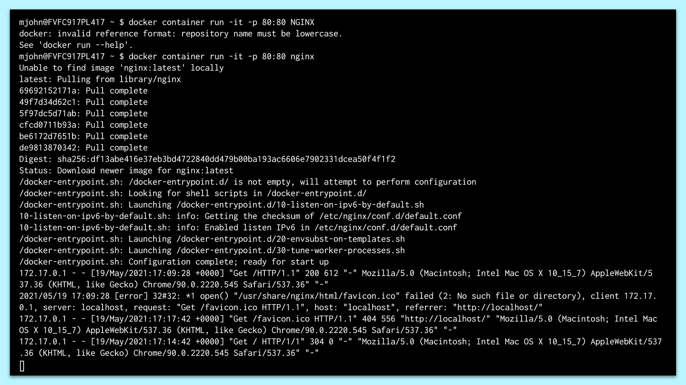
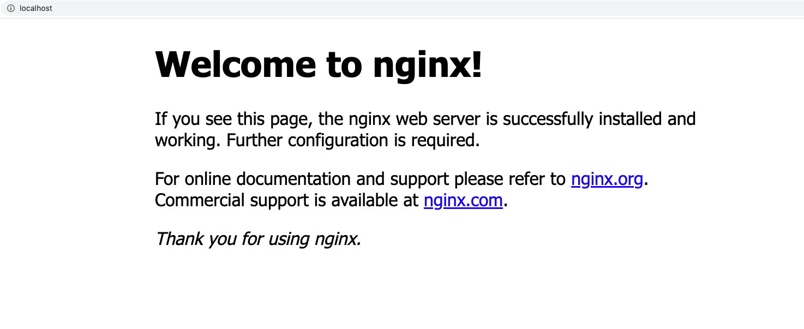
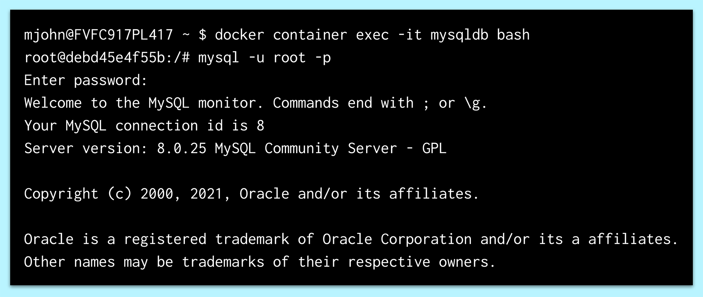
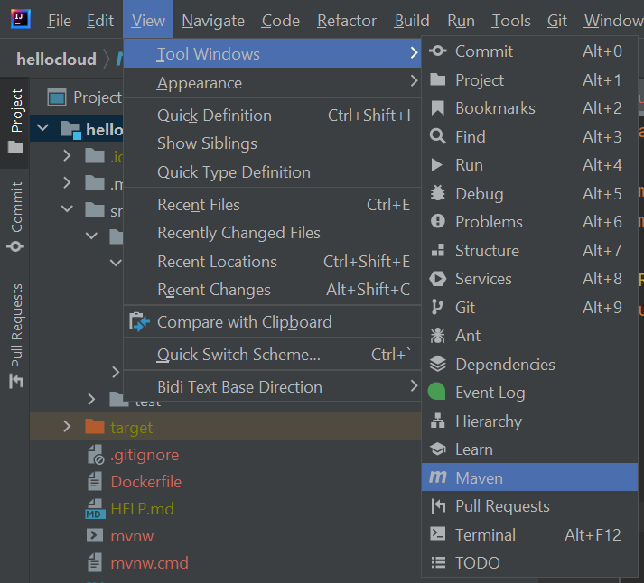
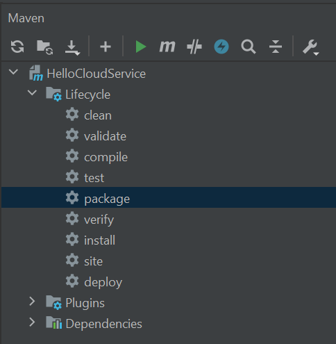
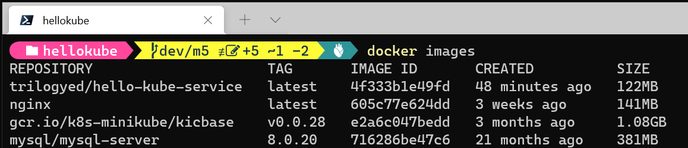
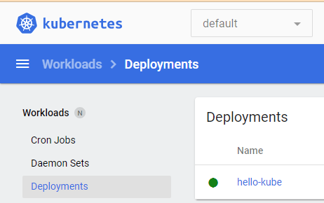
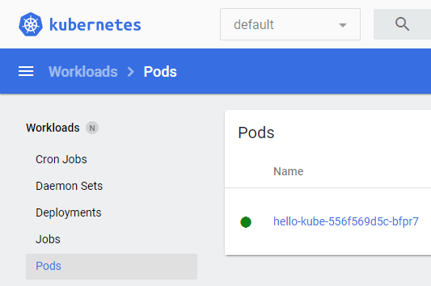

# 5.3-activities

## Student Do: Install Docker Desktop

In this activity, you will install Docker Desktop.

### Instructions for Windows

1. Note that the Windows Subsystem for Linux 2 (WSL2) must be installed before you can install Docker Desktop. To check whether it's installed, open a new admin PowerShell and run the following command:

    ```
    wsl --list --verbose
    ```

2. If the response resembles the following, WSL is installed on your device:

    ```
    NAME          STATE      VERSION
    Ubuntu-20.04  Stopped    2
    ```

3. If you need to install WSL, run the following command in an admin PowerShell:

    ```
    choco install wsl2
    ```

4. To install Docker Desktop, run the following command in an admin PowerShell:

    ```
    choco install docker-desktop
    ```

5. Check whether the installation succeeded by running the following command in PowerShell:

    ```
    docker --version
    ```

6. If the response in the terminal is the currently installed Docker Desktop version, the installation succeeded.

    > **Note:** If you have any problems installing Docker Desktop, refer to the [Install Docker Desktop on Windows](https://docs.docker.com/desktop/windows/install/) page in the Docker documentation.

### Instructions for macOS

1. Go to [Install Docker Desktop on Mac](https://docs.docker.com/docker-for-mac/install/).

2. Select the Mac with Intel Chip or the Mac with Apple Chip button, depending on the microprocessor in your Mac. The `Docker.dmg` file downloads.

    > **Important:** First check the OS version to ensure that a compatible version will download.

3. Double-click the `Docker.dmg` file to start the installation process. Remember to drag the Docker icon into the `Applications` folder.

## We Do: Docker CLI

In this activity, we will use the Docker CLI to run a simple web server in Docker.

Follow along with the instructor throughout the exercise.

### Instructions

1. In the terminal, enter the following command:

    ```
    docker
    ```

2. A long list of the available CLI commands will be displayed in the terminal.

    > **Deep Dive:** For examples of the options for each command, refer to the [Docker (Base Command)](https://docs.docker.com/engine/reference/commandline/docker/) page in the Docker documentation.

3. In the terminal, enter the following command:

    ```
    docker container run -it -p 80:80 nginx
    ```

    Let's break down the preceding command:

    * All Docker commands start with `docker`.

    * `container` specifies that we're creating a container.

    * `run` tells Docker to run a command in a new container.

    * The `-it` is a combination of two options to run in interactive mode:
        * The `-i` (or `--interactive`) option causes the container to run in the foreground in interactive mode. This allows commands to run in the container, even when it's running.
        * The `-t` option stands for `pseudo-tty`, which specifies how Unix will communicate with the terminal.
        * For more information about these options, refer to the [Detached vs. Foreground](https://docs.docker.com/engine/reference/run/#detached-vs-foreground) section in the Docker run reference.

    * The `-p` (or `--publish`) option exposes a port or a range of ports from the container to the host.
        * The first number `80` is the port that's opened on the local machine.
        * The second number `80` is the default port for NGINX, which is the port that's exposed from the container.

    * The name of the image repository, which we call `nginx`, must be lowercase.

4. If the response in the terminal resembles the following image, the container was successfully created:

    

    > In the preceding image, notice that the `docker` command first searched locally for the `nginx` image repository. When it didn't find it, `docker` searched Docker Hub and found it. The `docker` command then pulled it down and stored it on the local device.

    > Note that the image contains the necessary instructions and files to create and run a container with NGINX.

5. To test whether the web server is properly running, open your browser, and then navigate to `localhost:80` or just `localhost`. The default homepage of NGINX should appear, as the following image shows:

    

6. Stop the container that's running by pressing CTRL+C in the terminal that's running the container.

## Student Do: Run Docker App

In the previous activity, we created a Docker container that runs NGINX. In this step, we'll create a container that runs NGINX in the background.

Specifically, we downloaded the `nginx` image from Docker Hub and then created a container from that image to run the NGINX web server. Now, we'll remove that container and develop a new container that runs in the background. This way, we can run the server in the background without it taking over the terminal.

### Instructions

1. In the terminal, run the following command to display the Docker images that are currently stored locally:

    ```
    docker images
    ```

2. You should something similar to the following displayed in the terminal:

    ```
    tvt@FVFJSLDF38283 ~ $ docker images
    REPOSITORY        TAG    IMAGE ID     CREATED             SIZE
    nginx             latest f0b8a9a54136 About an hour ago   133MB
    ```

3. In the terminal, run the following command to list the containers:

    ```
    docker container ls -a
    ```

4. You should something similar to the following displayed in the terminal:

    ```
    tvt@FVFJSLDF38283 ~ $ docker container ls -a
    CONTAINER ID   IMAGE     COMMAND                  CREATED             STATUS                         PORTS     NAMES
    d5982b999803   nginx     "/docker-entrypoint.…"   About an hour ago   Exited (0) 8 minutes ago                 frosty_gagarin
    7c7687dea542   nginx     "/docker-entrypoint.…"   About an hour ago   Created                                  gifted_shannon
    ```

    In the preceding response, notice that one container was created and another one exited. We'll delete the latter container and then create a new one. To do so, we need the first three characters of the container id.

5. In the terminal, run the following command:

    ```
    docker container rm <container_ID_initial_3>
    ```

    In the preceding command, notice that we used the `rm` command to remove the container that has `d59` as the first three characters of its container id.

    > **Pro Tip:** To delete all our containers, we can use the `docker rm $(docker ps -aq)` command.

    Note that if we list the containers again, this one will be missing.

6. Now we'll re-create the NGINX container, but this time, we'll run the container in the background. That is, we'll detach it from the terminal so it won't be able to receive input or display output. This is useful when a process needs to run without taking over a terminal. To do this, run the following command in the terminal:

    ```
    docker container run -d -p 8080:80 --name mynginx nginx
    ```

    Notice that the preceding command has a few modified options. Let's compare and contrast them with our earlier command, as follows:

    * The `-d` option runs the container in detached mode. That is, it detaches the container from the terminal and runs it in the background.

    * We expose the 8080 port on the `localhost`.

    * With the `--name` option, we assign the container a name: `mynginx`.

    * The last option specifies the image, `nginx`, which is still stored from the last pull from Docker Hub.

    Also notice that when this command ran, the container was created in the background.

7. To check whether the container is currently running, we can run the `docker container ls` command, as mentioned earlier. Or, we can run the following shorthand command:

    ```
    docker ps
    ```

8. You should something similar to the following displayed in the terminal:

    ```
    tvt@FVFJSLDF38283 ~ $ docker ps
    CONTAINER ID   IMAGE     COMMAND                  CREATED         STATUS         PORTS                  NAMES
    e92b179dc9bf   nginx     "/docker-entrypoint.…"   4 seconds ago   Up 2 seconds   0.0.0.0:8080->80/tcp   mynginx
    ```

    In the preceding response, notice that the `mynginx` container is currently running. To observe NGINX running in the browser, open the browser, and then navigate to `localhost:8080`.

9. Remove this container by running the following command:

    ```
    docker container rm mynginx -f
    ```

    In the preceding command, note that the `-f` option, which means force, removes the container, even if it's still running.

## Student Do: Run Docker MySQL

In the previous activity, you created a container that runs NGINX in the background. In this activity, you'll run a MySQL database in a container.

> **Important:** Turn off your local MySQL server to avoid possible errors.

### Instructions

1. Run the following command in the terminal, using your own MySQL root password:

    ```
    docker container run -d -p 3306:3306 --name mysqldb --env MYSQL_ROOT_PASSWORD=<password> mysql
    ```

    Notice that the preceding command uses many terms that we previously discussed. We create and run a Docker Container in detached mode. We expose port `3306` both on our `localhost` and in the container. The name of the container is `mysqldb`.

    The next option, `--env`, specifies the `MYSQL_ROOT_PASSWORD` environment variable. We assigned it to our MySQL root password. Finally, we pull the official `mysql` image from Docker Hub.

    > We could check whether the container is properly running with the `docker ps` command. But that wouldn't check whether MySQL was properly installed. So, to test MySQL, we'll navigate into the container and initialize the MySQL shell.

2. To enter the container, run the following command in the terminal:

    ```
    docker container exec -it mysqldb bash
    ```

    Note that the `docker container exec` command executes a command in a running container.

    Also note that the preceding command creates an interactive bash shell inside our container. We'll use this in a moment to create a MySQL shell.

    > **Deep Dive:** For more information about the other options that are available to execute on a running container, refer to [Docker Exec](https://docs.docker.com/engine/reference/commandline/exec/) in the Docker documentation.

3. Now, create a MySQL shell by running the following command:

    ```
    mysql -u root -p
    ```

4. You should something similar to the following displayed in the terminal:

    

    Notice that this response verifies that the MySQL instance is running properly in the container. We can now create tables and add data just as we could for any MySQL instance.

5. To exit the MySQL shell, run the `quit` command.

6. To exit the container, run the `exit` command.

    Now that we verified that the MySQL instance in the container is running properly, we can remove the container and the image.

7. First, let's stop and remove the `mysqldb` container, using these commands, where `<id>` is the first three characters of the container id:

    ```
    docker container stop <id>
    docker container rm <id>
    ```

8. Next, let's remove the image. To do this, note that the command to remove an image resembles the command to remove a container, except that you specify the image id:

    ```
    docker image rm <image id>.
    ```

9. Finally, let's go ahead and remove all the images by running the following command:

    ```
     docker rmi $(docker images -a -q)
    ```

## We Do: Create Docker Image

**Starter & Solved Folders:** [05-we-create-docker-image](https://drive.google.com/file/d/16HYUDpTTvmXcfJBSUdAYyJBlbDMK_Pbo/view?usp=sharing)

In this activity, we will create a Docker image from a Java application.

Follow along with the instructor throughout the exercise.

### Instructions

1. Open the starter project in IntelliJ.

2. Build and run the project.

3. Open a browser and visit `http://localhost:7979`. The service should return the following:

    ```
    "Hello from minikube!"
    ```

4. Stop the project and open the Maven Projects window in IntelliJ.

    * Click the View menu, then the Tool Windows, then Maven.
    
    

5. Expand the Lifecycle node, and double-click the Package node to create a JAR file for the project.

    

6. Add a file named `Dockerfile` to the root of the project.

    * The filename is case sensitive and does not have an extension.

7. Open `Dockerfile`, and enter the following:

   ```
    FROM openjdk:8-jdk-alpine
    ARG JAR_FILE=target/*.jar
    COPY ${JAR_FILE} app.jar
    ENTRYPOINT ["java","-jar","/app.jar"]
   ```

8. Open a terminal, navigate to the folder that contains `Dockerfile`, and enter the following command:

    ```
    docker build -t trilogyed/hello-kube-service .
    ```

9. In the terminal, enter the following command:

    ```
    docker images
    ```

10. The `hello-kube-service` should appear in the list.

11. In the terminal, enter the following command:

    ```
    docker run -d -p 7979:7979 --name hello-kube-service trilogyed/hello-kube-service
    ```

12. Open a browser, and visit `http://localhost:7979`. The service should return the following:

    ```
    "Hello from minikube!"
    ```

## We Do: Docker Hub

In this activity, we will create a repository in Docker Hub and push a Docker image to the repository.

Follow along with the instructor throughout the exercise.

### Instructions

1. Open a browser and visit [Docker Hub](http://localhost:7979).

    * You will need to create a free account if you don't have one already.

2. Log in to Docker Hub, and click Repositories to view your repositories.

3. Click the Create Repository button to create a new repository with the following information:

    * Name = hello-kube-service

    * Description = Demo repository for minikube

    * Visibility = Public

4. Open a terminal, and enter the following command:

    ```
    docker images
    ```

5. You'll see a list with all of your local Docker images displayed.

    

6. Use the image id for the `hello-kube-service` and the name of your Docker Hub repository, and enter the following command:

    ```
    docker tag <imageId> <dockerRepoName>:latest
    ```

    For example:

    ```
    docker tag 4f333b1e49fd someone/hello-kube-service:latest
    ```

7. In the terminal, enter the following command:

    ```
    docker login
    ```

8. You will be prompted to enter your username and password for Docker Hub.
    > It's confusing, but you need to enter your Docker username. For example, if you log in to Docker Hub as someone@nowhere.com, you need to enter your username as someone.

9. In the terminal, enter the following command:

    ```
    docker push someone/hello-kube-service:latest
    ```

10. In your browser,  refresh the page for your repository, and you'll see the image is now visible.

## Student Do: Install minikube

In this activity, you will install minikube.

### Instructions for Windows

1. To install minikube, run the following command in an admin PowerShell:

    ```
    choco install minikube
    ```

2. To start minikube, run the following command in an admin PowerShell:

    ```
    minikube start
    ```

3. To verify that minikube is working, open a new PowerShell and run the following command:

    ```
    kubectl get po -A
    ```

4. You should something similar to the following displayed in the terminal:

    ```
    NAMESPACE              NAME                                         READY   STATUS    RESTARTS      AGE
    kube-system            coredns-78fcd69978-4r6k8                     1/1     Running   0             18m
    kube-system            etcd-minikube                                1/1     Running   0             19m
    kube-system            kube-apiserver-minikube                      1/1     Running   0             19m
    kube-system            kube-controller-manager-minikube             1/1     Running   0             19m
    kube-system            kube-proxy-69s45                             1/1     Running   0             18m
    kube-system            kube-scheduler-minikube                      1/1     Running   0             19m
    kube-system            storage-provisioner                          1/1     Running   1 (18m ago)   19m
    kubernetes-dashboard   dashboard-metrics-scraper-5594458c94-csdh5   1/1     Running   0             12m
    kubernetes-dashboard   kubernetes-dashboard-654cf69797-h5llm        1/1     Running   0             12m
    ```

### Instructions for macOS

1. To install minikube, run the following command in terminal:

    ```
    brew install minikube
    ```

2. To start minikube, run the following command in terminal:

    ```
    minikube start
    ```

3. To verify that minikube is working, open a new terminal and run the following command:

    ```
    kubectl get po -A
    ```

4. You should something similar to the following displayed in the terminal:

    ```
    NAMESPACE              NAME                                         READY   STATUS    RESTARTS      AGE
    kube-system            coredns-78fcd69978-4r6k8                     1/1     Running   0             18m
    kube-system            etcd-minikube                                1/1     Running   0             19m
    kube-system            kube-apiserver-minikube                      1/1     Running   0             19m
    kube-system            kube-controller-manager-minikube             1/1     Running   0             19m
    kube-system            kube-proxy-69s45                             1/1     Running   0             18m
    kube-system            kube-scheduler-minikube                      1/1     Running   0             19m
    kube-system            storage-provisioner                          1/1     Running   1 (18m ago)   19m
    kubernetes-dashboard   dashboard-metrics-scraper-5594458c94-csdh5   1/1     Running   0             12m
    kubernetes-dashboard   kubernetes-dashboard-654cf69797-h5llm        1/1     Running   0             12m
    ```

## We Do: Hello Kube

In this activity, we will create a deployment for the `hello-kube-service` and expose it as service in minikube.

Follow along with the instructor throughout the exercise.

### Instructions

1. Open a new admin terminal, and enter the following command:

    ```
    minikube dashboard
    ```

    * This will launch a browser window with the Kubernetes Dashboard displayed.

2. Open a separate terminal, and enter the following command:

    ```
    kubectl create deployment hello-kube --image=<dockerRepoName> --port=8080
    ```

    For example:

    ```
    kubectl create deployment hello-kube --image=someone/hello-kube-service --port=8080
    ```

3. From the Kubernetes Dashboard:

    * Select Deployments to see the `hello-kube-service` deployment.

        

    * Select Pods to see the pod created for the `hello-kube-service`.

        

4. In the terminal, enter the following commands:

    ```
    kubectl get deployments
    kubectl get pods
    ```

5. To make `hello-kube` visible outside of minikube we need to expose it as a service. In the terminal, enter the following command:

    ```
    kubectl expose deployment hello-kube --type=NodePort --port=7979
    ```

6. Open a new admin terminal, and enter the following command:

    ```
    minikube service hello-kube
    ```

    > You must keep this terminal window open for the web service to be visible from `localhost`.

7. Finally, close both admin terminals. In the remaining terminal enter the following commands:

    ```
    kubectl delete service hello-kube
    kubectl delete deployment hello-kube
    ```

---

© 2021 Trilogy Education Services, a 2U, Inc. brand. All Rights Reserved.
