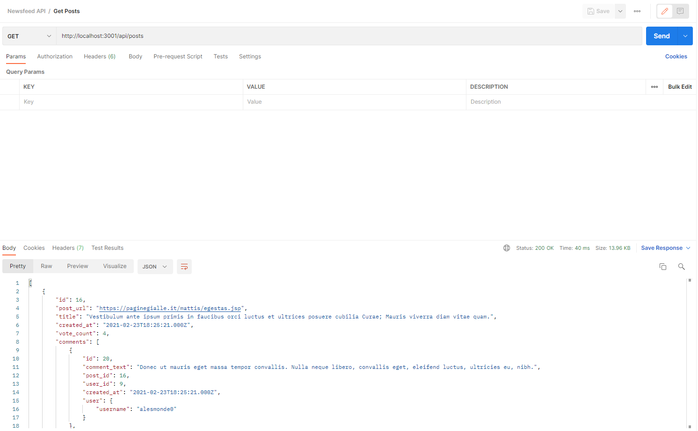

# Newsfeed

## Introduction

In this activity, we will containerize the newsfeed application.

## Overview

To containerize the newsfeed application, we'll follow these steps:

1. Create a `.dockerignore` file.
2. Create a Dockerfile.
2. Build a Docker image.
3. Create a container from the image.

## Instructions

### Create a .dockerignore file

>Point out to students that we can use a `.dockerignore` file to tell Docker to ignore certain files and folders. The `.dockerignore` file uses a format similar to a `.gitignore` file.

Create a new file named `.dockerignore` file in the `app` folder, and update the contents to the following:

```
node_modules
npm-debug.log
.git
.gitignore
```

We want to ignore these files while building a Docker image to both reduce the size of the image and help speed up the build process.

### Create a Dockerfile

Now create a new file named `Dockerfile` in the `app` folder. Remember that Docker will run the instructions in a Dockerfile in order, so we need to pay attention to the order of the instructions.

Now add the first line, which consists of the `FROM` instruction, to the Dockerfile. For this application, we're using Node.js. And, we'll specify the exact version that we want to use in our container, as follows:

```dockerfile
FROM node:14.17.0
```

Next, we want to create a new folder in our container and specify that it's the working directory for our application. To do that, use the `RUN` and `WORKDIR` instructions as follows:

```dockerfile
RUN mkdir -p /usr/src/app
WORKDIR /usr/src/app
```

Next, we want to install our application dependencies by using `npm`. To do that, we first need to copy the `package.json` and `package-lock.json` files to the working directory that we just created. So, add this instruction now, as follows:

```dockerfile
COPY package*.json ./
```

Then add the instruction to run `npm install` to install the dependencies, as follows:

```dockerfile
RUN npm install
```

Next, we want to copy all the files and folders from the source folder and add them to the working directory in the container. So, add that instruction now, and remember to use a period (.) to specify the current folders, as follows:

```dockerfile
COPY . .
```

> **Important:** Make sure there's a space between those two periods!

Next, we use the `EXPOSE` instruction to inform Docker that the container will listen on the specified network port at runtime. For us, that’s 3001, so enter the instruction as follows:

```dockerfile
EXPOSE 3001
```

Finally, we want to run the command to start our application in the container. For that, we use the `CMD` instruction. Note that only one `CMD` instruction can exist in any Dockerfile.

> **Pause:**
>
> **Question:** Why can only one `CMD` instruction exist in a Dockerfile?
>
> **Answer:** Only one `CMD` instruction can exist in a Dockerfile because a container can run only one process. When the process ends, so does the container.

Now, enter the `CMD` instruction as follows:

```dockerfile
CMD ["node", "server.js"]
```

And that's it for our Dockerfile! Here's how the entire Dockerfile should appear:

```dockerfile
FROM node:14.17.0

RUN mkdir -p /usr/src/app
WORKDIR /usr/src/app

COPY package*.json ./
RUN npm install

COPY . .

EXPOSE 3001

CMD ["node", "server.js"]
```

> **Deep Dive:** For more information about Dockerfiles, refer to the [Dockerfile reference](https://docs.docker.com/engine/reference/builder/).

In the next step, we'll use this Dockerfile to create an image.


### Build a Docker Image

In the previous step, we created a Dockerfile for the Newsfeed application. In this step, we'll containerize the Newsfeed application.

Specifically, we'll use the Dockerfile to build an image, create a container from the image, and run the application in the container.

To begin, use the Dockerfile to build an image by running the following command:

```bash
docker image build -t newsfeed-app .
```

Remember the space and the period (.) at the end! Notice that we name this Docker image `newsfeed-app`.

Next, check that the image was created correctly.

> **Hint:** Run the `docker images` command to display all the Docker images.

Now we can use the Docker image to create a container.


### Create a Container from the Docker Image

Next, we'll create a container from the `newsfeed-app` image and run it. Here's the command to create and run the container, but before you run it, we'll go over the command options:

```bash
docker container run -d \
-p 3001:3001 \
--env DB_USER=root \
--env DB_NAME=newsfeed_db \
--env DB_PASSWORD=<YOUR MYSQL PASSWORD> \
--env DB_HOST=<IP ADDRESS OF THE DATABASE CONTAINER> \
--link newsfeed-db:db \
--name=newsfeed-app newsfeed-app
```

In the preceding command, we have the familiar options of setting the port to 3001 and naming the container `newsfeed-app`. However, we use a few new options this time.

We use the `--env` option to set environment variables. Note that these environment variables match the ones in the `.env` file. Therefore, you need to enter your own MySQL root password for `DB_PASSWORD`. And for `DB_HOST`, you need to enter the IP address of the `newsfeed-db` database container that's currently running.

To find the IP address for your database container, run the following command:

```bash
docker inspect newsfeed-db | grep IPAddress
```

Another new option is `--link`. This links to another container. In our case, we link to our `newsfeed-db` database container and refer to it as `db`. We do this so that when our application runs, it will know which database to connect to.

Now it's time to run the `docker container run` command by including your MySQL password and the IP address of your `newsfeed-db` database container. Remember that you can use the backslashes (\\) to break apart the long command.


## Exercising the System

To check whether our application is running correctly from the container, we'll test the routes by using Postman. To do that, open Postman, and then make a `GET` request to any of the API endpoints, such as `localhost:3001/api/posts`. The posts should then display, as the following image shows:



Now take a moment to congratulate yourself for getting both the Newsfeed application and the database to run in containers!

> **Important:** If you get errors while creating the Docker image or container, you can check two items. First, did you delete the `node_modules` folder before building the image? Despite listing `node_modules` in the `.dockerignore` file, it sometimes causes errors. Second, do you have a typo in the Docker command?

We were able to run both our Newsfeed app and our database in containers by creating separate Dockerfiles for them, building Docker images from the Dockerfiles, and then creating Docker containers from the Docker images. However, we used a manual process to do all that. Next, we'll learn a more efficient way that we can accomplish all that&mdash;by using Docker Compose.

---

© 2022 Trilogy Education Services, a 2U, Inc. brand. All Rights Reserved.
