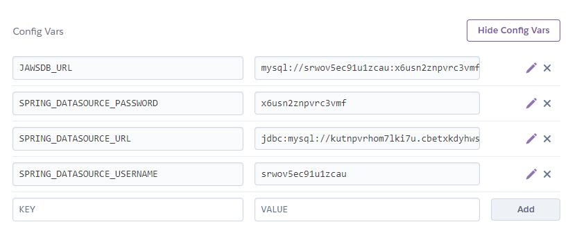

# Deploy RSVP

## Introduction

In this activity, you will deploy the RSVP service to Heroku using a Docker container.

## Instructions

1. Create a new local Git repository, and add the contents of the starter folder to the repository.

2. Open a terminal, navigate to the root of the repository, and enter the following command:

    ```
    heroku login
    ```

    You'll be prompted to press a key to continue. This will launch a browser window and ask for your username and password to log in to Heroku.

3. Once you're logged in successfully, enter the following command to log in to the Heroku Container Registry:

    ```
    heroku container:login
    ```

4. Next, we'll create a Heroku app. Enter the following command:

    ```
    heroku create
    ```

    Heroku will create an application for you with a randomly generated name.

5. When the application is deployed to Heroku, Heroku will assign a port for the application to an environment variable. Open the `application.properties` file, and add the following line at the beginning:

    ```
    server.port=${PORT}
    ```

    We'll need to save the changes and rebuild the `.jar` before continuing.

6. In the terminal, navigate to the `app` directory and run the following command:

    ```
    heroku container:push web
    ```

    >It is important that this command is run from the `app` directory. Otherwise Heroku will not be able to find the Docker image.

    Heroku will use this information to build the Docker image for the application and push that image to the Heroku Container Registry.

7. To make the container available, enter the following command:

    ```
    heroku container:release web
    ```

8. Now we need to make our database available in Heroku. From the terminal, enter the following command to add a MySQL database:

    ```
    heroku addons:create jawsdb
    ```

9. Now, open the [Heroku site](https://www.heroku.com/) and log in to view your dashboard. Navigate to the application that we created previously and select the Settings tab. Click the button labeled Reveal Config Vars to display the configuration variables.

    

    The `JAWSDB_URL` variable is created for you by Heroku when you add the JawsDB. This variable contains the connection string for the database.

    Using the information from `JAWSDB_URL`, create and populate the following configuration variables:

        SPRING_DATASOURCE_URL
        SPRING_DATASOURCE_USERNAME
        SPRING_DATASOURCE_PASSWORD

10. Open SQL Workbench and connect to the JawsDB and execute the following SQL to create the `rsvp` database:

    ```sql
    create schema if not exists rsvp;
    use rsvp;
            
    create table if not exists rsvp (
    rsvp_id int not null auto_increment primary key,
    guest_name varchar(50) not null,
    total_attending int not null
    );

    create schema if not exists rsvp_test;
    use rsvp_test;
            
    create table if not exists rsvp (
    rsvp_id int not null auto_increment primary key,
    guest_name varchar(50) not null,
    total_attending int not null
    );
    ```

11. Now, click the Open App button to view the application in the browser. Navigate to the `/rsvps` route. The output should resemble the following:

    ```
    [{"id":29,"guestName":"John","totalAttending":2},{"id":30,"guestName":"Paul","totalAttending":2},{"id":31,"guestName":"George","totalAttending":1},{"id":32,"guestName":"Ringo","totalAttending":1}]
    ```


---

© 2022 Trilogy Education Services, a 2U, Inc. brand. All Rights Reserved.
