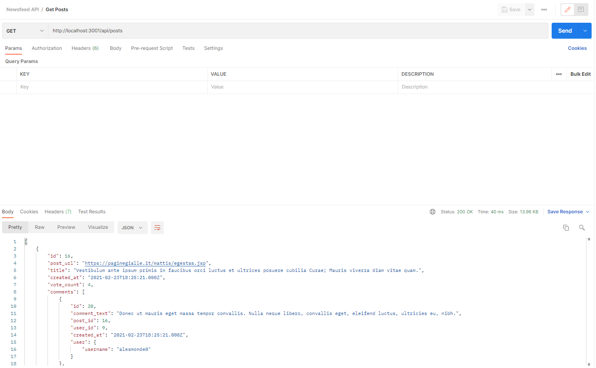
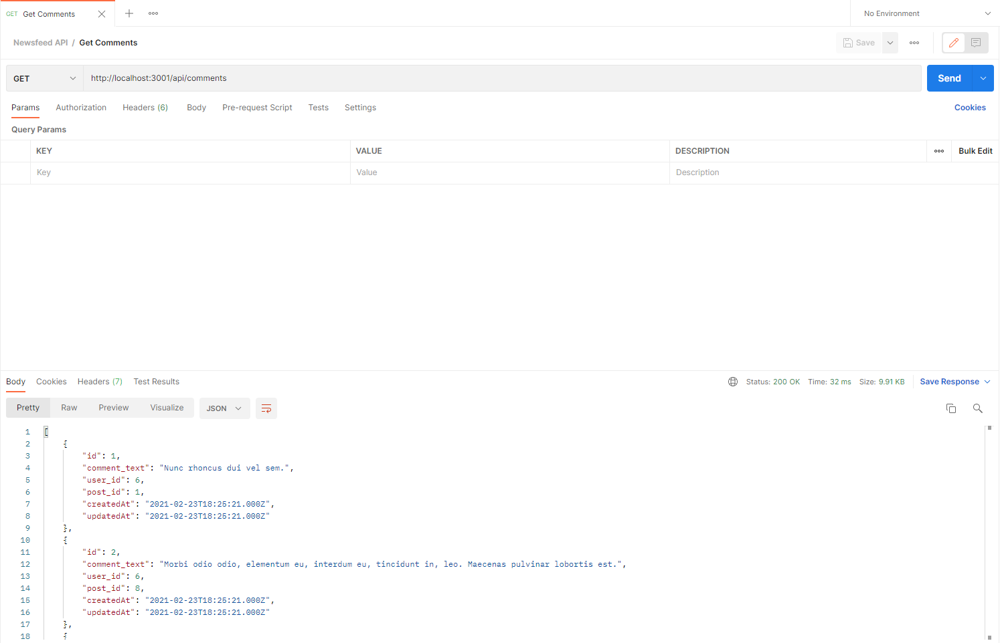

# 6.1-activities

## We Do: Newsfeed DB

**Starter & Solved Folders:** [01-newsfeed-db](https://drive.google.com/file/d/1U6bwLs5yUSWA-V-2Psgphxe2cXPYlKDP/view?usp=sharing)

In this activity, we will containerize the database for the Newsfeed application.

Follow along with the instructor throughout the exercise.

**Instructions:**

### Create a Dockerfile

Open the `db` folder, and examine its contents. Notice a `data` folder that's currently empty. When we run the database in a container later, we'll specify this `data` folder as a custom storage folder. The `backup.sql` file contains the backup data of our database. The `schema.sql` file was previously used to create our database.

In the `db` folder, create a file named `Dockerfile`. The case of the file name is important, and there is no file extension.

Open the Dockerfile, enter the following text in the file, and save the file:

```dockerfile
FROM mysql:8
ENV MYSQL_DATABASE=newsfeed_db
COPY ./backup.sql /docker-entrypoint-initdb.d/
```

A Dockerfile must begin with a `FROM` instruction. It specifies the parent image from which we're building. In this case, the `FROM mysql:8` instruction pulls down the `mysql` version 8 image.

The `ENV` instruction specifies our environment variables. In this case, we use the `MYSQL_DATABASE` variable to hold the database name.

Finally the `COPY` instruction copies new files or folders from the source and adds them to the file system of the container. In this case, we'll copy the `backup.sql` data into the database that will run in the container, which exists at `/docker-entrypoint-initdb.d/`.

In the next step, we'll use this Dockerfile to create an image.


### Build a Docker Image

To build a Docker image from a Dockerfile, we use the `docker image build` command. The command syntax is `docker image build [OPTIONS] PATH`. You need to be in the folder that contains the Dockerfile to run the `docker image build` command.

First, make sure that your Docker daemon is running and that your local MySQL server is stopped. The reason is that this container will use the same port.

Next, at your command line, navigate to the `db` folder that contains the Dockerfile. Then run the following Docker command:

```bash
docker image build -t newsfeed-db .
```

> **Important:** Remember the period (.) at the end of the command. A space and then a period follow `newsfeed-db`.

Let's go over the preceding command. The `-t` (or `--tag`) option names the image and optionally tags it. In this case, we name the image `newsfeed-db`. If we wanted to tag it as version 1, we'd use `-t newsfeed-db:v1`.

The period (.) specifies the `PATH`. This means that the Docker daemon will build the image from the files and folders that exist in the current working directory.

> **Deep Dive:** For more information about how to build a Docker image, refer to [Docker build](https://docs.docker.com/engine/reference/commandline/build/) in the Docker documentation.

Next, we'll check whether the Docker image was successfully created.

Run the command to display all the Docker images. The resulting list should include the `newsfeed-db` image and resemble the following:

```bash
// docker images
REPOSITORY    TAG       IMAGE ID       CREATED          SIZE
newsfeed-db   latest    df798f71b747   52 seconds ago   556MB
```

Now we can use the Docker image to create a container.


### Create a Container from the Docker Image

Now that we're familiar with how to create containers, we need to add a new option to the `docker container run` command: the `--volume` option.

The `--volume` syntax includes three fields but requires only two. The first field is the path to the file or folder on the host machine. Remember that this needs to be the absolute path. The second field is the path to where the file or folder is mounted in the container. A colon (:) separates these two fields. The third, optional field is a comma-separated list of configuration options.

In our case, we'll use only the first two fields. Let's discuss the second field first. We want our local `data` folder to be mounted in the `/var/lib/mysql` custom storage folder in the container, so we'll use that for the second field. For the first field, we need to find the absolute path of our `data` folder. Copy and paste the absolute path into the option so that it resembles the following:

```bash
--volume=/Users/username/newsfeed/db/data:/var/lib/mysql
```

Now add the new option to the `docker container run` command so that it appears as follows:

```bash
docker container run -d -p 3306:3306 \
--env MYSQL_ROOT_PASSWORD=<your password> \
--volume=<your path to the data directory>:/var/lib/mysql \
--name=newsfeed-db newsfeed-db
```

> **Pro Tip:** For readability, we use the backslashes (\\) to break apart long commands.

Let's now go over the preceding command. We're creating a container to run in detached mode. We set the port to 3306 and provide the MySQL password. We mount our `data` folder in the `/var/lib/mysql` folder in the container. We name our container `newsfeed-db`. Finally, we use the `newsfeed-db` image for this container.


## Exercising the System

Next, we'll check whether the container was created and whether it's now running correctly.

Run the Docker command to display all the running Docker containers. In the response, you should observe the `newsfeed-db` container running. This response should resemble the following:

```bash
CONTAINER ID   IMAGE         COMMAND                  CREATED       STATUS       PORTS                                                  NAMES
642e9730f82b   newsfeed-db   "docker-entrypoint.s…"   2 hours ago   Up 2 hours   0.0.0.0:3306->3306/tcp, :::3306->3306/tcp, 33060/tcp   newsfeed-db
```

As mentioned in an earlier lesson, the best way to check whether our database is running correctly in the container is to enter the container and then run a few queries in the MySQL Shell, so let’s do that now.

First, enter the `newsfeed-db` container by running the following command:

```bash
docker container exec -it newsfeed-db bash
```

Once you're in the container, initialize the MySQL Shell, and then enter your MySQL password, as shown here:

```bash
mysql -u root -p
```

Next, run the `show databases;` command. The response should list `newsfeed_db` as a database, as follows:

```bash
mysql> show databases;
+--------------------+
| Database           |
+--------------------+
| information_schema |
| mysql              |
| newsfeed_db        |
| performance_schema |
| sys                |
+--------------------+
5 rows in set (0.01 sec)
```

Next, switch to the `newsfeed_db` database. Then run the `SELECT * FROM user;` query. A list of the users in our database should appear, as follows:

```bash
mysql> SELECT * FROM user;
+----+---------------+---------------------------+--------------------------------------------------------------+
| id | username      | email                     | password                                                     |
+----+---------------+---------------------------+--------------------------------------------------------------+
|  1 | msprague5     | larnout5@imdb.com         | $2b$10$w1ouuW6RqXP8p4B0YGNYsOuZj0g1JdNltxCqCGluzZ0WKXb2qjXxe |
|  2 | djiri4        | gmidgley4@weather.com     | $2b$10$b5WyFpiYxTYy/SfUtB81rOhu0PJ/iK72g7taYDEF/oYChWD/MSnai |
|  3 | iboddam2      | cstoneman2@last.fm        | $2b$10$NPtOvwvJn0u2Gp085rx7PeJTdnXlmkgttA2gUTdJm79CJnXY7yKYO |
|  4 | dstanmer3     | ihellier3@goo.ne.jp       | $2b$10$zHg5QU31/0tTPuxts8.0G.nu1ANnxBmU7td398Jqw4dxMHjPokdDe |
|  5 | mpergens6     | hnapleton6@feedburner.com | $2b$10$SfM7cMiAUxPKPesnHCuvJOknBOPGus7/E1N2VuVES.NOyq5LO0XUm |
|  6 | tpenniell7    | kperigo7@china.com.cn     | $2b$10$JdO4dHlue5aV2xnjmHApsOzoSTlA2XyIaZbOpiZQt/1X0IvR7kTYW |
|  7 | msabbins8     | lmongain8@google.ru       | $2b$10$2z1OFlITXYmgewz56fj6ReMH5AIcgDlVjpz5FAK4o6wtUHr7eDwji |
|  8 | jmacarthur9   | bsteen9@epa.gov           | $2b$10$3xg49SCM3qHNgpf0AnB10eYpO4ga9ZEtnMeDDDCEwTOLylNrD1Xyi |
|  9 | alesmonde0    | nwestnedge0@cbc.ca        | $2b$10$tHU8FVgwIf3Nm8opiw2sDObc65qHPeWqNvAKCjQuT.VfMbGpF75Fq |
| 10 | jwilloughway1 | rmebes1@sogou.com         | $2b$10$bh85ivGtaD5RzEweoQHPjugcgAs7gfzI5kd5fKt3tHu8M4.ex4OJy |
+----+---------------+---------------------------+--------------------------------------------------------------+
10 rows in set (0.00 sec)
```

This confirms that our database is running correctly in a container with all the data inside.

Now quit the MySQL Shell and exit the container.

## We Do: Newsfeed

**Starter & Solved Folders:** [02-newsfeed](https://drive.google.com/file/d/1QRlLQWpl0XnWa_UuD90REd9qYRm6KY3w/view?usp=sharing)

In this activity, we will containerize the Newsfeed application.

Follow along with the instructor throughout the exercise.

**Instructions:**

### Create a .dockerignore file

>A `.dockerignore` file tells Docker to ignore certain files and folders. The `.dockerignore` file uses a format similar to a `.gitignore` file.

Create a new file named `.dockerignore` file in the `app` folder, and update the contents to the following:

```
node_modules
npm-debug.log
.git
.gitignore
```

We want to ignore these files while building a Docker image to both reduce the size of the image and help speed up the build process.

### Create a Dockerfile

Now create a new file named `Dockerfile` in the `app` folder . Remember that Docker will run the instructions in a Dockerfile in order, so we need to pay attention to the order of the instructions.

Now add the first line, which consists of the `FROM` instruction, to the Dockerfile. For this application, we're using Node.js. We'll specify the exact version that we want to use in our container, as follows:

```dockerfile
FROM node:14.17.0
```

Next, we want to create a new folder in our container and specify that it's the working directory for our application. To do that, use the `RUN` and `WORKDIR` instructions as follows:

```dockerfile
RUN mkdir -p /usr/src/app
WORKDIR /usr/src/app
```

Next, we want to install our application dependencies by using `npm`. To do that, we first need to copy the `package.json` and `package-lock.json` files to the working directory that we just created. Add this instruction now, as follows:

```dockerfile
COPY package*.json ./
```

Then add the instruction to run `npm install` to install the dependencies, as follows:

```dockerfile
RUN npm install
```

Next, we want to copy all the files and folders from the source folder and add them to the working directory in the container. Add that instruction now, and remember to use a period (.) to specify the current folders, as follows:

```dockerfile
COPY . .
```

> **Important:** Use a space between those two periods!

Next, we use the `EXPOSE` instruction to inform Docker that the container will listen on the specified network port at runtime. For us, that’s 3001, so enter the instruction as follows:

```dockerfile
EXPOSE 3001
```

Finally, we want to run the command to start our application in the container. For that, we use the `CMD` instruction. Note that only one `CMD` instruction can exist in any Dockerfile.

Now enter the `CMD` instruction as follows:

```dockerfile
CMD ["node", "server.js"]
```

And that's it for our Dockerfile! Here's how the entire Dockerfile should appear:

```dockerfile
FROM node:14.17.0

RUN mkdir -p /usr/src/app
WORKDIR /usr/src/app

COPY package*.json ./
RUN npm install

COPY . .

EXPOSE 3001

CMD ["node", "server.js"]
```

> **Deep Dive:** For more information about Dockerfiles, refer to the [Dockerfile reference](https://docs.docker.com/engine/reference/builder/).

In the next step, we'll use this Dockerfile to create an image.


### Build a Docker Image

In the previous step, we created a Dockerfile for the Newsfeed application. In this step, we'll containerize the Newsfeed application.

Specifically, we'll use the Dockerfile to build an image, create a container from the image, and run the application in the container.

To begin, use the Dockerfile to build an image by running the following command:

```bash
docker image build -t newsfeed-app .
```

Remember the space and the period (.) at the end! Notice that we name this Docker image `newsfeed-app`.

Next, check that the image was created correctly.

> **Hint:** Run the `docker images` command to display all the Docker images.

Now we can use the Docker image to create a container.


### Create a Container from the Docker Image

Next, we'll create a container from the `newsfeed-app` image and run it. Here's the command to create and run the container, but before you run it, we'll go over the command options:

```bash
docker container run -d \
-p 3001:3001 \
--env DB_USER=root \
--env DB_NAME=newsfeed_db \
--env DB_PASSWORD=<YOUR MYSQL PASSWORD> \
--env DB_HOST=<IP ADDRESS OF THE DATABASE CONTAINER> \
--link newsfeed-db:db \
--name=newsfeed-app newsfeed-app
```

In the preceding command, we have the familiar options of setting the port to 3001 and naming the container `newsfeed-app`. However, we use a few new options this time.

We use the `--env` option to set environment variables. Note that these environment variables match the ones in the `.env` file. Therefore, you need to enter your own MySQL root password for `DB_PASSWORD`. And for `DB_HOST`, you need to enter the IP address of the `newsfeed-db` database container that's currently running .

To find the IP address for your database container, run the following command:

```bash
docker inspect newsfeed-db | grep IPAddress
```

Another new option is `--link`. This links to another container. In our case, we link to our `newsfeed-db` database container and refer to it as `db`. We do this so that when our application runs, it will know which database to connect to.

Now, it's time to run the `docker container run` command by including your MySQL password and the IP address of your `newsfeed-db` database container. Remember that you can use the backslashes (\\) to break apart the long command.


## Exercising the System

To check whether our application is running correctly from the container, we'll test the routes using Postman. To do that, open Postman, and then make a `GET` request to any of the API endpoints, such as `localhost:3001/api/posts`. The posts should then be displayed, as shown in the following image:



Now take a moment to congratulate yourself for getting both the Newsfeed application and the database to run in containers!

> **Important:** If you get errors while creating the Docker image or container, you can check two items. First, did you delete the `node_modules` folder before building the image? Despite listing `node_modules` in the `.dockerignore` file, it sometimes causes errors. Second, do you have a typo in the Docker command?

We were able to run both our Newsfeed app and our database in containers by creating separate Dockerfiles for them, building Docker images from the Dockerfiles, and then creating Docker containers from the Docker images. However, we used a manual process to do all that. Next, we'll learn a more efficient way that we can accomplish all that&mdash;by using Docker Compose.


## Student Do: RSVP DB

**Starter & Solved Folders:** [03-rsvp-db](https://drive.google.com/file/d/1X1MryLUOYnaY6VHd68Wz0rpnWWDQG61L/view?usp=sharing)

In this activity, you will containerize the database for the RSVP service.

**Instructions:**

1. Create a Dockerfile in the `db` folder that does the following:
    - Uses the `mysql` image
    - Sets the `MYSQL_DATABASE` environment variable to `rsvp`
    - Copies the `backup.sql` script


2. From the command line, build a Docker image with the tag of `rsvp-db` using the Dockerfile you created in the previous step.

3. From the command line, display all Docker images, and verify that the `rsvp-db` image was created.

4. Create a Docker network to make it easier for containers to communicate:

```bash
docker network create rsvpnetwork
```

5. Update the following command with the correct information, and then run it to create a container from the Docker image:

```bash
docker container run -d -p 3306:3306 \
--env MYSQL_ROOT_PASSWORD=<your password> \
--volume=<your path to the data directory>:/var/lib/mysql \
--network=rsvpnetwork --name=mysql-db rsvp-db
```

6. From the command line, run the Docker command to display all the running containers, and verify that `rsvp-db` is running.

7. From the command line, enter the `mysql-db` container by running the following command:

```bash
docker container exec -it mysql-db bash
```

8. Once you're in the container, initialize the MySQL Shell, and then enter your MySQL password, as follows:

```bash
mysql -u root -p
```

9. From the MySQL Shell, run the `show databases;` command. The response should list `rsvp` as a database, as follows:

```bash
mysql> show databases;
+--------------------+
| Database           |
+--------------------+
| information_schema |
| mysql              |
| rsvp               |
| performance_schema |
| sys                |
+--------------------+
5 rows in set (0.01 sec)
```

10. Next, switch to the `rsvp` database. Then run the `SELECT * FROM rsvp;` query. A list of the users in our database should appear, as follows:

```bash
mysql> SELECT * FROM rsvp;
+---------+------------+-----------------+
| rsvp_id | guest_name | total_attending |
+---------+------------+-----------------+
|       1 | John       |               2 |
|       2 | Paul       |               2 |
|       3 | George     |               1 |
|       4 | Ringo      |               1 |
+---------+------------+-----------------+
4 rows in set (0.00 sec)
```

This confirms that our database is running correctly in a container with all the data inside.

11. Now quit the MySQL Shell and exit the container.

## Student Do: RSVP

**Starter & Solved Folders:** [04-rsvp](https://drive.google.com/file/d/1qx6H6GnXJxekZhk_uX74K_dqFJTiv8tj/view?usp=sharing)

In this activity, we will containerize the RSVP service.

**Instructions:**

1. Update the `application.properties` file to change the connection string to resemble the following:

    ```
    spring.datasource.url: jdbc:mysql://mysql-db:3306/rsvp?useSSL=false&serverTimezone=UTC&createDatabaseIfNotExist=true&allowPublicKeyRetrieval=true
    ```

    >Notice that we are using the container name of `mysql-db` instead of `localhost` for the connection string.

2. Create a Dockerfile in the `app` folder that does the following:
    - Uses the `openjdk:8-jdk-alpine` image
    - Copies the `.jar` file for the service

3. From the command line, build a Docker image with the tag of `rsvp-service` using the Dockerfile you created in the previous step.

4. From the command line, display all Docker images, and verify that the `rsvp-service` image was created.

5. From the command line, create and run a container from the Docker image using the following command:

    ```bash
    docker run -d -p 8080:8080 --network=rsvpnetwork --name rsvp-service rsvp-service
    ```

6. To check whether our application is running correctly from the container, browse to [http://localhost:8080/rsvps](http://localhost:8080/rsvps). The output should resemble the following:

    ```
    [{"id":29,"guestName":"John","totalAttending":2},{"id":30,"guestName":"Paul","totalAttending":2},{"id":31,"guestName":"George","totalAttending":1},{"id":32,"guestName":"Ringo","totalAttending":1}]
    ```

## We Do: Hello Heroku

**Starter Folder:**[05-hello-heroku](https://drive.google.com/file/d/1ROa1IagE6G5IJLlk5lQwt-szC0hQPqo0/view?usp=sharing)

In this activity, we'll create a a simple REST service and deploy it to Heroku.

Follow along with the instructor throughout the exercise.

**Instructions:**

1. Go to the Spring Initializr (http://start.spring.io).

2. Create a new project:

   * Set ```Group``` to ```com.trilogyed```. 
   
   * Set ```Artifact``` to ```hello-heroku```. 
   
   * Set ```Name``` to ```HelloHeroku```. 

   * Set ```Package name``` to ```com.trilogyed.hello.heroku```. 

   * Set ```Java``` to ```8```. 

3. Add the ```Spring Web``` starter dependency.

4. Unzip the project template into a directory that is not in a Git repository.

5. Create a new Java class called `com.trilogyed.hello.heroku.controller.HelloHerokuController`.

   - Add code to the controller so it resembles the following:

      ```java
        package com.trilogyed.hello.heroku.controller;

        import org.springframework.web.bind.annotation.GetMapping;
        import org.springframework.web.bind.annotation.RestController;

        @RestController
        public class HelloHerokuController {

            @GetMapping(value = "/hello")
            public String helloHeroku(){
                return "Hello, Heroku!";
            }
        }
      ```

6. Navigate to the starter project directory, and run the following commands to create a local Git repository:

    ```
    git init
    git add .
    git commit -m "initial commit"
    ```

7. From the command line, run the following command to log in to Heroku:

    ```
    heroku login
    ```

8. From the command line, run the following command to create a Heroku app:

    ```
    heroku create
    ```

    The output should resemble the following:
    ```
    Creating app... done, ⬢ serene-taiga-24346
    https://serene-taiga-24346.herokuapp.com/ | https://git.heroku.com/serene-taiga-24346.git
    ```

9. From the command line, run the following command to deploy the Heroku app:

    ```
    git push heroku main
    ```

10. From the command line, run the following command to open the Heroku app in your browser:

    ```
    heroku open
    ```

11. Browse to the `/hello` route; the output should resemble the following:
    ```
    Hello, Heroku!
    ```

## We Do: Compose Newsfeed

**Starter & Solved Folders:** [06-compose-newsfeed](https://drive.google.com/file/d/1-rW3G8aZos7ksmz-WZiiOKxPusgOk_WK/view?usp=sharing)

In this activity, you will create, configure, and run a Spring Cloud Config Server.

Follow along with the instructor throughout the exercise.

**Instructions:**

1. Make sure to stop both `newsfeed` containers, if they are still running. From the command line, enter the following commands:

    ```bash
    docker container stop newsfeed-db
    docker container stop newsfeed-app
    ```

2. Next, in IntelliJ, open the Newsfeed application. In the `app` folder, create a new file, and name it `docker-compose.yml`.

3. Open `docker-compose.yml`. At the beginning of the file, specify the version of the Compose file format. Use version 3, as follows:

    ```yaml
    version: '3'
    ```

4. Update the `.env` file with the correct values for the `newsfeed` database.

5. Next, we'll add the service definitions. A **service definition** specifies a service and then lists the configuration items that are applied to each container started for that service.

    We'll start with the database. The reason is that we need the database to be created and started before the application. In the Compose file, starting on a new line after the Compose file format version, add the following service definition:

    ```yaml
    services:
      db:
        image: newsfeed-db
        environment:
          MYSQL_ROOT_PASSWORD: ${DB_PASSWORD}
          MYSQL_DATABASE: ${DB_NAME}
        restart: always
        ports:
          - '3306:3306'
        volumes:
          - <Absolute path to data directory>:/var/lib/mysql
    ```

    We'll now go over this service definition line by line. Take note of how much it resembles the set of command-line options that we use with the `docker run` command.

    > **Note:** As with the SAM template in an earlier module, we need to pay attention to the indentation. Because it's a `YAML` file, the Compose file is white-space dependent.

    The service definition specifies that we're calling the `db` database container and then lists all its configuration items. First, we list the Docker image on which we base this container. That's the `newsfeed-db` image that we already created.

    Next come the environment variables. We have only two variables: `MYSQL_ROOT_PASSWORD` and `MYSQL_DATABASE`. Instead of hardcoding the password and the database name in the Compose file, we take advantage of the `.env` file, which already has that information. Furthermore, hardcoding any credentials in Dockerfiles or Compose files would pose a security risk. We use string interpolation to assign the `DB_PASSWORD` and `DB_NAME` values from our `.env` file to the environment variables in the Compose file.

    Next, we set the restart policy to `always`. This means that the container will continue trying to restart after being stopped for any reason.

    We then map the ports to 3306.

    Finally, we need to bind-mount a volume. Notice that we use the same syntax that we used for the `--volume` option in the `docker container run` command earlier in the module. Replace `<Absolute path to data directory>` with the absolute path to your `data` directory.

6. Now we can define the application service. To do that, add the following service definition after the `db` service definition:

    ```yaml
      app:
        image: newsfeed-app
        restart: always
        ports:
          - '3001:3001'
        environment:
          DB_PASSWORD: ${DB_PASSWORD}
          DB_DATABASE: ${DB_NAME}
          DB_USER: ${DB_USER}
          DB_HOST: db
        depends_on:
          - db
    ```

    Make sure that `app` is indented and aligned with `db` under `services`.

    We'll now go over this service definition line by line.

    We're calling the `app` application container and then listing all its configuration items. First, we specify the Docker image, which is `newsfeed-app`.

    We set the restart policy to `always` and map the ports to 3001.

    Next come the environment variables. Recall that we have four environment variables for our application to correctly connect to the database. They're the same variables that we used earlier with the `docker container run` command. The only difference is that `DB_HOST` now references the `db` container that we just defined. Because the `.env` file already has these variables, we use string interpolation to assign them to these environment variables.

    Finally, `depends_on` expresses the dependency between services. Our app depends on the database being up and running. This is similar to the way that we used the `--link` option at the command line earlier.

7. A Compose file resembles the `docker container run` set of command-line options that we used to build the containers. Here's the complete `docker-compose.yml` file:

    ```yaml
    version: '3'
    services:
      db:
        image: newsfeed-db
        environment:
          MYSQL_ROOT_PASSWORD: ${DB_PASSWORD}
          MYSQL_DATABASE: ${DB_NAME}
        restart: always
        ports:
          - '3306:3306'
        volumes:
          - <Absolute path to data directory>:/var/lib/mysql
      app:
        image: newsfeed-app
        restart: always
        ports:
          - '3001:3001'
        environment:
          DB_PASSWORD: ${DB_PASSWORD}
          DB_DATABASE: ${DB_NAME}
          DB_USER: ${DB_USER}
          DB_HOST: db
        depends_on:
          - db
    ```

    > **Deep Dive:** For more information about Docker Compose, refer to the [Compose file version 3 reference](https://docs.docker.com/compose/compose-file/compose-file-v3/) in the Docker documentation.

8. Now we can create and run both containers in one step! To do that, at your command line, run the following command:

    ```bash
    docker compose up -d
    ```

    > **Pro Tip:** With the `-d` option, the new Docker containers will start and run in the background.

    The preceding command creates both containers and gives them generic names, like `app_db_1` and `app_app_1`. In your console, you can observe that the application is up and running. Let's test the routes again using Postman.

    > **Note:** Docker will create both the app and db containers at the same time. The app container will try to connect to the db container. Until the db container has finished initializing you may see errors from the app container. This is expected. The app will continue trying to connect until the db container is available.

9. Open Postman, and then make a `GET` request to any of the API endpoints, like `localhost:3001/api/comments`. The comments should then be displayed, as the following image shows:

    

    The Newsfeed application and the database are now both running in containers, and we needed only one command to make that happen!

10. Press CTRL+C to stop the containers.

## Student Do: Compose RSVP

**Starter & Solved Folders:** [06-compose-rsvp](https://drive.google.com/file/d/1LCJZZxCh3eq3Sh9SBPU7w-iI--EWvNYO/view?usp=sharing)

In this activity, you will create, configure, and run a Spring Cloud Config Server.


**Instructions:**

1. Make sure to stop both newsfeed containers, if they are still running. From the command line, enter the following commands:

    ```bash
    docker container stop rsvp-service
    docker container stop rsvp-db
    ```

2. Next, in IntelliJ, open the RSVP service application. In the `app` folder, create a new file, and name it `docker-compose.yml`.

3. Open `docker-compose.yml`. At the beginning of the file, specify the version of the Compose file format. Use version 3, as follows:

    ```yaml
    version: '3'
    ```

4. Update the `.env` file with the correct values for the `rsvp` database.

5. Next, you'll add the service definition for the database. The service definition should resemble the following:

    ```yaml
    services:
        db:
            image: rsvp-db
            environment:
            MYSQL_ROOT_PASSWORD: ${DB_PASSWORD}
            MYSQL_DATABASE: ${DB_NAME}
            restart: always
            ports:
            - '3306:3306'
            volumes:
            - <Absolute path to data directory>:/var/lib/mysql
            networks:
            - rsvpnetwork
    ```

6. Now we can define the application service. To do that, add the following service definition after the `db` service definition:

    ```yaml
        app:
            image: rsvp-service
            restart: always
            ports:
            - '8080:8080'
            environment:
            SPRING_DATASOURCE_URL: jdbc:mysql://db:3306/rsvp?useSSL=false&serverTimezone=UTC&createDatabaseIfNotExist=true&allowPublicKeyRetrieval=true
            depends_on:
            - db
            networks:
            - rsvpnetwork
    ```

7. Next, we can define the network the containers will use to communicate. To do that, add the following definition after the service definitions:

    ```yaml
    networks:
    rsvpnetwork:
        driver: bridge
    ```

8. A Compose file resembles the `docker container run` set of command-line options that we used to build the containers. Here's the complete `docker-compose.yml` file:

    ```yaml
    version: '3'

    services:
    db:
        image: rsvp-db
        environment:
        MYSQL_ROOT_PASSWORD: ${DB_PASSWORD}
        MYSQL_DATABASE: ${DB_NAME}
        restart: always
        ports:
        - '3306:3306'
        volumes:
        - <Absolute path to data directory>:/var/lib/mysql
        networks:
        - rsvpnetwork

    app:
        image: rsvp-service
        restart: always
        ports:
        - '8080:8080'
        environment:
        SPRING_DATASOURCE_URL: jdbc:mysql://db:3306/rsvp?useSSL=false&serverTimezone=UTC&createDatabaseIfNotExist=true&allowPublicKeyRetrieval=true
        depends_on:
        - db
        networks:
        - rsvpnetwork

    networks:
    rsvpnetwork:
        driver: bridge
    ```


9. Now we can create and run the containers all in one step! To do that, at your command line, run the following command:

    ```bash
    docker compose up -d
    ```

10. To check whether our application is running correctly from the container, browse to [http://localhost:8080/rsvps](http://localhost:8080/rsvps). The output should resemble the following:

    ```
    [{"id":29,"guestName":"John","totalAttending":2},{"id":30,"guestName":"Paul","totalAttending":2},{"id":31,"guestName":"George","totalAttending":1},{"id":32,"guestName":"Ringo","totalAttending":1}]
    ```

11. Press CTRL+C to stop the containers.


## We Do: Deploy RSVP

**Starter & Solved Folders:** [07-deploy-rsvp](https://drive.google.com/file/d/1bie1YjOxu2oIQxktncnd273WlkHcUyAY/view?usp=sharing)

In this activity, you will create, configure, and run a Spring Cloud Config Server.

Follow along with the instructor throughout the exercise.

**Instructions:**

1. Create a new local Git repository, and add the contents of the starter folder to the repository.

2. Open a terminal, navigate to the root of the repository, and enter the following command:

    ```
    heroku login
    ```

    You'll be prompted to press a key to continue. This will launch a browser window and ask for your username and password to log in to Heroku.

3. Once you're logged in successfully, enter the following command to log in to the Heroku Container Registry:

    ```
    heroku container:login
    ```

4. Next, we'll create a Heroku app. Enter the following command:

    ```
    heroku create
    ```

    Heroku will create an application for you with a randomly generated name.

5. When the application is deployed to Heroku, Heroku will assign a port for the application to an environment variable. Open up the `application.properties` file, and add the following line at the beginning:

    ```
    server.port=${PORT}
    ```

    We'll need to save the changes and rebuild the `.jar` before continuing.

6. In the terminal, navigate to the `app` directory, and run the following command:

    ```
    heroku container:push web
    ```

    >It is important that this command is run from the `app` directory. Otherwise Heroku will not be able to find the Docker image.

    Heroku will use this information to build the Docker image for the application and push that image to the Heroku Container Registry.

7. To make the container available, enter the following command:

    ```
    heroku container:release web
    ```

8. Now we need to make our database available in Heroku. From the terminal, enter the following command to add a MySQL database:

    ```
    heroku addons:create jawsdb
    ```

9. Now open the [Heroku site](https://www.heroku.com/), and log in to view your dashboard. Navigate to the application that we created previously, and select the Settings tab. Click the button labeled Reveal Config Vars to display the configuration variables, as shown next:

    

    The `JAWSDB_URL` variable is created for you by Heroku when you add the JawsDB. This variable contains the connection string for the database.

    Using the information from `JAWSDB_URL`, create and populate the following configuration variables:

        SPRING_DATASOURCE_URL
        SPRING_DATASOURCE_USERNAME
        SPRING_DATASOURCE_PASSWORD

10. Open SQL Workbench and connect to the JawsDB and execute the following SQL to create the `rsvp` database:

    ```sql
    create schema if not exists rsvp;
    use rsvp;
            
    create table if not exists rsvp (
    rsvp_id int not null auto_increment primary key,
    guest_name varchar(50) not null,
    total_attending int not null
    );

    create schema if not exists rsvp_test;
    use rsvp_test;
            
    create table if not exists rsvp (
    rsvp_id int not null auto_increment primary key,
    guest_name varchar(50) not null,
    total_attending int not null
    );
    ```

11. Now, click the Open App button to view the application in the browser. Navigate to the `/rsvps` route. The output should resemble the following:

    ```
    [{"id":29,"guestName":"John","totalAttending":2},{"id":30,"guestName":"Paul","totalAttending":2},{"id":31,"guestName":"George","totalAttending":1},{"id":32,"guestName":"Ringo","totalAttending":1}]
    ```

---

© 2022 Trilogy Education Services, a 2U, Inc. brand. All Rights Reserved.
