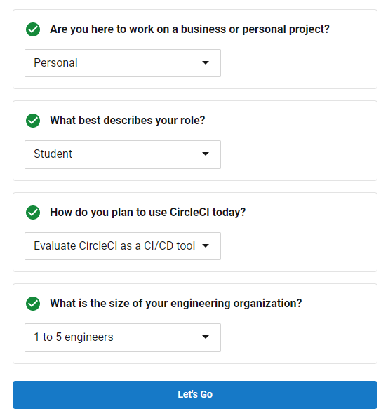
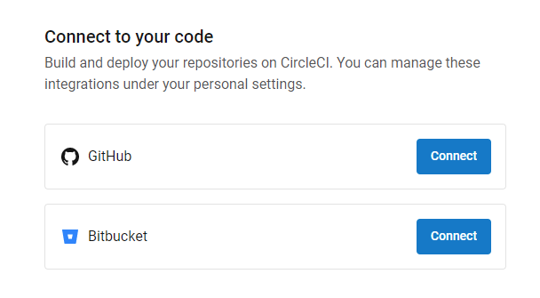
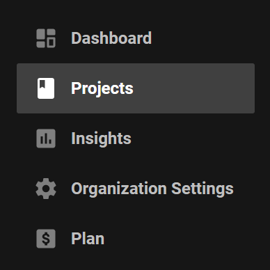
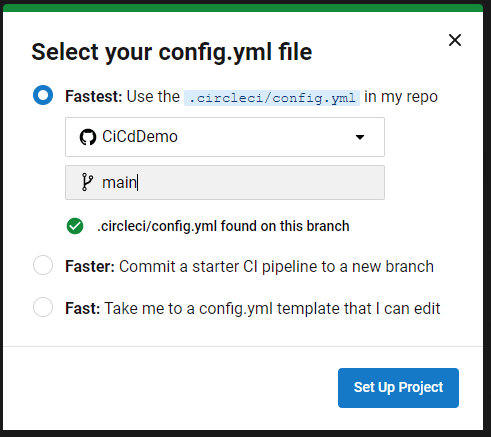

# 6.2-activities

## Student Do: Investigate CI

In this activity, you will research to answer questions about CI.

**Instructions:**

1. Research to answer the following questions about CI:

    - What is CI?
    - Why do we use it?
    - What is the goal?
    - What are the pros and cons?
    - What examples are out there?

**Note** Be prepared to discuss your answers.

## Student Do: Investigate CD

In this activity, you will research to answer questions about CD.

**Instructions:**

1. Research to answer the following questions about CD:

    - What is CD?
    - Why do we use it?
    - What is the goal?
    - What are the pros and cons?
    - What examples are out there?

**Note** Be prepared to discuss your answers.

## We Do: Hello Circle

**Starter & Solved Folders:** [03-hello-circle](https://drive.google.com/file/d/1yuaop_yOWLqoxVcvSHqrXijOQLh2ES6x/view?usp=sharing)

In this activity, we will start creating a simple CI/CD pipeline using CircleCI.

Follow along with the instructor throughout the exercise.

**Instructions:**

### Step 1 - Create GitHub Repo

1. Login to [GitHub](https://github.com/) and create a new public repo named `CiCdDemo`.

2. Clone the new repo locally.

### Step 2 - Create Project

1. Go to the Spring Initializr (http://start.spring.io).

2. Create a new project:

   * Set ```Group``` to ```com.trilogyed```

   * Set ```Artifact``` to ```hello-circle```

   * Set ```Name``` to ```HelloCircle``` 

   * Set ```Package name``` to ```com.trilogyed.hellocircle```

   * Set ```Java``` to ```8``` 

3. Add the following dependencies:

   * ```Spring Web [WEB]```

4. Click `Generate` to download the zipped project.

5. Unzip the project and add the files to the local CiCdDemo repo.

6. Open the `hello-circle` project in IntelliJ, create a new class called `com.trilogyed.hellocircle.controller.HelloCircleController` and add the following code to this class:

    ```java
    @RestController
    public class HelloCircleController {

    @GetMapping(value = "/hello")
        public String helloCircle(){
            return "Hello, Circle!";
        }
    }
    ```

8. Save your changes and commit them to the local CiCdDemo repo.

9. Push your changes to the remote CiCdDemo repo.

### Step 3 - Config.yml

Now, we have a simple REST web service and we've added the code to a repo.

>Remember, the goal with CI is that we want our code to build and run our tests everytime that we commit changes.

There are two parts to setup CircleCI:
- Tell CircleCI about our repo
- Tell CircleCI what to do when it detects a change

In this activity we'll focus on telling CircleCI what to do when it detects a change.

1. Add a new folder called `.circleci` to the root of your local repo.

2. Add new file called `config.yml` to the `.circleci` folder.

**Note:** The indentation in a .yml file is very important. It needs to be consistent throughout the file in order to work correctly.

3. First, we identify which version of CircleCI we are using. Add the following text to the `config.yml`:
   ```
    # Use the latest 2.1 version of CircleCI pipeline process engine.
    # See: https://circleci.com/docs/2.0/configuration-reference
    version: 2.1
   ```

4. Next, we define a job called `build-and-test`. Add the following text to the `config.yml`:
   ```
    # Define a job to be invoked later in a workflow.
    # See: https://circleci.com/docs/2.0/configuration-reference/#jobs
    jobs:
    # Below is the definition of your job to build and test your app, you can rename and customize it as you want.
    build-and-test:
   ```

5. The first thing we'll do in the `build-and-test` job is set the working directory. Add the following text to the `config.yml`:
   ```
        working_directory: ~/CiCdDemo/hello-circle
   ```

6. The next thing we'll do is tell CircleCI to start with a Java image. Add the following text to the `config.yml`:
   ```
        # These next lines define a Docker executor: https://circleci.com/docs/2.0/executor-types/
        # You can specify an image from Dockerhub or use one of our Convenience Images from CircleCI's Developer Hub.
        # Be sure to update the Docker image tag below to openjdk version of your application.
        # A list of available CircleCI Docker Convenience Images are available here: https://circleci.com/developer/images/image/cimg/openjdk
        docker:
        - image: cimg/openjdk:8.0
   ```

7. Now, we'll define the steps in the `build-and-test` job. Add the following text to the `config.yml`:
   ```
        # Add steps to the job
        # See: https://circleci.com/docs/2.0/configuration-reference/#steps
        steps:
        # Checkout the code as the first step.
        - checkout:
            path: ~/CiCdDemo
        # Use mvn clean and package as the standard maven build phase
        - run:
            name: Build
            command: mvn -B -DskipTests clean package
        # Then run your tests!
        - run:
            name: Test
            command: mvn test
   ```

8. Finally, we'll define a workflow called `sample` to run the `build-and-test` job. Add the following text to the `config.yml`:
   ```
    # Invoke jobs via workflows
    # See: https://circleci.com/docs/2.0/configuration-reference/#workflows
    workflows:
    sample: # This is the name of the workflow, feel free to change it to better match your workflow.
        # Inside the workflow, you define the jobs you want to run.
        jobs:
        - build-and-test
   ```

9. Save your changes and commit them to the local CiCdDemo repo.

10. Push your changes to the remote CiCdDemo repo.

**Note:** There is a completed `config.yml` file in the `starter` folder that you can use.

The completed `config.yml` file should resemble the following:

   ```
    # Use the latest 2.1 version of CircleCI pipeline process engine.
    # See: https://circleci.com/docs/2.0/configuration-reference
    version: 2.1

    # Define a job to be invoked later in a workflow.
    # See: https://circleci.com/docs/2.0/configuration-reference/#jobs
    jobs:
    # Below is the definition of your job to build and test your app, you can rename and customize it as you want.
    build-and-test:
        working_directory: ~/CiCdDemo/hello-circle

        # These next lines define a Docker executor: https://circleci.com/docs/2.0/executor-types/
        # You can specify an image from Dockerhub or use one of our Convenience Images from CircleCI's Developer Hub.
        # Be sure to update the Docker image tag below to openjdk version of your application.
        # A list of available CircleCI Docker Convenience Images are available here: https://circleci.com/developer/images/image/cimg/openjdk
        docker:
        - image: cimg/openjdk:8.0
        # Add steps to the job
        # See: https://circleci.com/docs/2.0/configuration-reference/#steps
        steps:
        # Checkout the code as the first step.
        - checkout:
            path: ~/CiCdDemo
        # Use mvn clean and package as the standard maven build phase
        - run:
            name: Build
            command: mvn -B -DskipTests clean package
        # Then run your tests!
        - run:
            name: Test
            command: mvn test

    # Invoke jobs via workflows
    # See: https://circleci.com/docs/2.0/configuration-reference/#workflows
    workflows:
    sample: # This is the name of the workflow, feel free to change it to better match your workflow.
        # Inside the workflow, you define the jobs you want to run.
        jobs:
        - build-and-test
   ```

## We Do: Hello Circle 2

In this activity, we will finish creating a simple CI/CD pipeline using CircleCI.

Follow along with the instructor throughout the exercise.

**Instructions:**

### Step 1 - Setup CircleCI

1. If you do not have a CircleCI account, open [https://circleci.com/signup/](https://circleci.com/signup/) and sign up for a free CircleCI account.

2. You'll need to answer a quick survey about how you use CircleCI:

   

3. You'll be prompted to connect your code:

   

4. Select GitHub and allow CircleCI to access your repositories.

5. You may also need to select `GitHub` as your organization.

### Step 2 - Set Up Project

1. Login to [CircleCI](https://circleci.com/).

2. From the menu, navigate to the `Projects` tab.



3. From the list of projects, select the CiCdDemo project and click the `Set Up Project` button.



4. Select the `CiCdDemo` repository and the `main` branch. The green checkmark indicates that the `config.yml` file is found.

5. There are two ways to view the pipeline for the `CiCdDemo` project:

    - From the `Projects` tab, click on the the `CiCdDemo` project name
    - From the `Dashboard` tab, filter by project to only show `CiCdDemo`

## We Do: Hello Circle 3

**Starter & Solved Folders:** [05-hello-circle-3](https://drive.google.com/file/d/19FGmhhuqr92j3HOM6baMKxUpoIOlmglN/view?usp=sharing)

In this activity, we will commit code changes to trigger a simple CI/CD pipeline using CircleCI.

Follow along with the instructor throughout the exercise.

**Instructions:**

1. Log in to [CircleCI](https://circleci.com/) and navigate to the `CiCdDemo` pipeline.
   - Keep this browser window open as we make changes so we can view the pipeline run.

2. Open the `hello-circle` project in IntelliJ, edit the `com.trilogyed.hellocircle.controller.HelloCircleControllerTest` class, and add the following test:

    ```java
    @Test
    public void shouldReturnAnswer() throws Exception {
        // arrange and act
        mockMvc.perform(get("/answer"))
                .andDo(print())
                .andExpect(status().isOk())

                // assert
                .andExpect(content().string("The answer is 42!"));
    }
    ```

3. Save your changes and commit them to the local CiCdDemo repo.

4. Push your changes to the remote CiCdDemo repo.

5. In the browser window for the `CiCdDemo` pipeline, the pipeline will run and fail because the test fails.

6. In IntelliJ, edit the `com.trilogyed.hellocircle.controller.HelloCircleController` class, and add the following endpoint:

    ```java
    @GetMapping(value = "/answer")
    public String getAnswer(){
        return "The answer is 42!";
    }
    ```

7. Save your changes and commit them to the local CiCdDemo repo.

8. Push your changes to the remote CiCdDemo repo.

9. In the browser window for the `CiCdDemo` pipeline, the pipeline will run and complete successfully because all of the tests now pass.

## Student Do: Month Converter

**Starter & Solved Folders:** [06-month-converter](https://drive.google.com/file/d/1kjqRlXIG258nfarzswj7HfkFVPo1bT4_/view?usp=sharing)

In this activity, we will create a simple CI/CD pipeline using CircleCI.

**Instructions:**

1. Create a new public repo named `MonthCiCd`.

2. Clone the new repo locally.

3. Add the starter files to the local MonthCiCd repo, commit, and push the changes to the remote MonthCiCd repo.

4. Add a new folder called `.circleci` to the root of your local repo.

5. Add new file called `config.yml` to the `.circleci` folder.

6. Update the `config.yml` to do the following:

    - create a Java image
    - build the MonthConverter application
    - test the MonthConverter application

7. Save your changes and commit them to the local MonthCiCd repo.

8. Push your changes to the remote MonthCiCd repo.

9. Login to [CircleCI](https://circleci.com/).
   - Keep this browser window open as we make changes so we can view the pipeline run.

10. Setup the CircleCI project for MonthCiCd

11. Open the `MonthConverter` project in IntelliJ, edit the `com.example.controller.MonthControllerTests` class, and add the following tests:

    ```java
    @Test
    public void shouldReturnMonthAbbreviationOnValidGetRequest() throws Exception {
        String outputJson = "Sep";

        mockMvc.perform(
                        get("/monthAbbreviation/9")
                                .contentType(MediaType.APPLICATION_JSON)
                )
                .andDo(print())
                .andExpect(status().isOk())
                .andExpect(content().string(outputJson));
    }

    @Test
    public void shouldReturn422ForInvalidMonthAbbreviationId() throws Exception {
        mockMvc.perform(
                        get("/monthAbbreviation/999")
                                .contentType(MediaType.APPLICATION_JSON)
                )
                .andDo(print())
                .andExpect(status().isUnprocessableEntity());
    }
    ```

12. Save your changes and commit them to the local MonthCiCd repo.

13. Push your changes to the remote MonthCiCd repo.

14. In the browser window for the `MonthCiCd` pipeline, the pipeline will run and fail because the tests fail.

15. In IntelliJ, edit the `com.example.controller.MonthController` class, and add the following endpoint:

    ```java
    @RequestMapping(value="/monthAbbreviation/{monthNumber}", method=RequestMethod.GET)
    @ResponseStatus(value = HttpStatus.OK)
    public String getMonthAbbreviation(@PathVariable String monthNumber) {

        switch (monthNumber) {
            case "1":
                return "Jan";
            case "2":
                return "Feb";
            case "3":
                return "Mar";
            case "4":
                return "Apr";
            case "5":
                return "May";
            case "6":
                return "Jun";
            case "7":
                return "Jul";
            case "8":
                return "Aug";
            case "9":
                return "Sep";
            case "10":
                return "Oct";
            case "11":
                return "Nov";
            case "12":
                return "Dec";
            default:
                throw new ResponseStatusException(HttpStatus.UNPROCESSABLE_ENTITY, "Invalid Month Number Specified");
        }
    }
    ```

16. Save your changes and commit them to the local MonthCiCd repo.

17. Push your changes to the remote MonthCiCd repo.

18. In the browser window for the `MonthCiCd` pipeline, the pipeline will run and complete successfully because all of the tests now pass.

---

© 2021 Trilogy Education Services, a 2U, Inc. brand. All Rights Reserved.