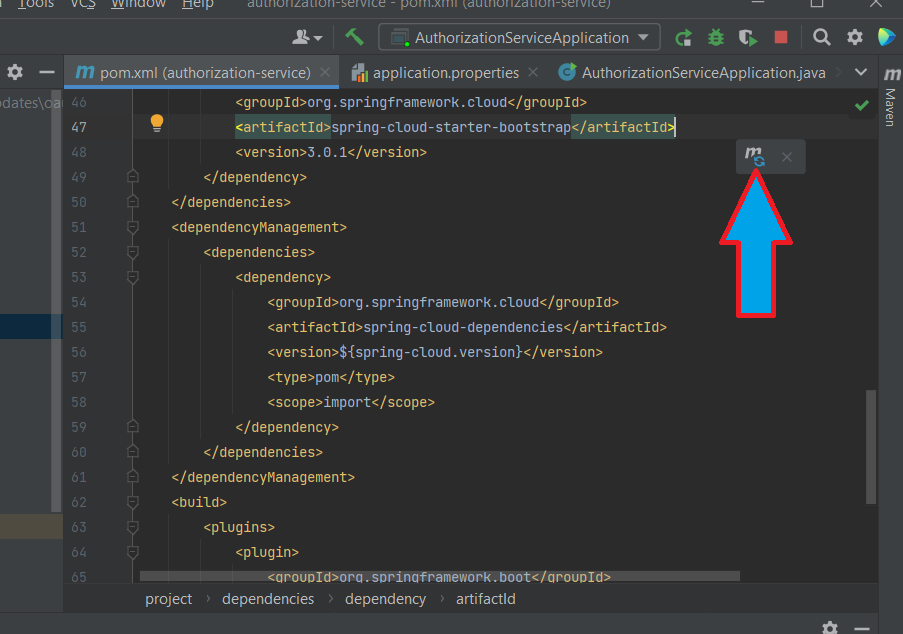
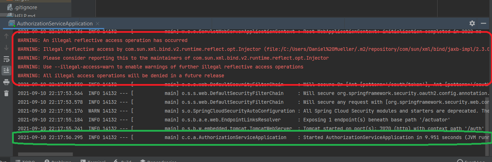
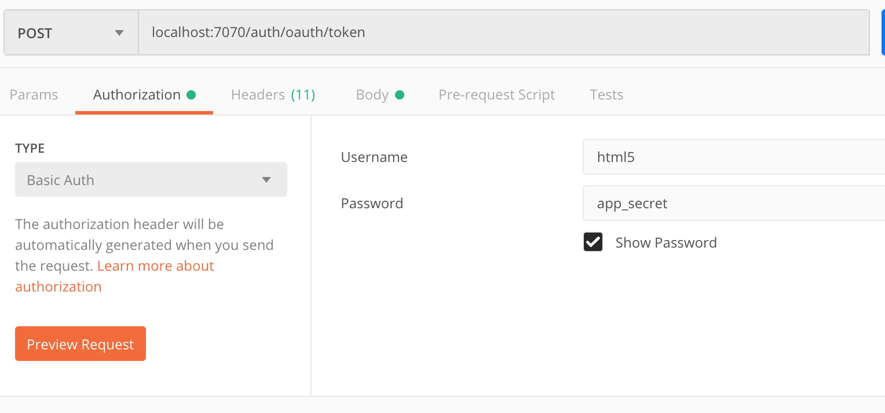
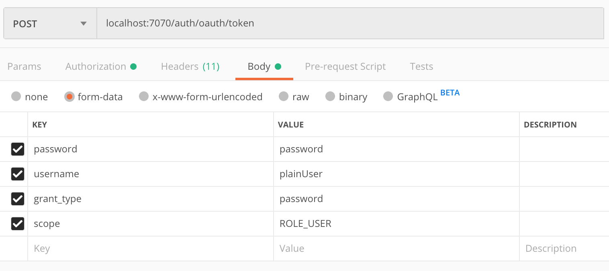
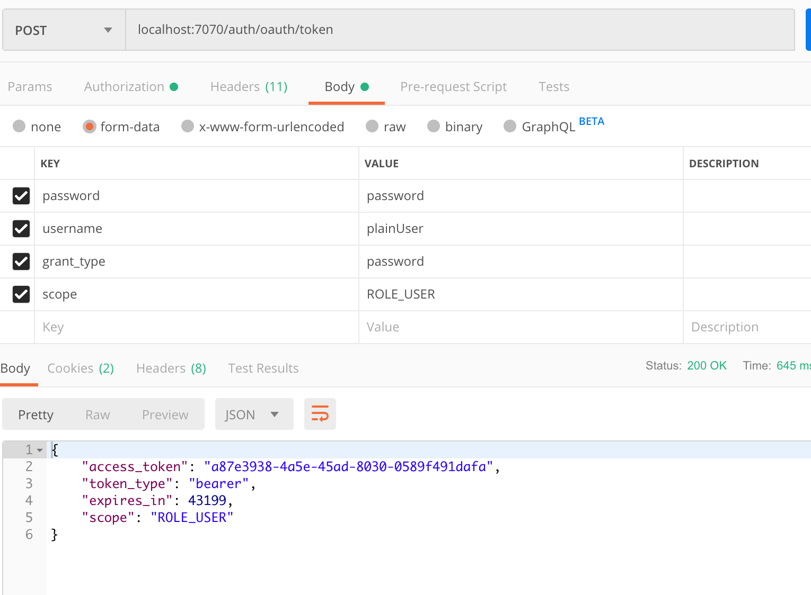
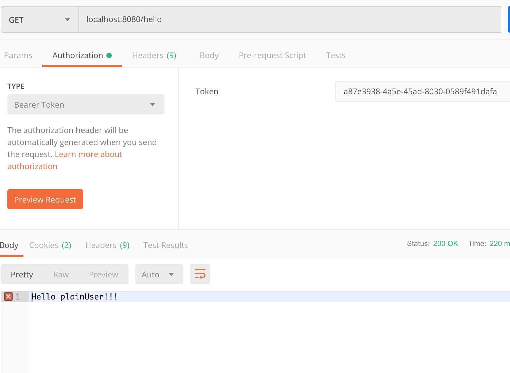
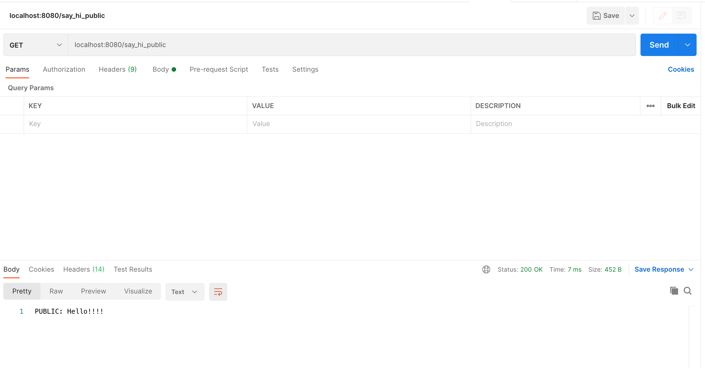
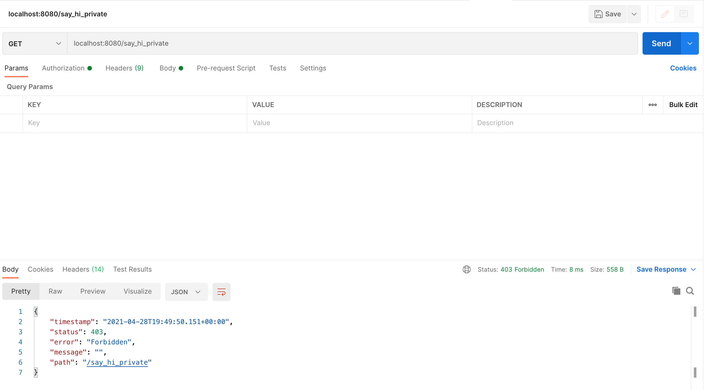
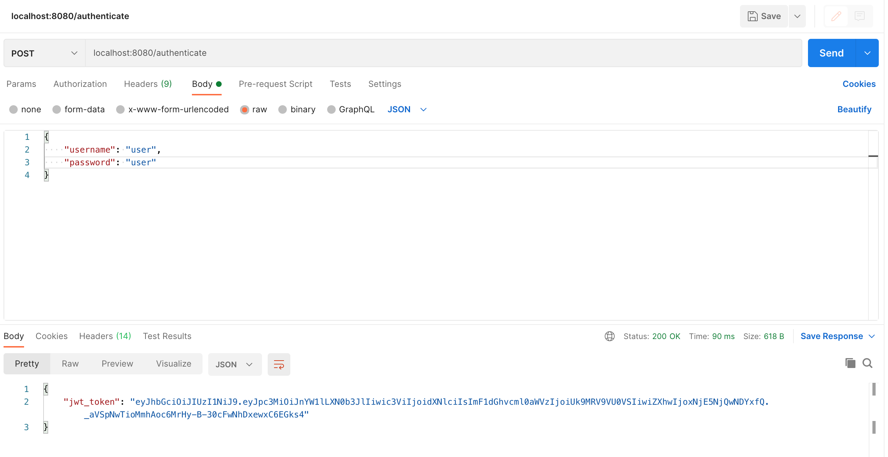
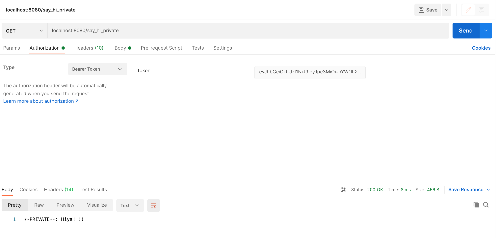

# 6.3-activities

## Student Do: OAuth Tutorial

**Solved Folder:** [01-oauth-tutorial](https://drive.google.com/file/d/1eysrQX5J-0hjFGtnJVwl2y_RJgRCClB0/view?usp=sharing)

In this activity, you will create an OAuth authorization server that issues tokens for users contained in a Spring Security schema. The `OAuth` token will then be used by a client to access a separate service. That service then validates the given token with the Authorization Server before granting access.

**Instructions:**

### Step 1: Create the Authorization Server Project

Step 1 is to create the Authorization Server.  We'll use the Spring Initializr to create our project. Go to ```start.spring.io```, and enter the following information:

- Group = com.company
- Artifact = authorization-service
- Dependencies = Spring Web, JDBC API, MySQL Driver

Download the project, copy it into your working directory, and open the project in IntelliJ.

Because support for OAuth development by the Spring Framework team has changed recently, we need to make a few changes to the `POM`.

In the `<properties>` section, add `<spring-cloud.version>2020.0.3</spring-cloud.version>` so that it looks like this:
```xml
	<properties>
		<java.version>1.8</java.version>
		<spring-cloud.version>2020.0.3</spring-cloud.version>
	</properties>
```
Change the version of the parent project to 2.5.14 so that it looks like this:
```xml
	<parent>
		<groupId>org.springframework.boot</groupId>
		<artifactId>spring-boot-starter-parent</artifactId>
		<version>2.5.14</version>
		<relativePath/> <!-- lookup parent from repository -->
	</parent>
```
Also, add the following dependencies in the `<dependencies>` section:
```xml
		<dependency>
			<groupId>org.springframework.cloud</groupId>
			<artifactId>spring-cloud-starter-oauth2</artifactId>
			<version>2.2.4.RELEASE</version>
		</dependency>
		<dependency>
			<groupId>org.springframework.cloud</groupId>
			<artifactId>spring-cloud-starter-bootstrap</artifactId>
			<version>3.0.1</version>
		</dependency>
```

Finally, between the `<dependencies>` section and the `<build>` section, add a `<dependencyManagement>` block like the following snippet. (This is required because we're using Spring Cloud libraries.)
```xml
    </dependencies>
	<dependencyManagement>
		<dependencies>
			<dependency>
				<groupId>org.springframework.cloud</groupId>
				<artifactId>spring-cloud-dependencies</artifactId>
				<version>${spring-cloud.version}</version>
				<type>pom</type>
				<scope>import</scope>
			</dependency>
		</dependencies>
	</dependencyManagement>
    <build>
```

You will not need to copy the `</dependencies>` tag or the `<build>` tag from the previous code. They are there so you will know where to put the `<dependencyManagement>` block.

**Note:** Do NOT put the `<dependencyManagement>` block *within* the existing `<dependencies>` block. It belongs *after* the existing `<dependencies>` block.

Be sure to click the Maven refresh icon so that the dependencies are updated in your project.




### Step 2: Create Spring Security Schema

We will use the default schema supplied by Spring Security. For details on this schema and how it works, see the Spring Security tutorial.

The following script creates the schema and the tables that hold users and authorities and populates the tables with test users and authorities. Open MySQL Workbench, and run the following script:

```sql
create schema if not exists auth_server;
use auth_server;

create table if not exists users(
	username varchar(50) not null primary key,
	password varchar(100) not null,
	enabled boolean not null
);

create table if not exists authorities (
	username varchar(50) not null,
	authority varchar(50) not null,
	constraint fk_authorities_users foreign key(username) references users(username)
);

create unique index ix_auth_username on authorities (username,authority);

insert into users (username, password, enabled) values ('plainUser', '$2a$10$KxTc8SYbIB/IaXCWz6NA4ug1pkAYM/e.P.0YQFGE3Ua4FZ6Qf842a', true);
insert into users (username, password, enabled) values ('managerUser', '$2a$10$QPnaeWBWz1BdDglni2CLzO2YMeifVXtQDPgUOVNETTcj8cEGwqiym', true);
insert into users (username, password, enabled) values ('adminUser', '$2a$10$Hc878CPLJ4hOtwyzt6V7..LHtzhcR3zqcXOAPseY9QGg05ZxcsTR6', true);

insert into authorities (username, authority) values ('plainUser', 'ROLE_USER');
insert into authorities (username, authority) values ('managerUser', 'ROLE_USER');
insert into authorities (username, authority) values ('managerUser', 'ROLE_MANAGER');
insert into authorities (username, authority) values ('adminUser', 'ROLE_USER');
insert into authorities (username, authority) values ('adminUser', 'ROLE_MANAGER');
insert into authorities (username, authority) values ('adminUser', 'ROLE_ADMIN');
```

At this point, we also need to configure the datasource so our server can talk to the database. Open the ```application.properties``` file, and add the following: 
```
spring.datasource.url: jdbc:mysql://localhost:3306/auth_server?useSSL=false&serverTimezone=UTC&allowPublicKeyRetrieval=true
spring.datasource.username: root
spring.datasource.password: rootroot

server.port=7070
security.sessions=never
server.servlet.context-path=/auth
```
**Note about Server Time Zone Configuration**

If the `serverTimezone=UTC` does not work on your machine, it may be necessary to change UTC to a more specific time zone setting based on your location. For example, `serverTimezone=US/Central` is valid syntax for Central Time. One of these three options should work:
- `US/Eastern`
- `US/Mountain`
- `US/Pacific`

Lastly, omitting the time zone from the datasource URL altogether should also be considered when troubleshooting.

Some items to note about the `application.properties` entries:

* The JDBC entries are standard.
* We're setting the port of the server to 7070.
* We're indicating that we don't want to use sessions.
* We've indicated that the context path for this application should be ```/auth```. This means that all endpoint paths for the application will be prepended with ```/auth```.


### Step 3: Add @EnableResourceServer Annotation

Now we will add the `@EnableResourceServer` annotation to the `AuthorizationServiceApplication` class, as shown in the next snippet. This enables the resource server features for this application.

```java
@SpringBootApplication
@EnableResourceServer
public class AuthorizationServiceApplication {

	public static void main(String[] args) {
		SpringApplication.run(AuthorizationServiceApplication.class, args);
	}
}
```

### Step 4: Configure the Authentication Manager for the Authorization Server

Next, we will configure the Authorization Server to use the security schema created in the previous step. Create a new Java class called ```com.company.authorizationservice.SecurityConfig```, and add the following code:

**Note:** A few DataSource classes are available. Use `javax.sql.DataSource`.

```java
@Configuration
@EnableWebSecurity
public class SecurityConfig extends WebSecurityConfigurerAdapter {

    @Autowired
    DataSource dataSource;

    @Autowired
    public void configAuthentication(AuthenticationManagerBuilder authBuilder) throws Exception {

        PasswordEncoder encoder = new BCryptPasswordEncoder();

        authBuilder.jdbcAuthentication()
                .dataSource(dataSource)
                .usersByUsernameQuery(
          "select username, password, enabled from users where username = ?")
                .authoritiesByUsernameQuery(
          "select username, authority from authorities where username = ?")
                .passwordEncoder(encoder);

    }

    @Bean
    public BCryptPasswordEncoder passwordEncoder() {
        return new BCryptPasswordEncoder();
    }

    @Bean
    @Override
    public AuthenticationManager authenticationManagerBean() throws Exception {
        AuthenticationManager am = super.authenticationManagerBean();
        return am;
    }
}
```

Some items to note about this code:

* The `dataSource` and `configureAuthentication` are identical to the configuration used in the Spring Security tutorial. See that tutorial for details.
* We expose the password encoder and Authentication Manager as beans so they can be used to configure the Authorization Server clients and endpoints.

### Step 5: Configure the Authorization Server Clients and Endpoints

Now we will configure the Authorization Server itself. This will be done in two steps:

1. Configure the OAuth clients.
1. Configure the endpoints.

#### **5.1 Configure OAuth Clients**

Now we will configure the OAuth clients that the Authorization Service will accept. Create a new Java class called `com.company.authorizationservice.OAuthConfig`, and add the following code:

```java
@Configuration
@EnableAuthorizationServer
public class OAuthConfig  extends AuthorizationServerConfigurerAdapter {

    @Override
    public void configure(ClientDetailsServiceConfigurer clients) throws Exception {

        clients.inMemory()
                .withClient("html5")
                .authorizedGrantTypes("password")
                .scopes("ROLE_USER", "ROLE_MANAGER", "ROLE_ADMIN")
                .secret("$2a$10$0Mf57EA3kipR1ej14v/tpeZ5UvV7kmcym57hfztwF79seJc.ulnHS");
    }
}
```

In this code, we register one client called ```html5``` with the Authorization Server. We configure this client with the following attributes:

* Because this is a configuration class, we must annotate it with ```@Configuration```.
* We use the ```@EnableAuthorizationServer``` annotation to turn on the Authorization Server features.
* This client is allowed to use the OAuth 2 ```password``` flow. 
* This client is given the ```ROLE_USER```, ```ROLE_MANAGER```, and ```ROLE_ADMIN``` authorities.
* The client has a secret (this is somewhat like a password) with the value of ```app_secret``` that is hashed using BCrypt.

#### **5.2 Configure Endpoints**

Endpoints are also configured in the `OAuthConfig` class created in the previous step.  Modify your `OAuthConfig` class so it looks like this:

```java
@Configuration
@EnableAuthorizationServer
public class OAuthConfig  extends AuthorizationServerConfigurerAdapter {

    private AuthenticationManager authenticationManager;

    @Autowired
    public OAuthConfig(AuthenticationManager authenticationManager) {
        this.authenticationManager = authenticationManager;
    }

    @Override
    public void configure(ClientDetailsServiceConfigurer clients) throws Exception {

        clients.inMemory()
                .withClient("html5")
                .authorizedGrantTypes("password")
                .scopes("ROLE_USER", "ROLE_MANAGER", "ROLE_ADMIN")
                .secret("$2a$10$0Mf57EA3kipR1ej14v/tpeZ5UvV7kmcym57hfztwF79seJc.ulnHS");
    }

    @Override
    public void configure(AuthorizationServerEndpointsConfigurer endpoints) throws Exception {
        endpoints.authenticationManager(this.authenticationManager);
    }
}
```

Some items to note about this code:

* We inject the `AuthenticationManger` that we created and exposed as a bean earlier.
* We pass the injected `AuthenticationManager` to our endpoints configuration so that the Authentication Manager can be used to protect the endpoints of the Authorization Server.

### Step 6: Create User Information Endpoint for Authorization Server

Now we need to create an endpoint on the Authorization Server where client applications (like oauth-greeter) can validate their tokens and get the user data associated with the token. Create a new Java class called ```com.company.authorizationservice.controller.UserInfoController```, and add the following code:

**Note:** More than one `Principal` class is available. Use `java.security.Principal`.

```java
@RestController
public class UserInfoController {

    @RequestMapping(value = "/userinfo", method = RequestMethod.GET)
    public Principal getUserInfo(Principal principal) {
        System.out.println("CALLED userinfo");
        return principal;
    }
}

```

Things to note about this code:

* This is a simple REST endpoint.
* Spring Security will inject the `Principal` associated with the token.
* The endpoint returns the `Principal`.

### Step 7: Create the oath-greeter Project

Now that the Authorization Server is created, we will create a simple web service that uses it.

We'll use the Spring Initializr to create our project. Go to ```start.spring.io```, and enter the following information:

- Group = com.company
- Artifact = oauth-greeter
- Dependencies = Spring Web

Download the project, copy it into your working directory, and open the project in IntelliJ.

Just as with the authorization-server project, we need to make some updates to the `POM`.

In the `<properties>` section, add `<spring-cloud.version>2020.0.3</spring-cloud.version>` so that it looks like this:
```xml
	<properties>
		<java.version>1.8</java.version>
		<spring-cloud.version>2020.0.3</spring-cloud.version>
	</properties>
```
Change the version of the parent project to 2.5.14 so that it looks like this:
```xml
	<parent>
		<groupId>org.springframework.boot</groupId>
		<artifactId>spring-boot-starter-parent</artifactId>
		<version>2.5.14</version>
		<relativePath/> <!-- lookup parent from repository -->
	</parent>
```
Also, add the following dependencies in the `<dependencies>` section:
```xml
		<dependency>
			<groupId>org.springframework.cloud</groupId>
			<artifactId>spring-cloud-starter-oauth2</artifactId>
			<version>2.2.4.RELEASE</version>
		</dependency>
		<dependency>
			<groupId>org.springframework.cloud</groupId>
			<artifactId>spring-cloud-starter-bootstrap</artifactId>
			<version>3.0.1</version>
		</dependency>
```
Finally, between the `<dependencies>` section and the `<build>` section, add a `<dependencyManagement>` block like the following snippet. (This is required because we're using Spring Cloud libraries.)
```xml
    </dependencies>
	<dependencyManagement>
		<dependencies>
			<dependency>
				<groupId>org.springframework.cloud</groupId>
				<artifactId>spring-cloud-dependencies</artifactId>
				<version>${spring-cloud.version}</version>
				<type>pom</type>
				<scope>import</scope>
			</dependency>
		</dependencies>
	</dependencyManagement>
    <build>
```

You will not need to copy the `</dependencies>` tag or the `<build>` tag from the previous code. They are there so you will know where to put the `<dependencyManagement>` block.

**Note:** Do NOT put the `<dependencyManagement>` block *within* the existing `<dependencies>` block. It belongs *after* the existing `<dependencies>` block.

Be sure to click the Maven refresh icon so that the dependencies are updated in your project.


### Step 8: Create the Endpoint for oauth-greeter

The next step is to create a REST endpoint for our service so we can demonstrate how this system works. Create a new Java class called ```com.company.oauthgreeter.controller.GreeterController```, and add the following code:

**Note:** More than one `Principal` class is available. Use `java.security.Principal`.

```java
@RestController
public class GreeterController {

    @RequestMapping(value = "/hello", method = RequestMethod.GET)
    public String hello(Principal principal) {

        return "Hello " + principal.getName() + "!!!";
    }
}
```

Items to note about this code:

* This is a standard REST endpoint.
* We will rely on Spring Security to inject a `Principal` into this method. The sequence of events is:
  * The client application (Postman) makes a `GET` request to this endpoint. The request includes an `OAuth` token.
  * When the request is received, the oath-greeter application sends the token to the Authorization Server for validation and retrieval of the user's information.
  * If the token is valid, the Authorization Server sends back the user as a JSON representation of a `Principal` object (this is done by the ```userinfo``` endpoint that we created on the Authorization Service).
  * Spring (in the oauth-greeter) service gets the JSON representation of the `Principal`, converts it to a `Principal` object, and injects it into this method.

### Step 9: Configure oauth-greeter to Use the Token and the Authorization Server

Finally, we need to configure the oauth-greeter to use tokens and access the Authorization Server.

First, open the ```OAuthGreeterApplication``` class, and add the ```@EnableResourceServer``` annotation. This tells the application to use the `OAuth` token. The code will look like this:

```java
@SpringBootApplication
@EnableResourceServer
public class OauthGreeterApplication {

	public static void main(String[] args) {
		SpringApplication.run(OauthGreeterApplication.class, args);
	}

}
```

Second, we need to tell our application the location to get user information from the Authorization Server. Open the ```application.properties``` file, and add the following entry:

```
security.oauth2.resource.user-info-uri=http://localhost:7070/auth/userinfo
```

Note that this is the ```userinfo``` endpoint on the Authorization Server that we created in a previous step.

## Exercising the System

Now it is time to exercise the system. We'll do this in three steps:

1. Start the authorization-service API and the oauth-greeter API.
    * In both apps, you may see a warning that looks like this:
    
    This warning will not negatively impact the app, and you can ignore it. (It is due to a dependency of a dependency, and we don't need to fix it.) As long as you see the line "Started AuthorizationServiceApplication in #.### seconds...", the application is running.

2. Ask the Authorization Server for a bearer token.
3. Send a request to the Resource Server (oauth-greeter) that includes the bearer token.

### Requesting a Bearer Token

We request a bearer token from the Authorization Server by sending a `POST` to ```localhost:7070/auth/oauth/token```. This is a standard endpoint provided by Spring OAuth. Our `POST` request must include two things:

1. HTTP Basic authorization headers that contain the client id and client secret
2. A data form containing:
   1. The username and password for the user that is requesting access
   2. The grant type we're requesting (our application supports only 'password')
   3. The scope or authorities we're requesting

Open Postman, and create a `POST` request as shown in the following two images. The first image shows how to set the authorization headers. The second image shows how to set the data form.







You should get the following result when you submit this request:



### Send a Request to the Resource Server

Now we will send a request to the Resource Server that includes the token. The Resource Server will ask the Authorization Server to validate the token and send back user information. The endpoint uses that returned information to display the user's name in the response.

Our request to the Resource Server must include the token we just got from the Authorization Server. We include the token in the authorization headers under the Bearer Token type. Make the following request to the Resource Server. You should get the result shown here:




## Student Do: JWT Tutorial

**Starter & Solved Folders:** [02-jwt-tutorial](https://drive.google.com/file/d/12v5KqMmft09hMp4gWRvuGeQ1zVByBEGb/view?usp=sharing)

In this activity, you will control access to a Spring Boot Web service using Spring Security and JWT.

**Instructions:**

### Step 1: Create the Project

We'll use the Spring Initializr to create our project. Go to [start.spring.io](https://start.spring.io/), and enter the following information:

**Group**: com.example

**Artifact**: jwt-tutorial

**Java Version**: 8

**Dependencies**: Spring Web Starter, Spring Security

Download the project, copy it into your working directory, and open the project in IntelliJ. Add the following JWT entries to your `pom.xml` file:

```properties
<dependency>
    <groupId>io.jsonwebtoken</groupId>
    <artifactId>jjwt-api</artifactId>
    <version>0.11.2</version>
</dependency>
<dependency>
    <groupId>io.jsonwebtoken</groupId>
    <artifactId>jjwt-impl</artifactId>
    <version>0.11.2</version>
    <scope>runtime</scope>
</dependency>
<dependency>
    <groupId>io.jsonwebtoken</groupId>
    <artifactId>jjwt-jackson</artifactId>
    <version>0.11.2</version>
    <scope>runtime</scope>
</dependency>
```

### Step 2: Implement the /say_hi_* Endpoints

Now we will create the Controller and endpoints for this simple web service. Create a new Java class called `com.example.jwttutorial.controller.SayHiController`, and add the following code. 

```java
package com.example.jwttutorial.controller;

import org.springframework.web.bind.annotation.GetMapping;
import org.springframework.web.bind.annotation.RestController;

@RestController
public class SayHiController {

    @GetMapping("/say_hi_public")
    public String sayHiPublic() {
        return "PUBLIC: Hello!!!!";
    }

    @GetMapping("/say_hi_private")
    public String sayHiPrivate() {
        return "**PRIVATE**: Hiya!!!!";
    }
}
```

### Step 3: Implement the JWT Converter

In this step, we implement a class to convert users to JWT tokens and vice versa. Create a new class called `com.example.jwttutorial.security.JwtConverter`, and add the following code:

```java
package com.example.jwttutorial.security;

import io.jsonwebtoken.*;
import io.jsonwebtoken.security.Keys;
import org.springframework.security.core.GrantedAuthority;
import org.springframework.security.core.authority.SimpleGrantedAuthority;
import org.springframework.security.core.userdetails.User;
import org.springframework.stereotype.Component;

import java.security.Key;
import java.util.Arrays;
import java.util.Date;
import java.util.List;
import java.util.stream.Collectors;

@Component
public class JwtConverter {

    private Key key = Keys.secretKeyFor(SignatureAlgorithm.HS256);
    private final String ISSUER = "game-store";
    private final int EXPIRATION_MINUTES = 15;
    private final int EXPIRATION_MILLIS = EXPIRATION_MINUTES * 60 * 1000;

    public String getTokenFromUser(User user) {

        String authorities = user.getAuthorities().stream()
                .map(i -> i.getAuthority())
                .collect(Collectors.joining(","));

        return Jwts.builder()
                .setIssuer(ISSUER)
                .setSubject(user.getUsername())
                .claim("authorities", authorities)
                .setExpiration(new Date(System.currentTimeMillis() + EXPIRATION_MILLIS))
                .signWith(key)
                .compact();
    }

    public User getUserFromToken(String token) {

        if (token == null || !token.startsWith("Bearer ")) {
            return null;
        }

        try {
            Jws<Claims> jws = Jwts.parserBuilder()
                    .requireIssuer(ISSUER)
                    .setSigningKey(key)
                    .build()
                    .parseClaimsJws(token.substring(7));

            String username = jws.getBody().getSubject();
            String authStr = (String) jws.getBody().get("authorities");
            List<GrantedAuthority> authorities = Arrays.stream(authStr.split(","))
                    .map(i -> new SimpleGrantedAuthority(i))
                    .collect(Collectors.toList());

            return new User(username, username, authorities);

        } catch (JwtException e) {
            System.out.println(e);
        }

        return null;
    }
}
```

### Step 4: Implement the JWT Request Filter

Now we implement a filter class that intercepts requests, checks authentication, and issues JWTs when appropriate. Create a new class called `com.example.jwttutorial.security.JwtRequestFilter`, and add the following code:

```java
package com.example.jwttutorial.security;

import org.springframework.security.authentication.AuthenticationManager;
import org.springframework.security.authentication.UsernamePasswordAuthenticationToken;
import org.springframework.security.core.context.SecurityContextHolder;
import org.springframework.security.core.userdetails.User;
import org.springframework.security.web.authentication.www.BasicAuthenticationFilter;

import javax.servlet.FilterChain;
import javax.servlet.ServletException;
import javax.servlet.http.HttpServletRequest;
import javax.servlet.http.HttpServletResponse;
import java.io.IOException;

public class JwtRequestFilter extends BasicAuthenticationFilter {

    private final JwtConverter converter;

    public JwtRequestFilter(AuthenticationManager authenticationManager, JwtConverter converter) {
        super(authenticationManager);
        this.converter = converter;
    }

    @Override
    protected void doFilterInternal(HttpServletRequest request,
                                    HttpServletResponse response,
                                    FilterChain chain) throws IOException, ServletException {

        String authorization = request.getHeader("Authorization");
        if (authorization != null && authorization.startsWith("Bearer ")) {

            User user = converter.getUserFromToken(authorization);
            if (user == null) {
                response.setStatus(403); // Forbidden
            } else {
                UsernamePasswordAuthenticationToken token = new UsernamePasswordAuthenticationToken(
                        user.getUsername(), null, user.getAuthorities());

                SecurityContextHolder.getContext().setAuthentication(token);
            }
        }

        chain.doFilter(request, response);
    }
}
```

### Step 5: Implement the Security Configuration Class

Next, we implement the configuration class for our security settings. This class does the following:

* Secures the web service endpoints
* Configures CORS
* Creates and configures a user for the application

Create a new class called `com.example.jwttutorial.security.SecurityConfig`, and add the following code:

```java
package com.example.jwttutorial.security;

import org.springframework.beans.factory.annotation.Autowired;
import org.springframework.context.annotation.Bean;
import org.springframework.http.HttpMethod;
import org.springframework.security.authentication.AuthenticationManager;
import org.springframework.security.config.annotation.authentication.builders.AuthenticationManagerBuilder;
import org.springframework.security.config.annotation.web.builders.HttpSecurity;
import org.springframework.security.config.annotation.web.configuration.EnableWebSecurity;
import org.springframework.security.config.annotation.web.configuration.WebSecurityConfigurerAdapter;
import org.springframework.security.config.http.SessionCreationPolicy;
import org.springframework.security.core.userdetails.User;
import org.springframework.security.crypto.bcrypt.BCryptPasswordEncoder;
import org.springframework.security.crypto.password.PasswordEncoder;
import org.springframework.web.servlet.config.annotation.CorsRegistry;
import org.springframework.web.servlet.config.annotation.WebMvcConfigurer;

@EnableWebSecurity
public class SecurityConfig extends WebSecurityConfigurerAdapter {

    @Autowired
    private PasswordEncoder encoder;
    private final JwtConverter converter;

    public SecurityConfig(JwtConverter converter) {
        this.converter = converter;
    }

    // Secure endpoints
    @Override
    protected void configure(HttpSecurity http) throws Exception {

        http.cors(); // adds handling for the OPTIONS pre-flight
        http.csrf().disable();

        http.authorizeRequests()
                .antMatchers("/authenticate").permitAll()
                .antMatchers(HttpMethod.POST, "/refresh_token").authenticated()
                .antMatchers("/say_hi_private").authenticated()
                .antMatchers("/say_hi_public").permitAll()
                .and()
                .addFilter(new JwtRequestFilter(authenticationManager(), converter))
                .sessionManagement()
                .sessionCreationPolicy(SessionCreationPolicy.STATELESS);
    }

    @Override
    protected void configure(AuthenticationManagerBuilder auth) throws Exception {

        User.UserBuilder userBuilder = User.withUsername("user")
                .password("user").passwordEncoder(password -> encoder.encode(password))
                .roles("USER");

        auth.inMemoryAuthentication()
                .withUser(userBuilder);
    }

    @Override
    @Bean
    protected AuthenticationManager authenticationManager() throws Exception {
        return super.authenticationManager();
    }

    @Bean
    public PasswordEncoder getEncoder() {
        return new BCryptPasswordEncoder();
    }

    @Bean
    public WebMvcConfigurer corsConfigurer() {

        // Configure CORS globally versus
        // controller-by-controller.
        // Can be combined with @CrossOrigin.
        return new WebMvcConfigurer() {

            @Override
            public void addCorsMappings(CorsRegistry registry) {
                registry.addMapping("/**")
                        .allowedOrigins("*")
                        .allowedMethods("*")
                        .allowedHeaders("*");
            }
        };
    }
}
```

### Step 6: Implement the /authenticate and /refresh_token Endpoints

In this step, we implement the endpoints that allow clients to authenticate, obtain a JWT token, and refresh the token when needed. Create a new class called `com.example.jwttoken.controller.AuthController`, and add the following code:

```java
package com.example.jwttutorial.controller;

import com.example.jwttutorial.security.JwtConverter;
import org.springframework.http.HttpStatus;
import org.springframework.http.ResponseEntity;
import org.springframework.security.authentication.AuthenticationManager;
import org.springframework.security.authentication.UsernamePasswordAuthenticationToken;
import org.springframework.security.core.Authentication;
import org.springframework.security.core.AuthenticationException;
import org.springframework.security.core.userdetails.User;
import org.springframework.web.bind.annotation.PostMapping;
import org.springframework.web.bind.annotation.RequestBody;
import org.springframework.web.bind.annotation.RestController;

import java.util.HashMap;
import java.util.Map;

@RestController
public class AuthController {

    private final AuthenticationManager authenticationManager;
    private final JwtConverter converter;

    public AuthController(AuthenticationManager authenticationManager, JwtConverter converter) {
        this.authenticationManager = authenticationManager;
        this.converter = converter;
    }

    @PostMapping("/authenticate")
    public ResponseEntity<Map<String, String>> authenticate(@RequestBody Map<String, String> credentials) {

        UsernamePasswordAuthenticationToken authToken =
                new UsernamePasswordAuthenticationToken(credentials.get("username"), credentials.get("password"));

        try {
            Authentication authentication = authenticationManager.authenticate(authToken);

            if (authentication.isAuthenticated()) {
                String jwtToken = converter.getTokenFromUser((User) authentication.getPrincipal());

                HashMap<String, String> map = new HashMap<>();
                map.put("jwt_token", jwtToken);

                return new ResponseEntity<>(map, HttpStatus.OK);
            }

        } catch (AuthenticationException ex) {
            System.out.println(ex);
        }

        return new ResponseEntity<>(HttpStatus.FORBIDDEN);
    }

    @PostMapping("/refresh_token")
    public ResponseEntity<Map<String, String>> refreshToken(UsernamePasswordAuthenticationToken principal) {
        User user = new User(principal.getName(), principal.getName(), principal.getAuthorities());
        String jwtToken = converter.getTokenFromUser(user);

        HashMap<String, String> map = new HashMap<>();
        map.put("jwt_token", jwtToken);

        return new ResponseEntity<>(map, HttpStatus.OK);
    }

}
```

### Step 7: Exercise the Web Service with Postman

Now it is time to test our application. Build your project, start your JWT Tutorial web service, and then issue the following requests from Postman.

#### /say_hi_public

Issue a `GET` request to the `/say_hi_public` endpoint. The following should be displayed:



#### /say_hi_private (without JWT token)

Issue a `GET` request to the `/say_hi_private` endpoint. The following should be displayed:



#### /authenticate

Issue a `POST` request to the `/authenticate` endpoint sending the username and password in the request body as shown in the next image. Displayed should be something similar to the following (your token value will be different):



#### /say_hi_private (with JWT token)

Now issue a `GET` request to the `/say_hi_private` endpoint. Use the value of the jwt_token shown earlier as the token value for the bearer token in your request as shown next. The following should be displayed:




---

© 2022 Trilogy Education Services, a 2U, Inc. brand. All Rights Reserved.
