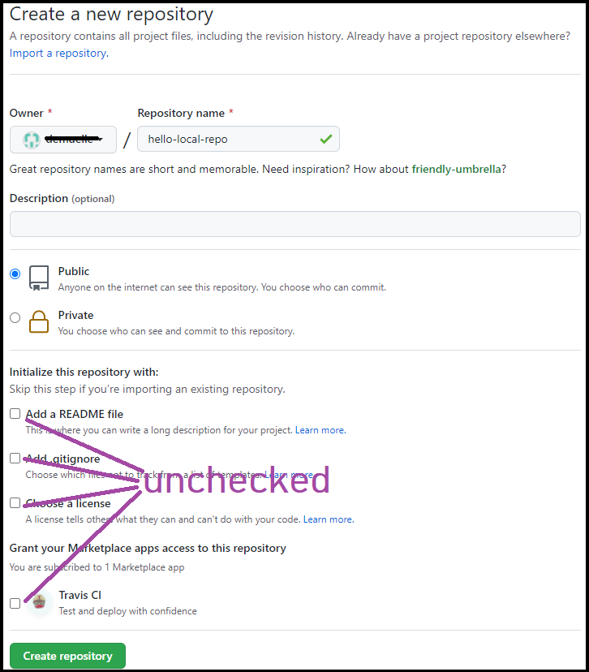

# Guide: Initialize a Repository and Sync It To GitHub

There are a few ways to get started working on a project using GitHub for source control. One common method is to create a Git repository on GitHub and clone it to your local machine. You can also initialize a Git repository on your local machine and then sync it with GitHub. Here's how to do that:

## Part 1: Set up the repository locally
1. From terminal, navigate to the project folder in your workspace.
2. Run the command:

    ```git init .```

    This will initialize the folder as a git folder in your local.
   * Make sure to include the (.) at the end of this command.

3. Run the command:

    ```git status```
    
    This shows useful information, including your current branch, and uncommitted files. Check the name of your branch.

    If you are on branch `main`, skip the next step. If you are on branch `master`, you need to change it to `main` because GitHub's default branch is main.

    

4. *If your branch is **master**,* run the command: 

    ```git branch -M main```

    Note: Here are [some ways](https://superuser.com/questions/1419613/change-git-init-default-branch-name/1559582) you can ensure that you always start with `main` and not `master`

    Confirm that your branch is now `main` by again running `git status`.

5. To stage the files you want to commit, run the command

    ```git add .```
    
6. Commit the staged files with

    ```git commit -m "First Commit" ```

    Leave this terminal open. You'll need to run some commands from this directory a tiny bit later.

## Part 2: Set up and connect to GitHub
1. On the GitHub UI, create a repo and choose a name. If you already have a project that you're working on locally, use that name (for example, `hello-heroku` or `rsvp-service`). For this example, we'll use `hello-local-repo`, but you can name your repo anything.
   * Leave all the boxes unchecked. In this step, you will not create a README or a .gitignore or a license file.
    

2. On the next page, there are some helpful commands.

    

    Copy the command that starts with `git remote...` and run it in your terminal.

    Note: After you set up the remote, you can check that it is set up correctly by running `git remote -v` You should see remote setups for `fetch` and `push`

    

3. To push the code and setup tracking on the main branch, run the command

    ```git push -u origin main```

4. To confirm that the folder is up to date and in sync with the main branch, run

    ```git status```

**Note:** If you don't have a `.gitignore` file in your repository, you're going to want one. The internet has plenty of these. For example, [here](https://www.toptal.com/developers/gitignore)'s a handy `.gitignore` generator.