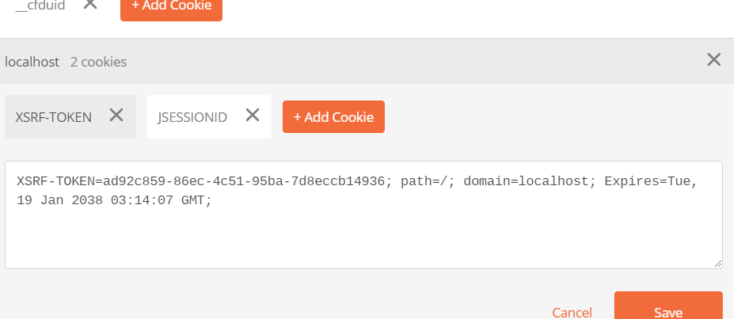

# Multiple HTTP Methods

## Introduction

In this activity, we will control access to endpoints based on HTTP methods.

## Instructions

1. In the `RsvpController` class, add a method to delete a `privateEvent`. Now the controller should resemble the following:

   ```java
   @RestController
   public class RsvpController {
      @RequestMapping(value="/publicEvent", method= RequestMethod.GET)
      public String viewPublicEvents() {
         return "Here are the public events.";
      }

      /// ... some other methods
      @RequestMapping(value="/privateEvent", method= RequestMethod.GET)
      public String viewPrivateEvents(Principal principal) {
         return "Here are the private events, exclusively for you, " + principal.getName();
      }

      // Here's the new one.
      @RequestMapping(value="/privateEvent/{id}", method=RequestMethod.DELETE)
      public String deletePrivateEvent(Principal principal, @PathVariable int id) {
         return "You (" + principal.getName() + ") have deleted the private event with id " + id + ".";
      }

      /// ... some other methods

      @RequestMapping(value="/allDone", method=RequestMethod.GET)
      public String calledByLogout() {
         return "You are logged out.";
      }
   }
   ```

2. Update the code in `SecurityConfig` to resemble the following:

   ```java
   httpSecurity.authorizeRequests()
         .mvcMatchers(HttpMethod.GET, "/privateEvent").hasAuthority("REGISTERED_USER")
         .mvcMatchers(HttpMethod.DELETE, "/privateEvent/*").hasAuthority("RSVP_ADMIN")
         .mvcMatchers("/registerPrivateEvent").hasAuthority("REGISTERED_USER")
         .mvcMatchers("/guestList").hasAuthority("EVENT_PUBLISHER")
         .mvcMatchers("/eventPublishersList").hasAuthority("RSVP_ADMIN")
         .anyRequest().permitAll();
   ```

   >Note that we have to add the `HttpMethod` arguments to the first two `mvcMatchers`.

3. Open Postman.

- This is where it can get tricky. To exercise this, we need to use Postman so that we can send something other than a `GET`. We have to jump through some hoops with Postman so that we properly handle the CSRF header and cookie.
  1. Send an empty `DELETE`.
     * Our first attempt will be to send an empty `DELETE` to `/privateEvent/1`. You should get a 403 forbidden response as shown here:
       
     * We get a 403 forbidden response because we didn't send a username and password for HTTP Basic authentication. The browser usually automatically prompts us for a username and password, but that is not the case when we use Postman. We need to send the username and password in the headers.

  2. Send an empty `DELETE` with authentication headers.
     * Go back to the `DELETE` request that you just sent in Postman, and add HTTP Basic authentication headers as shown in the following image (the Authorization tab; for type, choose Basic Auth; enter Username and Password), and submit the request. You should still get a 403 forbidden response as shown here:
       
     * We get a 403 forbidden response because we haven't accounted for the CSRF token required by Spring Security for requests that change application state such as `DELETE`, `POST`, and `PUT`. We need to send the CSRF token in the header of our request.

  3. Send an empty `DELETE` with authentication headers and a CSRF token.
     * Recall that we configured Spring Security to send the CSRF token back to us in a cookie. The value of the CSRF token can be found in the Cookies menu in Postman. Handling these cookies is automatically handled by various client frameworks. Because we are using Postman, we have to handle the token manually. 

     * Click the Cookies menu link.
       
      * Postman should display the following:
        
     * Now click on the XSRF-TOKEN to display the following:
       
     * Copy the value of the XSRF-TOKEN. We will send this value in our request headers.
     * Close the Manage Cookies dialog, click the Headers menu item, and add the X-XSRF-TOKEN header key. Use the XSRF value that you copied in the previous step as the value for the key. Submit the request, and your Postman UI should look similar to this (you will have a different value for the X-XSRF-TOKEN Key). Send the request.
       
     * Now that we have included both the authentication headers and the CSRF token, Spring Security has granted us access to the protected resource. Both of these header values must be sent with every Postman request to this endpoint. This may seem labor intensive, but don't worry&mdash;this functionality is handled with low overhead by front-end frameworks like Angular and React.


---

© 2022 Trilogy Education Services, a 2U, Inc. brand. All Rights Reserved.
