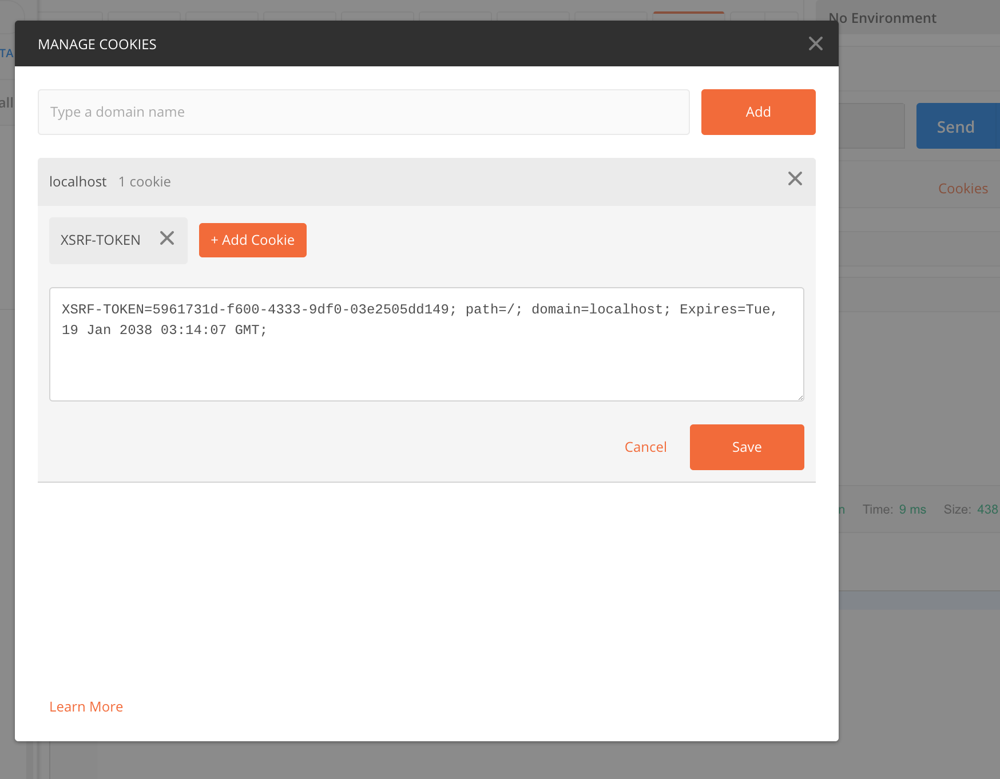

# Spring Security

## Introduction

In this activity, you will control access to a Spring Boot web service using Spring Security authentication and role-based access control (authorization).

## Overview

The ``secure-app`` is a simple Spring Boot REST web service that you will secure with Spring Security. The application will include authentication and role-based access control.


You'll build the system in the following steps:

1. Create the project.
2. Implement the REST endpoints/API.
3. Create the Spring Security Schema.
4. Configure Spring Security components.
5. Apply Spring Security to the endpoints.

## Instructions

### Step 1: Create the Project

1. Go to the Spring Initializr (http://start.spring.io).

2. Create a new project as follows:

   * Set ```Group``` to ```com.trilogyed```.

   * Set ```Artifact``` to ```secure-app```.

   * Set ```Name``` to ```SecureApp```. 

   * Set ```Package name``` to ```com.trilogyed.secureapp```.

   * Set ```Java``` to ```8```. 

3. Add the following dependencies:

   * ```Spring Web [WEB]```

   * ```Spring Data JPA [SQL]```

   * ```MySQL Driver [SQL]```

   * ```Spring Security [SECURITY]```

4. Click Generate to download the zipped project, unzip the project, and open it in IntelliJ.

### Step 2: Implement REST Enpoints

Next, create the Controller and endpoints for this application. Create a new Java class called ```com.trilogyed.secureapp.controller.SecureAppController```, and add the following code:

    ```java
    @RestController
    public class SecureAppController {

        @RequestMapping(value = "/open", method = RequestMethod.GET)
        public String open() {
            return "Open endpoint - anyone can access.";
        }

        @RequestMapping(value = "/loggedin", method = RequestMethod.GET)
        public String loggedIn(Principal principal) {
            return "Hello " + principal.getName() + "! Looks like you're logged in!";
        }

        @RequestMapping(value = "/needsRole", method = RequestMethod.GET)
        public String authRoleGet(Principal principal) {
            return "Hello " + principal.getName() + "! Looks like you have the MGR role";
        }

        @RequestMapping(value = "/needsRole", method = RequestMethod.POST)
        public String authRolePost(Principal principal) {
            return "Hello " + principal.getName() + "! Looks like you have the ADMIN role";
        }

        @RequestMapping(value = "/allDone", method = RequestMethod.GET)
        public String allDone() {
            return "That's All Folks!";
        }
    }
    ```

    Items to note about this code:

    * Later, we will configure Spring Security. When we do that, the `Principal` parameter will be automatically passed to the methods that need it.

### Step 3: Create the Spring Security Schema

Spring Security provides a default schema that stores users and their associated authorities. **Authorities** is the term that Spring Security uses for roles or permissions. 

Spring Security authorities are arbitrary strings that have no inherent meaning to the Spring Security system itself. The system will simply attempt to match the authorities assigned to a given user with the list of authorities that are allowed to access a resource. If there is at least one match, access is granted. Otherwise, access is denied.

Keep in mind that authorities have no relationship to other authorities and are not inherently hierarchical. If you need hierarchical authorities (which is common), you can create a hierarchical relationship by making sure that users who have higher-level access authorities (whatever that means in your application) also have all of the lower-level access authorities. For example, our example application has the following three authorities, or roles:

1. ```ROLE_USER```
2. ```ROLE_MANAGER```
3. ```ROLE_ADMIN```

To make these hierarchical, you would make sure all users in the system have ```ROLE_USER```. You would make sure that all managers have both ```ROLE_USER``` and ```ROLE_MANAGER```, and you would make sure all administrators have ```ROLE_USER```, ```ROLE_MANAGER```, and ```ROLE_ADMIN```. See the SQL script that follows.

The following script
- Creates the schema
- Creates the tables within the schema that hold users and authorities
- Populates the tables with test users and authorities

Open MySQL Workbench, and run the following script:

```sql
create schema if not exists secureapp;
use secureapp;

create table if not exists users(
	username varchar(50) not null primary key,
	password varchar(100) not null,
	enabled boolean not null
);

create table if not exists authorities (
	username varchar(50) not null,
	authority varchar(50) not null,
	constraint fk_authorities_users foreign key(username) references users(username));
	create unique index ix_auth_username on authorities (username,authority
);

insert into users (username, password, enabled) values ('plainUser', '$2a$10$KxTc8SYbIB/IaXCWz6NA4ug1pkAYM/e.P.0YQFGE3Ua4FZ6Qf842a', true);
insert into users (username, password, enabled) values ('managerUser', '$2a$10$QPnaeWBWz1BdDglni2CLzO2YMeifVXtQDPgUOVNETTcj8cEGwqiym', true);
insert into users (username, password, enabled) values ('adminUser', '$2a$10$Hc878CPLJ4hOtwyzt6V7..LHtzhcR3zqcXOAPseY9QGg05ZxcsTR6', true);

insert into authorities (username, authority) values ('plainUser', 'ROLE_USER');
insert into authorities (username, authority) values ('managerUser', 'ROLE_USER');
insert into authorities (username, authority) values ('managerUser', 'ROLE_MANAGER');
insert into authorities (username, authority) values ('adminUser', 'ROLE_USER');
insert into authorities (username, authority) values ('adminUser', 'ROLE_MANAGER');
insert into authorities (username, authority) values ('adminUser', 'ROLE_ADMIN');
```

Some items to note about this code:

* The passwords are hashed using the BCrypt library. Storing plaintext passwords in a database is a security risk. BCrypt is the recommended password hashing algorithm for Spring Security.
* The plaintext value of each password is ```password```.
* We'll see how to create BCrypt-hashed passwords in the next section.
* We have three users with the following roles:
  * ```plainUser``` : ```ROLE_USER```
  * ```managerUser``` : ```ROLE_USER, ROLE_MANAGER```
  * ```adminUser``` : ```ROLE_USER, ROLE_MANAGER, ROLE_ADMIN```

### Step 4: Configure Spring Security

We'll configure Spring Security in the following steps:

1. Configure the database connection.
2. Configure the Authentication Manager.

#### 4.1 Configure the Database Connection

Open the ```application.properties```, and add the following entries:

```java
spring.datasource.url: jdbc:mysql://localhost:3306/secureapp?useSSL=false&serverTimezone=UTC&allowPublicKeyRetrieval=true
spring.datasource.username: root
spring.datasource.password: rootroot
spring.datasource.driver-class-name: com.mysql.cj.jdbc.Driver
```

###### ***Note about Server Time Zone Configuration***
###### If the `serverTimezone=UTC` does not work on your machine,  it may be necessary to change UTC to a more specific time zone setting based on your location. For example,  `serverTimezone=US/Central` is valid syntax for Central Time. Lastly, omitting the time zone from the datasource URL altogether should also be considered when troubleshooting. One of the following three options should work.

---


#### 4.2 Configure the Authentication Manager

Now, we'll configure Spring Security to use the database for authentication and authorization data. Create a new Java class called ```com.trilogyed.secureapp.SecurityConfig```, and add the following code:

```java
@Configuration
public class SecurityConfig extends WebSecurityConfigurerAdapter {

    @Autowired
    DataSource dataSource;

    @Autowired
    public void configAuthentication(AuthenticationManagerBuilder authBuilder) throws Exception {

        PasswordEncoder encoder = new BCryptPasswordEncoder();

        authBuilder.jdbcAuthentication()
                .dataSource(dataSource)
                .usersByUsernameQuery(
          				"select username, password, enabled from users where username = ?")
                .authoritiesByUsernameQuery(
          				"select username, authority from authorities where username = ?")
                .passwordEncoder(encoder);
    }
}

```

Some items to note about the code:

* This is a configuration class and is marked with the ```@Configuration``` annotation.
* This class extends ```WebSecurityConfigurerAdapter```.
* We are autowiring the data source configured in the previous step.
* When importing the DataSource library into the project, be sure to select this import: ```javax.sql.DataSource```. 
* As mentioned earlier, storing plaintext passwords in the database is a security risk, so we hash the passwords in this database using a ```PasswordEncoder```. We have chosen to use the BCrypt password encoder for this application. This will cause Spring Security to apply the BCrypt hashing algorithm to incoming passwords before comparing them to the value in the database.
* We use the supplied `AuthenticationManagerBuilder` to configure Spring Security to use the database schema created previously. We need to supply a data source, a query to find users by username, a query to find authorities by username, and a password encoder.

##### Hashing Passwords

The SQL script we used to create and populate our security database included already hashed passwords. We did that by creating a `PasswordUtility` class. Create a new Java class called ```com.trilogyed.secureapp.util.PasswordUtility```, and add the following code:

```java
public class PasswordUtility {

    public static void main(String[] args) {
        PasswordEncoder enc = new BCryptPasswordEncoder();

        String password = "password";

        String encodedPassword = enc.encode(password);

        System.out.println(encodedPassword);
    }
}
```

This is a crude program that takes a password string, applies the BCrypt algorithm, and then prints the hashed string to the console. We copied the value printed to the console and pasted it into the SQL script.

### Step 5: Apply Spring Security to Endpoints

Our final step is to apply Spring Security to the endpoints of our application. We'll do this in five parts:

1. Enable web security.
2. Turn on HTTP basic authentication (username and password).
3. Apply security rules to the endpoints.
4. Set up the logout rules.
5. Configure the Cross Site Request Forgery protection.

Open the ```SecurityConfig``` class that you created in the previous step, and modify it so it looks like this:

```java
@Configuration
@EnableWebSecurity
public class SecurityConfig extends WebSecurityConfigurerAdapter {

    @Autowired
    DataSource dataSource;

    @Autowired
    public void configAuthentication(AuthenticationManagerBuilder authBuilder) throws Exception {

        PasswordEncoder encoder = new BCryptPasswordEncoder();

        authBuilder.jdbcAuthentication()
                .dataSource(dataSource)
                .usersByUsernameQuery(
          				"select username, password, enabled from users where username = ?")
                .authoritiesByUsernameQuery(
          				"select username, authority from authorities where username = ?")
                .passwordEncoder(encoder);

    }
    
    public void configure(HttpSecurity httpSecurity) throws Exception {

        httpSecurity.httpBasic();

        httpSecurity.authorizeRequests()
                .mvcMatchers("/loggedin").authenticated()
                .mvcMatchers(HttpMethod.GET, "/needsRole").hasAuthority("ROLE_MANAGER")
                .mvcMatchers(HttpMethod.POST, "/needsRole").hasAuthority("ROLE_ADMIN")
                .anyRequest().permitAll();

        httpSecurity
                .logout()
                .clearAuthentication(true)
                .logoutRequestMatcher(new AntPathRequestMatcher("/logout"))
                .logoutSuccessUrl("/allDone")
                .deleteCookies("JSESSIONID")
                .deleteCookies("XSRF-TOKEN")
                .invalidateHttpSession(true);

        httpSecurity
                .csrf()
                .csrfTokenRepository(CookieCsrfTokenRepository.withHttpOnlyFalse());
    }
}
```

Items to note about this code follow.

##### 5.1 Enable Web Security

Web security is enabled by adding the ```@EnableWebSecurity``` annotation to the ```SecurityConfig``` class.

##### 5.2 Turn on HTTP Basic Authentication

We want to use a method of authentication for this application called HTTP Basic. This is done by calling the ```httpBasic()``` method on the `HttpSecurity` parameter passed into the ```configure``` method.

##### 5.3 Apply Security Rules to Endpoints

Access rules are applied at the endpoint level. Rules can be applied to individual endpoints or to groups of endpoints by matching `RequestMappings` to access rules. These rules are executed in the order they are coded, so you must make sure the more specific rules come before the more general rules. Our configuration code follows:

```java
        httpSecurity.authorizeRequests()
                .mvcMatchers("/loggedin").authenticated()
                .mvcMatchers(HttpMethod.GET, "/needsRole").hasAuthority("ROLE_MANAGER")
                .mvcMatchers(HttpMethod.POST, "/needsRole").hasAuthority("ROLE_ADMIN")
                .anyRequest().permitAll();
```

We do the following:

1. First, we match ```/loggedin``` and specify that you must be logged in (authenticated) to access the endpoint. 
2. Next, we specify that ```GET``` requests to ```/needsRole``` are accessible only to users with the ```ROLE_MANAGER``` authority. This implies that the user is also logged in because you can't have an authority if you're not logged in.
3. Next, we specify that ```POST``` requests to ```/needsRole``` are accessible only to users with the ```ROLE_ADMIN``` authority.
4. Finally, we specify that we'll permit anyone (logged in or not) to access all other endpoints.

##### 5.4 Set Up Logout Rules

We enable logout by calling the ```logout()``` method on the ```HttpSecurity``` parameter. We then specify the following:

1. The URL that is to be called for logging out
2. The URL that the application will redirect to when logout is complete
3. The cookies to delete
4. Tell the application to invalidate the HTTP session

##### 5.5 Configure CSRF Protection

Spring has CSRF protection enabled by default, but the mechanism used for exchanging the CSRF token by default is the HTTP session, which doesn't work well for Postman and many frameworks, including Angular. These frameworks expect the CSRF token in a cookie, so we tell Spring Security to put the CSRF token in a cookie to accommodate these clients.

## Exercising the Application

Now that the application is built and configured, it is time to exercise the endpoints and make sure our security rules are acting as expected. Start your service, and follow the next steps to validate your configuration.

We will be testing our endpoints with *incognito* windows so we don't have to clear the cache between every test.

#### Browser

##### The open Endpoint

* Open a new incognito window in your browser, and navigate to ```localhost:8080/open```. You should *not* be prompted to log in.
* The page should display: ```Open endpoint - anyone can access.```

##### The loggedin Endpoint

* Navigate to ```localhost:8080/loggedin```. 
* You should be prompted for a username and password. 
* Enter ```plainUser``` for the username and ```password``` for the password. 
* The page should display: ```Hello plainUser! Looks like you're logged in!```.

##### The needsRole Endpoint: GET

* Navigate to ```localhost:8080/needsRole``` using the same window/tab you used in the previous step. 
* You should get a whitelabel error page and a 403 forbidden error. This is because you are logged in as a user that has only the ```ROLE_USER``` authority, and ```ROLE_MANAGER``` is required to access this endpoint. 

We'll now log in as another user and try again:

* Navigate to ```localhost:8080/logout```. The browser should redirect to ```localhost:8080/allDone``` and display ```That's All, Folks!```. 
* Close your incognito window, and open another incognito window. 
* Navigate to ```localhost:8080/needsRole```. You should be prompted for a username and password. Enter ```managerUser``` for the username and ```password``` for the password.
* The page should display ```Hello managerUser! Looks like you have the MGR role.``` 


#### Postman

##### The needsRole Endpoint: POST

We'll use Postman to test sending a ```POST``` request to ```/needsRole```. We'll do this in several steps to illustrate how HTTP Basic authentication and CSRF tokens are handled with Postman.

##### Step 1: Send an Empty POST

Our first attempt will be to send an empty `POST` to ```/needsRole```. Open Postman and send a `POST` as shown in the following image. You should get a 403 forbidden response as shown here:


We get a 403 forbidden response because we didn't send a username and password for HTTP Basic authentication. The browser automatically prompted us for a username and password, but that is not the case when we use Postman. We need to send the username and password in the headers.

##### Step 2: Send an Empty POST with Authentication Headers

Go back to the `POST` request that you just sent in Postman, and add HTTP Basic authentication headers as shown in the next image, and submit the request. You should still get a 403 forbidden response as shown here:


We get a 403 forbidden response because we haven't accounted for the CSRF token required by Spring Security for requests that change application state, such as `POST` and `PUT`. We need to send the CSRF token in the header of our request.

##### Step 3: Send an Empty POST with Authentication Headers and CSRF Token

Recall that we configured Spring Security to send the CSRF token back to us in a cookie. The value of the CSRF token can be found in the Cookies menu in Postman. Handling these cookies is automatically handled by various client frameworks. Because we are using Postman, we have to handle the token manually. 

Click the Cookies menu link. Postman should display the following:


Now click the XSRF-TOKEN to display the following:



Copy the value of the XSRF-TOKEN. We will send this value in our request headers.

###### **Note about the XSRF-TOKEN:**
###### - The XSRF-TOKEN generated by Postman is valid for 24 hours. After that 24-hour period, the student will need to copy a new token into the header so that a valid XSRF-TOKEN is passed to the API.

Close the Manage Cookies dialog, click the Headers menu item, and add the X-XSRF-TOKEN header key. Use the XSRF value that you copied in the previous step as the value for the key. Submit the request, and your Postman UI should look similar to this (you will have a different value for the X-XSRF-TOKEN Key): 


Now that we have included both the authentication headers and the CSRF token, Spring Security has granted us access to the protected resource. Both of these header values must be sent with every Postman request to this endpoint.

---

© 2022 Trilogy Education Services, a 2U, Inc. brand. All Rights Reserved.
