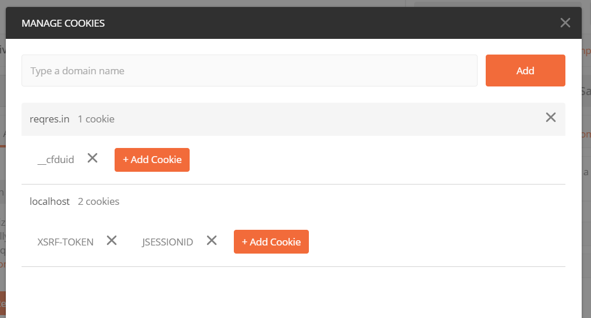

# 6.4-activities

## We Do: Secure RSVP

**Solved Folder:** [01-secure-rsvp](https://drive.google.com/file/d/1igufNSOlqxcBUgxm1-UrN_vWbwU98eic/view?usp=sharing)

In this activity, we will create a simple REST web service from scratch that uses Spring Security.

**Instructions:**

### Step 1: Create Project

1. Go to the Spring Initializr (http://start.spring.io).

2. Create a new project:

   * Set ```Group``` to ```com.trilogyed```.

   * Set ```Artifact``` to ```secure-rsvp```.

   * Set ```Name``` to ```SecureRsvp```. 

   * Set ```Package name``` to ```com.trilogyed.securersvp```.

   * Set ```Java``` to ```8```. 

3. Add the following dependencies:

   * ```Spring Web [WEB]```

   * ```Spring Data JPA [SQL]```

   * ```MySQL Driver [SQL]```

   * ```Spring Security [SECURITY]```

4. Click Generate to download the zipped project, unzip the project, and open it in IntelliJ.

5. Next, we'll create a database for our application. Open MySQL Workbench, and run the following to create a new schema:

    ```
    create schema if not exists secureapp;
    ```

6. In IntelliJ, update the `src/main/resources/application.properties` file to include the following connection information for the new schema:

    ```properties
    spring.datasource.url: jdbc:mysql://localhost:3306/secureapp?useSSL=false&serverTimezone=UTC&allowPublicKeyRetrieval=true
    spring.datasource.username: root
    spring.datasource.password: rootroot
    spring.datasource.driver-class-name: com.mysql.cj.jdbc.Driver
    ```

7. Create a new class called `com.trilogyed.securersvp.controller.RsvpController`, and add the following code to this class:

    ```java
    @RestController
    public class RsvpController {
        @RequestMapping(value="/publicEvent", method= RequestMethod.GET)
        public String viewPublicEvents() {
            return "Here are the public events.";
        }
        
        @RequestMapping(value="/privateEvent", method= RequestMethod.GET)
        public String viewPrivateEvents() {
            return "Here are the private events.";
        }
    }
    ```

8. Start the app by running the main method in the `SecureRsvpApplication` class.

9. In a browser, go to [http://localhost:8080/publicEvent](http://localhost:8080/publicEvent).

    We are prompted for a username and password. By adding the Spring Security dependency, spring automatically attempts to apply security.
    
    To verify that our endpoints are working correctly, we'll disable the security for now, and then turn it back on later.

10. In IntelliJ, open the main class `SecureRsvpApplication`, and disable security by updating the `SpringBootApplication` annotation as follows:

    ```java
    @SpringBootApplication(exclude = { SecurityAutoConfiguration.class})
    ```

11. Restart the app.

12. In a browser, go to [http://localhost:8080/publicEvent](http://localhost:8080/publicEvent). The output should resemble the following:

    ```
    Here are the public events.
    ```

13. Go to [http://localhost:8080/privateEvent](http://localhost:8080/privateEvent). The output should resemble the following:

    ```
    Here are the private events.
    ```

### Step 2: Create a Password Encoder Utility

Before we can add users to our database, we'll need a way to encode user passwords. We don't want to store plaintext passwords in the database. We'll create a utility to generate encoded passwords.

1. In IntelliJ, create a class called `com.trilogyed.securersvp.util.PasswordUtility`, and use the following code:

   ```java
   public class PasswordUtility {
   
       public static void main(String[] args) {
           PasswordEncoder enc = new BCryptPasswordEncoder();
   
           String password = "password";
   
           String encodedPassword = enc.encode(password);
   
           System.out.println(encodedPassword);
       }
   }
   ```

2. Now run the utility to generate an encoded password. It will print in the console.

   - This is a very simple utility. To generate a hashed version of a password, simply change the value of the password variable to whatever you want to generate a hash for.

   - Note that if you run the application several times, it generates different outputs. This is due to the secure nature of BCrypt.

     - See https://stackabuse.com/password-encoding-with-spring-security/ for more information on why this works.

### Step 3: Spring Security Schema and Enable Security

Now we have an encoded password. We need somewhere to put it. For Spring Security to work properly, we need a way to store and retrieve hashed passwords for users, as well as authorities (what a user is allowed to do) associated with users. This can be modeled simply with two database tables.

1. Open MySQL Workbench, and run the following:

   ```sql
   use secureapp;
   
   create table if not exists users(
       username varchar(50) not null primary key,
       password varchar(100) not null,
       enabled boolean not null
   );
   
   create table if not exists authorities (
       username varchar(50) not null,
       authority varchar(50) not null,
       constraint fk_authorities_users foreign key(username) references users(username));
       create unique index ix_auth_username on authorities (username,authority
   );
   ```

2. Add a record to the user table with any username and the output of the password generator utility as follows:

   ```sql
   insert into users (username, password, enabled) values ('alex','$2a$10$ZFJLAIAt3xKVs9B.Iepgy.Dwxcj9RKW3oKJWKR4JhX5DmhQRBvVma',true);
   ```

    Now we have to give this user permission to do something. We can do that by adding a record to the Authorities table. What authority should we give this user? We can name the authority anything we want. The key is that the name of the authority is consistent with the name of the authority we use in our application (Java) code.

3. Add a record to the Authorities table, as shown here:

   ```sql
   insert into authorities (username, authority) values ('alex', 'REGISTERED_USER');
   ```

    Finally, it's time to add security to our app. Before we reenable security, we have to write some code that configures how the security will work for the app.

4. In IntelliJ, create a new class called `com.trilogyed.securersvp.SecurityConfig`, and add the following code to the class:

   ```java
   @Configuration
   public class SecurityConfig extends WebSecurityConfigurerAdapter {
   
       @Autowired
       DataSource dataSource;
   
       @Autowired
       public void configAuthentication(AuthenticationManagerBuilder authBuilder) throws Exception {
   
           PasswordEncoder encoder = new BCryptPasswordEncoder();
   
           authBuilder.jdbcAuthentication()
               .dataSource(dataSource)
               .usersByUsernameQuery(
                       "select username, password, enabled from users where username = ?")
               .authoritiesByUsernameQuery(
                       "select username, authority from authorities where username = ?")
               .passwordEncoder(encoder);
       }
   
       public void configure(HttpSecurity httpSecurity) throws Exception {
   
           httpSecurity.httpBasic();
   
           httpSecurity.authorizeRequests()
               .mvcMatchers("/privateEvent").hasAuthority("REGISTERED_USER")
               .anyRequest().permitAll();
       }
   }
   ```

    **Notes** about the code:

    - We add the `@Configuration` annotation to this class because this class has configuration code that needs to run when the application starts.
    - To configure security, we have to extend the `WebSecurityConfigurerAdapter` class.
    - We autowire our datasource that contains our security config.
    - The `configAuthentication` method allows us to set our query for users that allows us to check a password, as well as our query for authorities.
    - **Note** that we can use any query here.
        - The only rules are that the first three columns of the `usersByUsernameQuery` must represent username, password, and whether the user is enabled, and the first two columns of the `authoritiesByUsernameQuery` must be a username and an authority.
        - That being said, the actual table and column names don't matter.
    - Because we are using BCrypt, we pass an instance of the `BCryptPasswordEncoder`.
    - We will not need to further modify the `configAuthentication` method.
    - The configure method is where we set up our rules. We will eventually chain together a bunch of `mvcMatchers` method calls to configure authorization rules for our app.

5. Finally, we have to reenable security by removing the exclusion from our main application class.

    In `SecureRsvpApplication.java`, **remove** the exclude parameter on the `@SpringBootApplication` annotation so the class now looks like this:

    ```java
    @SpringBootApplication
    public class SecureRsvpApplication {

        public static void main(String[] args) {
            SpringApplication.run(SecureRsvpApplication.class, args);
        }

    }
    ```

6. Restart the app.

7. Open a new **incognito** (or private) browser window, and navigate to [http://localhost:8080/publicEvent](http://localhost:8080/publicEvent). Verify that credentials are not required.

    >It's important (for this step and the next one) to browse incognito. Otherwise, the browser tries to help us out by storing some header information that doesn't allow us to cleanly exercise our application.

8. Open a new **incognito** (or private) browser window, and navigate to [http://localhost:8080/privateEvent](http://localhost:8080/privateEvent). Verify that credentials are required.

## Student Do: Register Endpoint

**Starter & Solved Folders:** [02-register-endpoint](https://drive.google.com/file/d/1PsMWFMU5Idscsdg7RWguUZttguC2IYJw/view?usp=sharing)

In this activity, you will add a public and a private endpoint to register events. You will also add a new user to the database.

**Instructions:**

1. Open the `RsvpController` class, and add a new endpoint that does not require authentication called `/registerPublicEvent`. This endpoint returns the following message: "You are registering for a public event."

2. In the `RsvpController` class, add a new endpoint that requires the same authorization as the `privateEvent` called `/registerPrivateEvent`. This endpoint returns the following message: "You are registering for a private event."

3. Add new user to the database called `'kim'` to the database with the same authorities as `alex`.

4. Test the new endpoints to verify that they are working correctly.

## We Do: CSRF Principal Logout

**Starter & Solved Folders:** [03-csrf-principal-logout](https://drive.google.com/file/d/1QBavlodYDF-PTz3nJVxuXTJcw6DWqpGZ/view?usp=sharing)

In this activity, we'll configure CSRF protection and logout for our web service. We'll also use the `Principal` object to get information about the user.

**Instructions:**

1. In IntelliJ, open the `SecurityConfig` class, and update the configure method to include the last two blocks (`logout` and `csrf`) as follows:

   ```java
       public void configure(HttpSecurity httpSecurity) throws Exception {
   
           httpSecurity.httpBasic();
   
           httpSecurity.authorizeRequests()
               .mvcMatchers("/privateEvent").hasAuthority("REGISTERED_USER")
               .mvcMatchers("/registerPrivateEvent").hasAuthority("REGISTERED_USER")
               .anyRequest().permitAll();

           httpSecurity
               .logout()
               .clearAuthentication(true)
               .logoutRequestMatcher(new AntPathRequestMatcher("/logout"))
               .logoutSuccessUrl("/allDone")
               .deleteCookies("JSESSIONID")
               .deleteCookies("XSRF-TOKEN")
               .invalidateHttpSession(true);

           httpSecurity
               .csrf()
               .csrfTokenRepository(CookieCsrfTokenRepository.withHttpOnlyFalse());
       }
   ```

    **Notes about the code:**

    We enable logout by calling the `logout()` method on the `HttpSecurity` parameter. We then specify the following:

    1. The URL that is to be called for logging out
    2. The URL that the application will redirect to when logout is complete
    3. The cookies to delete
    4. Tell the application to invalidate the HTTP session

    Spring has CSRF protection enabled by default, but the mechanism used for exchanging the CSRF token by default is the HTTP session, which doesn't work well for Postman and many frameworks, including Angular. These frameworks expect the CSRF token in a cookie, so we tell Spring Security to put the CSRF token in a cookie to accommodate these clients.

2. Open the `RsvpController` class, and update the code on the `privateEvent` and `registerPrivateEvent` endpoints so that they take the `Principal` as a parameter, and use it in the code. The code should resemble the following:

    ```java
    @RestController
    public class RsvpController {
        @RequestMapping(value="/publicEvent", method= RequestMethod.GET)
        public String viewPublicEvents() {
            return "Here are the public events.";
        }

        @RequestMapping(value="/registerPublicEvent", method= RequestMethod.GET)
        public String registerPublicEvent() {
            return "You are registering for a public event.";
        }

        @RequestMapping(value="/privateEvent", method= RequestMethod.GET)
        public String viewPrivateEvents(Principal principal) {
            return "Here are the private events, exclusively for you, " + principal.getName();
        }

        @RequestMapping(value="/registerPrivateEvent", method= RequestMethod.GET)
        public String registerPrivateEvent(Principal principal) {
            return "You are registering for a private event, " + principal.getName();
        }
    }
    ```

3. In the `RsvpController` class, update the code to handle logout. The code should resemble the following:

    ```java
    @RestController
    public class RsvpController {
        @RequestMapping(value="/publicEvent", method= RequestMethod.GET)
        public String viewPublicEvents() {
            return "Here are the public events.";
        }

        @RequestMapping(value="/registerPublicEvent", method= RequestMethod.GET)
        public String registerPublicEvent() {
            return "You are registering for a public event.";
        }

        @RequestMapping(value="/privateEvent", method= RequestMethod.GET)
        public String viewPrivateEvents(Principal principal) {
            return "Here are the private events, exclusively for you, " + principal.getName();
        }

        @RequestMapping(value="/registerPrivateEvent", method= RequestMethod.GET)
        public String registerPrivateEvent(Principal principal) {
            return "You are registering for a private event, " + principal.getName();
        }

        @RequestMapping(value="/allDone", method=RequestMethod.GET)
        public String calledByLogout() {
            return "You are logged out.";
        }
    }
    ```

4. Restart the app.

5. Open [http://localhost:8080/publicEvent](http://localhost:8080/publicEvent). Verify that credentials are not required.

6. Open [http://localhost:8080/privateEvent](http://localhost:8080/privateEvent). Log in using the credentials for one of the users. The output should display the name of the user in the message.


## Student Do: Guest List Endpoint

**Starter & Solved Folders:** [04-guest-list-endpoint](https://drive.google.com/file/d/1MIf3sEJpeX7-J9WgvGG-XGYJZBoYzyhS/view?usp=sharing)

In this activity, you will add a private endpoint to view the guest list. You will also add a new user to the database and a new authority.

**Instructions:**

1. Add a new user to the database called `'bill'` to the database.

2. Add a new authority to the database called `'EVENT_PUBLISHER'` to the database. Give `'bill'` the `'EVENT_PUBLISHER'` authority.

3. In the `RsvpController` class, add a new endpoint called `/guestList`. This endpoint requires the `'EVENT_PUBLISHER'` authorization and returns the following message: "Hello, <username>. Because you are an event publisher, you can see this guest list."
   - The username should be the name of the user who is calling the endpoint.

4. Test the new endpoint to verify it is working correctly:

   - Close all your incognito windows (to clear all session information).
   - Open a new incognito window.
   - Go to [http://localhost:8080/guestList](http://localhost:8080/guestList).
   - Log in as bill.

## We Do: Hierarchical Access

**Starter & Solved Folders:** [05-hierarchical-access](https://drive.google.com/file/d/1pDfsLVksPFzizqvKuy8i34inou0HWnqz/view?usp=sharing)

In this activity, we will add multiple authorities to a single user.

**Instructions:**

1. Open MySQL Workbench, and ask learners: "What do we need to add to the database to allow the user, bill, to access the `privateEvent` endpoint?"

2. The following insert will add the `REGISTERED_USER` authority for `'bill'`:

   ```sql
   insert into authorities (username, authority) values ('bill', 'REGISTERED_USER');
   ```

3. Now close all your incoginito windows (to clear all session information).

4. Test the publicEvent endpoint to verify it is working correctly:

   - Open a new incognito window.
   - Go to [http://localhost:8080/publicEvent](http://localhost:8080/publicEvent).

5. Test the guestList endpoint to verify it is working correctly:

   - Go to [http://localhost:8080/guestList](http://localhost:8080/guestList).
   - Log in as bill.

6. Test the privateEvent endpoint to verify it is working correctly:

   - Go to [http://localhost:8080/privateEvent](http://localhost:8080/privateEvent).

## Student Do: Admin Endpoint

**Starter & Solved Folders:** [06-admin-endpoint](https://drive.google.com/file/d/10Sathqk3LJhRd2ZunerHZCrY9Q3UGloN/view?usp=sharing)

In this activity, we will add an admin authority, a new user, and a new endpoint.

**Instructions:**

1. Add a new `RSVP_ADMIN` authority.

2. Add a new user called `'francis'`.

3. Give `'francis'` all of the existing authorities.

4. In the `RsvpController` class, add a new endpoint called `/eventPublishersList`. This endpoint requires the `'RSVP_ADMIN'` authorization and returns the following message: "Hello, <username>. You may view a list of event publishers."
   - The username should be the name of the user who is calling the endpoint.

5. Now close all your incoginito windows (to clear all session information).

6. Test the `publicEvent` endpoint to verify it is working correctly:

   - Open a new incognito window.
   - Go to [http://localhost:8080/publicEvent](http://localhost:8080/publicEvent).

7. Test the `guestList` endpoint to verify it is working correctly:

   - Go to [http://localhost:8080/guestList](http://localhost:8080/guestList).
   - Log in as francis.

8. Test the `privateEvent` endpoint to verify it is working correctly:

   - Go to [http://localhost:8080/privateEvent](http://localhost:8080/privateEvent).

9. Test the privateEvent endpoint to verify it is working correctly:

   - Go to [http://localhost:8080/eventPublishersList](http://localhost:8080/eventPublishersList).


## We Do: Multiple HTTP Methods

**Starter & Solved Folders:** [07-mulitple-http-methods](https://drive.google.com/file/d/1A5mLMCwSkBwrEL9EeXv5ysM-hvIRVRn-/view?usp=sharing)

In this activity, we will control access to endpoints based on HTTP method.

**Instructions:**

1. In the` RsvpController`, add a method to delete a `privateEvent`. Now the controller should resemble the following:

   ```java
   @RestController
   public class RsvpController {
      @RequestMapping(value="/publicEvent", method= RequestMethod.GET)
      public String viewPublicEvents() {
         return "Here are the public events.";
      }

      /// ... some other methods
      @RequestMapping(value="/privateEvent", method= RequestMethod.GET)
      public String viewPrivateEvents(Principal principal) {
         return "Here are the private events, exclusively for you, " + principal.getName();
      }

      // Here's the new one.
      @RequestMapping(value="/privateEvent/{id}", method=RequestMethod.DELETE)
      public String deletePrivateEvent(Principal principal, @PathVariable int id) {
         return "You (" + principal.getName() + ") have deleted the private event with id " + id + ".";
      }

      /// ... some other methods

      @RequestMapping(value="/allDone", method=RequestMethod.GET)
      public String calledByLogout() {
         return "You are logged out.";
      }
   }
   ```

2. Update the code in `SecurityConfig` to resemble the following:

   ```java
   httpSecurity.authorizeRequests()
         .mvcMatchers(HttpMethod.GET, "/privateEvent").hasAuthority("REGISTERED_USER")
         .mvcMatchers(HttpMethod.DELETE, "/privateEvent/*").hasAuthority("RSVP_ADMIN")
         .mvcMatchers("/registerPrivateEvent").hasAuthority("REGISTERED_USER")
         .mvcMatchers("/guestList").hasAuthority("EVENT_PUBLISHER")
         .mvcMatchers("/eventPublishersList").hasAuthority("RSVP_ADMIN")
         .anyRequest().permitAll();
   ```

   >Note that we have to add the `HttpMethod` arguments to the first two `mvcMatchers`.

3. Open Postman.

- This is where it can get tricky. To exercise this, we need to use Postman so that we can send something other than a `GET`. We have to jump through some hoops with Postman so that we properly handle the CSRF header and cookie.
  1. Send an empty `DELETE`.
     * Our first attempt will be to send an empty `DELETE` to `/privateEvent/1`. You should get a 403 forbidden response as shown here:
       
     * We get a 403 forbidden response because we didn't send a username and password for HTTP Basic authentication. The browser automatically prompted us for a username and password, but that is not the case when we use Postman. We need to send the username and password in the headers.

  2. Send an empty `DELETE` with authentication headers.
     * Go back to the `DELETE` request that you just sent in Postman, and add HTTP Basic authentication headers as show in the image that follows (the Authorization tab; for type, choose Basic Auth; enter username and password), and submit the request. You should still get a 403 forbidden response as shown next:
       
     * We get a 403 forbidden response because we haven't accounted for the CSRF token required by Spring Security for requests that change application state, such as `DELETE`, `POST`, and `PUT`. We need to send the CSRF token in the header of our request.

  3. Send and empty `DELETE` with authentication headers and a CSRF token.
     * Recall that we configured Spring Security to send the CSRF token back to us in a cookie. The value of the CSRF token can be found in the Cookies menu in Postman. Handling these cookies is automatically handled by various client frameworks. Because we are using Postman, we have to handle the token manually. 

     * Click the Cookies menu link.
       
      * Postman should display the following:
        
     * Now click the XSRF-TOKEN to display the following:
       
     * Copy the value of the XSRF-TOKEN. We will send this value in our request headers.
     * Close the Manage Cookies dialog, click the Headers menu item, and add the X-XSRF-TOKEN header key. Use the XSRF value that you copied in the previous step as the value for the key. Submit the request. Your Postman UI should look similar to the following image (you will have a different value for the X-XSRF-TOKEN key). Send the request.
       
     * Now that we have included both the authentication headers and the CSRF token, Spring Security has granted us access to the protected resource. Both of these header values must be sent with every Postman request to this endpoint. This may seem labor intensive, but don't worry&mdash;this functionality is handled with low overhead by front-end frameworks like Angular and React.

## Student Do: Spring Security

**Solved Folder:**[08-spring-security](https://drive.google.com/file/d/1JnZcyVYIQw0kFX8137F3KX62X2EhFL5V/view?usp=sharing)

In this activity, you will control access to a Spring Boot web service using Spring Security authentication and role-based access control (authorization).

**Instructions:**

### Step 1: Create the Project

1. Go to the Spring Initializr (http://start.spring.io).

2. Create a new project:

   * Set ```Group``` to ```com.trilogyed```.

   * Set ```Artifact``` to ```secure-app```.

   * Set ```Name``` to ```SecureApp```. 

   * Set ```Package name``` to ```com.trilogyed.secureapp```.

   * Set ```Java``` to ```8```. 

3. Add the following dependencies:

   * ```Spring Web [WEB]```

   * ```Spring Data JPA [SQL]```

   * ```MySQL Driver [SQL]```

   * ```Spring Security [SECURITY]```

4. Click Generate to download the zipped project, unzip the project, and open it in IntelliJ.

### Step 2: Implement REST Endpoints

Next, create the Controller and endpoints for this application. Create a new Java class called ```com.trilogyed.secureapp.controller.SecureAppController```, and add the following code:

    ```java
    @RestController
    public class SecureAppController {

        @RequestMapping(value = "/open", method = RequestMethod.GET)
        public String open() {
            return "Open endpoint - anyone can access.";
        }

        @RequestMapping(value = "/loggedin", method = RequestMethod.GET)
        public String loggedIn(Principal principal) {
            return "Hello " + principal.getName() + "! Looks like you're logged in!";
        }

        @RequestMapping(value = "/needsRole", method = RequestMethod.GET)
        public String authRoleGet(Principal principal) {
            return "Hello " + principal.getName() + "! Looks like you have the MGR role";
        }

        @RequestMapping(value = "/needsRole", method = RequestMethod.POST)
        public String authRolePost(Principal principal) {
            return "Hello " + principal.getName() + "! Looks like you have the ADMIN role";
        }

        @RequestMapping(value = "/allDone", method = RequestMethod.GET)
        public String allDone() {
            return "That's All Folks!";
        }
    }
    ```

    **Items to note about this code:**

    * Later, we will configure Spring Security. When we do that, the `Principal` parameter will be automatically passed to the methods that need it.

### Step 3: Create the Spring Security Schema

Spring Security provides a default schema that stores users and their associated authorities. **Authorities** is the term that Spring Security uses for roles or permissions. 

Spring Security authorities are arbitrary strings that have no inherent meaning to the Spring Security system itself. The system will simply attempt to match the authorities assigned to a given user with the list of authorities that are allowed to access a resource. If there is at least one match, access is granted. Otherwise, access is denied.

Keep in mind that authorities have no relationship to other authorities and are not inherently hierarchical. If you need hierarchical authorities (which is common), you can create a hierarchical relationship by making sure that users who have higher-level access authorities (whatever that means in your application) also have all of the lower-level access authorities. For example, our example application has three authorities or roles:

1. ```ROLE_USER```
2. ```ROLE_MANAGER```
3. ```ROLE_ADMIN```

To make these hierarchical, you would make sure all user in the system have ```ROLE_USER```. You would make sure that all managers have both ```ROLE_USER``` and ```ROLE_MANAGER``` and you would make sure all administrators have ```ROLE_USER```, ```ROLE_MANAGER```, and ```ROLE_ADMIN```. See the SQL script that follows.

The following script
- Creates the schema
- Creates the tables within the schema that hold users and authorities
- Populates the tables with test users and authorities

Open MySQL Workbench, and run the following script:

```sql
create schema if not exists secureapp;
use secureapp;

create table if not exists users(
	username varchar(50) not null primary key,
	password varchar(100) not null,
	enabled boolean not null
);

create table if not exists authorities (
	username varchar(50) not null,
	authority varchar(50) not null,
	constraint fk_authorities_users foreign key(username) references users(username));
	create unique index ix_auth_username on authorities (username,authority
);

insert into users (username, password, enabled) values ('plainUser', '$2a$10$KxTc8SYbIB/IaXCWz6NA4ug1pkAYM/e.P.0YQFGE3Ua4FZ6Qf842a', true);
insert into users (username, password, enabled) values ('managerUser', '$2a$10$QPnaeWBWz1BdDglni2CLzO2YMeifVXtQDPgUOVNETTcj8cEGwqiym', true);
insert into users (username, password, enabled) values ('adminUser', '$2a$10$Hc878CPLJ4hOtwyzt6V7..LHtzhcR3zqcXOAPseY9QGg05ZxcsTR6', true);

insert into authorities (username, authority) values ('plainUser', 'ROLE_USER');
insert into authorities (username, authority) values ('managerUser', 'ROLE_USER');
insert into authorities (username, authority) values ('managerUser', 'ROLE_MANAGER');
insert into authorities (username, authority) values ('adminUser', 'ROLE_USER');
insert into authorities (username, authority) values ('adminUser', 'ROLE_MANAGER');
insert into authorities (username, authority) values ('adminUser', 'ROLE_ADMIN');
```

**Some items to note about this code:**

* The passwords are hashed using the BCrypt library. Storing plaintext passwords in a database is a security risk. BCrypt is the recommended password-hashing algorithm for Spring Security.
* The plaintext value of each password is ```password```.
* We'll see how to create BCrypt-hashed passwords in the next section.
* We have three users with the following roles:
  * ```plainUser``` : ```ROLE_USER```
  * ```managerUser``` : ```ROLE_USER, ROLE_MANAGER```
  * ```adminUser``` : ```ROLE_USER, ROLE_MANAGER, ROLE_ADMIN```

### Step 4: Configure Spring Security

We'll configure Spring Security in the following steps:

1. Configure the database connection.
2. Configure the Authentication  Manager.

#### 4.1 Configure Database Connection

Open the ```application.properties```, and add the following entries:

```java
spring.datasource.url: jdbc:mysql://localhost:3306/secureapp?useSSL=false&serverTimezone=UTC&allowPublicKeyRetrieval=true
spring.datasource.username: root
spring.datasource.password: rootroot
spring.datasource.driver-class-name: com.mysql.cj.jdbc.Driver
```

**Note about Server Time Zone Configuration **
If the `serverTimezone=UTC` does not work on your machine, it may be necessary to change UTC to a more specific time zone setting based on your location. For example, `serverTimezone=US/Central` is valid syntax for Central Time. Lastly, omitting the time zone from the datasource URL altogether should also be considered when troubleshooting. 

---


#### 4.2 Configure the Authentication Manager

Now we'll configure Spring Security to use the database for authentication and authorization data. Create a new Java class called ```com.trilogyed.secureapp.SecurityConfig```, and add the following code:

```java
@Configuration
public class SecurityConfig extends WebSecurityConfigurerAdapter {

    @Autowired
    DataSource dataSource;

    @Autowired
    public void configAuthentication(AuthenticationManagerBuilder authBuilder) throws Exception {

        PasswordEncoder encoder = new BCryptPasswordEncoder();

        authBuilder.jdbcAuthentication()
                .dataSource(dataSource)
                .usersByUsernameQuery(
          				"select username, password, enabled from users where username = ?")
                .authoritiesByUsernameQuery(
          				"select username, authority from authorities where username = ?")
                .passwordEncoder(encoder);
    }
}

```

**Some items to note about the code:**

* This is a configuration class and is marked with the ```@Configuration``` annotation.
* This class extends ```WebSecurityConfigurerAdapter```.
* We are autowiring the datasource configured in the previous step.
* When importing the `DataSource` library into the project, be sure to select this import: ```javax.sql.DataSource```. 
* As mentioned earlier, storing plaintext passwords in the database is a security risk, so we hash the passwords in this database using a password encoder. We have chosen to use the BCrypt password encoder for this application. This will cause Spring Security to apply the BCrypt hashing algorithm to incoming passwords before comparing them to the value in the database.
* We use the supplied `AuthenticationManagerBuilder` to configure Spring Security to use the database schema created previously. We need to supply a datasource, a query to find users by username, a query to find authorities by username, and a password encoder.

##### Hashing Passwords

The SQL script we used to create and populate our security database included already hashed passwords. We did that by creating a `PasswordUtility` class. Create a new Java class called ```com.trilogyed.secureapp.util.PasswordUtility```, and add the following code:

```java
public class PasswordUtility {

    public static void main(String[] args) {
        PasswordEncoder enc = new BCryptPasswordEncoder();

        String password = "password";

        String encodedPassword = enc.encode(password);

        System.out.println(encodedPassword);
    }
}
```

This is a crude program that takes a password string, applies the BCrypt algorithm, and then prints the hashed string to the console. We copied the value printed to the console and pasted it into the SQL script.

### Step 5: Apply Spring Security to Endpoints

Our final step is to apply Spring Security to the endpoints of our application. We'll do this in five parts:

1. Enable web security.
2. Turn on HTTP Basic (username and password) authentication.
3. Apply security rules to the endpoints.
4. Set up the logout rules.
5. Configure the cross-site request forgery protection.

Open the ```SecurityConfig``` class that you created in the previous step, and modify it so it looks like this:

```java
@Configuration
@EnableWebSecurity
public class SecurityConfig extends WebSecurityConfigurerAdapter {

    @Autowired
    DataSource dataSource;

    @Autowired
    public void configAuthentication(AuthenticationManagerBuilder authBuilder) throws Exception {

        PasswordEncoder encoder = new BCryptPasswordEncoder();

        authBuilder.jdbcAuthentication()
                .dataSource(dataSource)
                .usersByUsernameQuery(
          				"select username, password, enabled from users where username = ?")
                .authoritiesByUsernameQuery(
          				"select username, authority from authorities where username = ?")
                .passwordEncoder(encoder);

    }
    
    public void configure(HttpSecurity httpSecurity) throws Exception {

        httpSecurity.httpBasic();

        httpSecurity.authorizeRequests()
                .mvcMatchers("/loggedin").authenticated()
                .mvcMatchers(HttpMethod.GET, "/needsRole").hasAuthority("ROLE_MANAGER")
                .mvcMatchers(HttpMethod.POST, "/needsRole").hasAuthority("ROLE_ADMIN")
                .anyRequest().permitAll();

        httpSecurity
                .logout()
                .clearAuthentication(true)
                .logoutRequestMatcher(new AntPathRequestMatcher("/logout"))
                .logoutSuccessUrl("/allDone")
                .deleteCookies("JSESSIONID")
                .deleteCookies("XSRF-TOKEN")
                .invalidateHttpSession(true);

        httpSecurity
                .csrf()
                .csrfTokenRepository(CookieCsrfTokenRepository.withHttpOnlyFalse());
    }
}
```

Items to note about this code follow.

##### 5.1 Enable Web Security

Web security is enabled by adding the ```@EnableWebSecurity``` annotation to the ```SecurityConfig``` class.

##### 5.2 Turn on HTTP Basic Authentication

We want to use a method of authentication for this application called "HTTP Basic." This is done by calling the ```httpBasic()``` method on the `HttpSecurity` parameter passed into the ```configure``` method.

##### 5.3 Apply Security Rules to Endpoints

Access rules are applied at the endpoint level. Rules can be applied to individual endpoints or to groups of endpoints by matching `RequestMappings` to access rules. These rules are executed in the order they are coded, so you must make sure the more specific rules come before the more general rules. In our configuration code

```java
        httpSecurity.authorizeRequests()
                .mvcMatchers("/loggedin").authenticated()
                .mvcMatchers(HttpMethod.GET, "/needsRole").hasAuthority("ROLE_MANAGER")
                .mvcMatchers(HttpMethod.POST, "/needsRole").hasAuthority("ROLE_ADMIN")
                .anyRequest().permitAll();
```

we do the following:

1. First, we match ```/loggedin```, and specify that you must be logged in (authenticated) to access the endpoint. 
2. Next, we specify that ```GET``` requests to ```/needsRole``` are accessible only to users with the ```ROLE_MANAGER``` authority. This implies that the user is also logged in because you can't have an authority if you're not logged in.
3. Next, we specify that ```POST``` requests to ```/needsRole``` are accessible only to users with the ```ROLE_ADMIN``` authority.
4. Finally, we specify that we'll permit anyone (logged in or not) to access all other endpoints.

##### 5.4 Set Up Logout Rules

We enable logout by calling the ```logout()``` method on the ```HttpSecurity``` parameter. We then specify the following:

1. The URL that is to be called for logging out
2. The URL that the application will redirect to when logout is complete
3. The cookies to delete
4. Tell the application to invalidate the HTTP session

##### 5.5 Configure CSRF Protection

Spring has CSRF protection enabled by default, but the mechanism used for exchanging the CSRF token by default is the HTTP session, which doesn't work well for Postman and many frameworks, including Angular. These frameworks expect the CSRF token in a cookie, so we tell Spring Security to put the CSRF token in a cookie to accommodate these clients.

## Exercising the Application

Now that the application is built and configured, it is time to exercise the endpoints and make sure our security rules are acting as expected. Start your service, and follow the next steps to validate your configuration.

We will be testing our endpoints with *incognito* windows so we don't have to clear the cache between every test.

#### Browser

##### The open Endpoint

* Open a new incognito window in your browser, and navigate to ```localhost:8080/open```. You should *not* be prompted to log in.
* The page should display: ```Open endpoint - anyone can access.```

##### The loggedin Endpoint

* Navigate to ```localhost:8080/loggedin```. 
* You should be prompted for a username and password. 
* Enter ```plainUser``` for the username and ```password``` for the password. 
* The page should display: ```Hello plainUser! Looks like you're logged in!```.

##### The needsRole Endpoint: GET

* Navigate to ```localhost:8080/needsRole``` using the same window/tab you used in the previous step. 
* You should get a whitelable error page and a 403 forbidden error. This is because you are logged in as a user that has only the ```ROLE_USER``` authority, and ```ROLE_MANAGER``` is required to access this endpoint. 

We'll now log in as another user and try again:

* Navigate to ```localhost:8080/logout```. The browser should redirect to ```localhost:8080/allDone``` and display ```That's All, Folks!```. 
* Close your incognito window, and open another incognito window. 
* Navigate to ```localhost:8080/needsRole```. You should be prompted for a username and password. Enter ```managerUser``` for the username and ```password``` for the password.
* The page should display ```Hello managerUser! Looks like you have the MGR role.``` 


#### Postman

##### The needsRole Endpoint: POST

We'll use Postman to test sending a ```POST``` request to ```/needsRole```. We'll do this in several steps to illustrate how HTTP Basic authentication and CSRF tokens are handled with Postman.

##### Step 1: Send an Empty POST

Our first attempt will be to send an empty `POST` to ```/needsRole```. Open Postman, and send a `POST` as shown in the following image. You should get a 403 forbidden response as shown here:


We get a 403 forbidden response because we didn't send a username and password for HTTP Basic authentication. The browser automatically prompted us for a username and password, but that is not the case when we use Postman. We need to send the username and password in the headers.

##### Step 2: Send an Empty POST with Authentication Headers

Go back to the `POST` request that you just sent in Postman, add HTTP Basic authentication headers as shown in the following image, and submit the request. You should still get a 403 forbidden response as shown here:


We get a 403 forbidden response because we haven't accounted for the CSRF token required by Spring Security for requests that change application state, such as `POST` and `PUT`. We need to send the CSRF token in the header of our request.

##### Step 3: Send an Empty POST with Authentication Headers and a CSRF Token

Recall that we configured Spring Security to send the CSRF token back to us in a cookie. The value of the CSRF token can be found in the Cookies menu in Postman. Handling these cookies is automatically handled by various client frameworks. Because we are using Postman, we have to handle the token manually. 

Click the Cookies menu link. Postman should display the following:


Now click the XSRF-TOKEN to display the following:


Copy the value of the XSRF-TOKEN. We will send this value in our request headers.

**Note about the XSRF-TOKEN:**
The XSRF-TOKEN generated by Postman is valid for 24 hours. After that 24-hour period, the student will need to copy a new token into the header so that a valid XSRF-TOKEN is passed to the API.

Close the Manage Cookies dialog, click the Headers menu item, and add the X-XSRF-TOKEN header key. Use the XSRF value that you copied in the previous step as the value for the key. Submit the request. Your Postman UI should look similar to this (you will have a different value for the X-XSRF-TOKEN Key): 


Now that we have included both the authentication headers and the CSRF token, Spring Security has granted us access to the protected resource. Both of these header values must be sent with every Postman request to this endpoint.


---

© 2022 Trilogy Education Services, a 2U, Inc. brand. All Rights Reserved.
